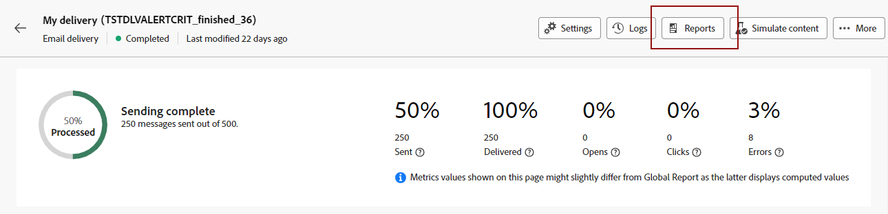

# 開始使用動態報告 {#about-dynamic-reports}

動態報告提供完全可自訂的即時報告。 它新增對設定檔資料的存取權，除了功能性電子郵件促銷活動資料（如開啟和點按）外，還支援依設定檔維度（如性別、城市和年齡）進行人口統計分析。 透過拖放介面，您可以探索資料、判斷電子郵件行銷活動對最重要客戶細分的執行方式，並評估其對收件者的影響。

## 存取動態報表 {#accessing-dynamic-reports}

您可以按一下「 」，在每個行銷活動和傳送中存取報告 **報表**. 隨後會出現一個快顯視窗，通知您將會被重新導向至 **動態報告** 新瀏覽器標籤中的頁面。

某些報表在傳送後無法立即使用，視收集和處理資訊所花費的時間而定。

動態報告分為兩個類別：

* **範本**，可透過使用複製以進行修改 **另存為** 選項(**專案>另存新檔……**)。
* **自訂報表** （以藍色標示），您可以按一下 **建立新專案** 上的按鈕 **報表** 首頁。

