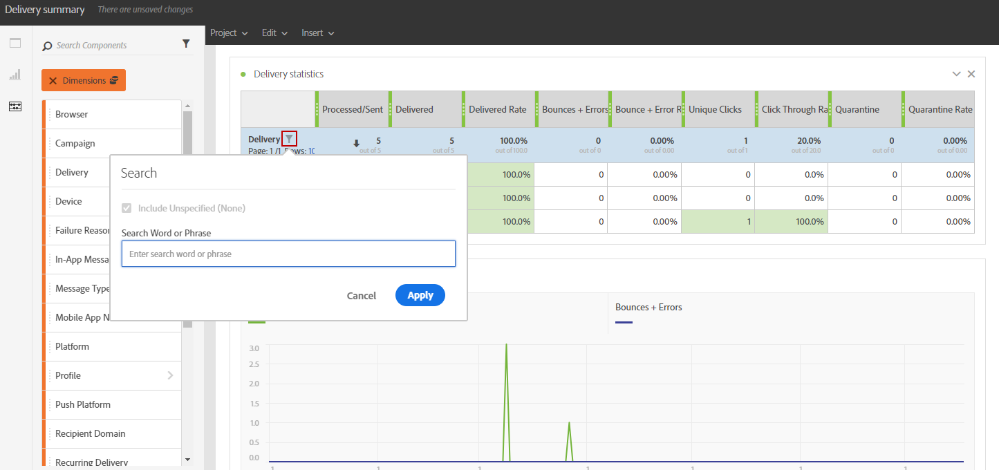

# 新增元件{#adding-components}

元件可協助您使用不同的維度、量度和時段來自訂報表。

1. 按一下「**[!UICONTROL 元件]**」索引標籤以存取元件清單。

   

1. **[!UICONTROL 元件]**&#x200B;標籤中顯示的每個類別都會顯示五個最常使用的專案，按一下類別名稱即可存取其完整的元件清單。

   元件表格分為四個類別：

   * **維度**：從傳遞記錄檔取得詳細資料，例如收件者的瀏覽器或網域，或傳遞成功。
   * **量度**：取得訊息狀態的詳細資料。 例如，是否已傳送訊息且使用者是否已將其開啟。
   * **[!UICONTROL 區段]**：根據收件者的年齡範圍篩選資料。 **[!UICONTROL 區段]**&#x200B;可以直接拖放到自由表格或面板的頂端列中。

     只有在管理員核准熒幕上顯示之「動態報告使用協定」的條款與條件後，才可使用此類別。 如果管理員拒絕合約，則不會在&#x200B;**[!UICONTROL 元件]**&#x200B;索引標籤中顯示區段，且不會收集資料。

   * **時間**：設定資料表的時段。

1. 將元件拖放至面板中，以開始篩選資料。

   

1. 拖放元件後，您可以使用&#x200B;**[!UICONTROL 列設定]**&#x200B;選項進一步設定表格。

   

1. 您也可以按一下&#x200B;**搜尋**&#x200B;圖示以進一步篩選表格。 透過此搜尋，您可以尋找特定結果，例如特定傳送或瀏覽器。

   

您可以視需要拖放任意數量的元件，並互相比較。

**相關主題：**

* [元件清單](list-of-components.md)
* [報告清單](defining-the-report-period.md)
