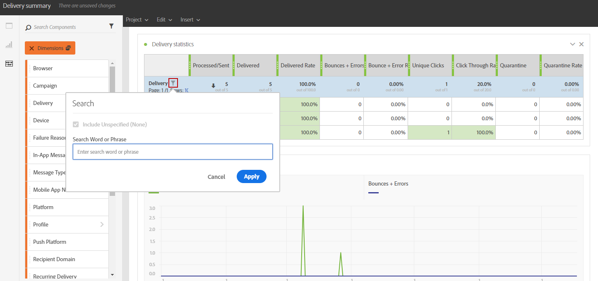

# 新增元件{#adding-components}

元件可協助您使用不同的維度、量度和時段來自訂報表。

1. 按一下 **[!UICONTROL 元件]** 標籤以存取元件清單。

   

1. 中顯示的每個類別 **[!UICONTROL 元件]** 索引標籤會顯示五個最常使用的專案，按一下類別名稱即可存取其完整的元件清單。

   元件表格分為四個類別：

   * **Dimension**：從傳送記錄檔取得詳細資料，例如收件者的瀏覽器或網域，或傳送成功。
   * **量度**：取得訊息狀態的詳細資料。 例如，是否已傳送訊息且使用者是否已將其開啟。
   * **[!UICONTROL 區段]**：根據收件者的年齡範圍篩選資料。 **[!UICONTROL 區段]** 可以直接在自由表格或面板的頂端列上拖放。

     只有在管理員核准熒幕上顯示之「動態報告使用協定」的條款與條件後，才可使用此類別。 如果管理員拒絕合約，則區段不會顯示在 **[!UICONTROL 元件]** 索引標籤和資料將不會被收集。

   * **時間**：設定表格的時段。

1. 將元件拖放至面板中，以開始篩選資料。

   

1. 拖放元件後，您還可使用進一步設定表格 **[!UICONTROL 列設定]** 選項。

   

1. 您也可以按一下 **搜尋** 圖示。 透過此搜尋，您可以尋找特定結果，例如特定傳送或瀏覽器。

   

您可以視需要拖放任意數量的元件，並互相比較。

**相關主題：**

* [元件清單](list-of-components.md)
* [報告清單](defining-the-report-period.md)
