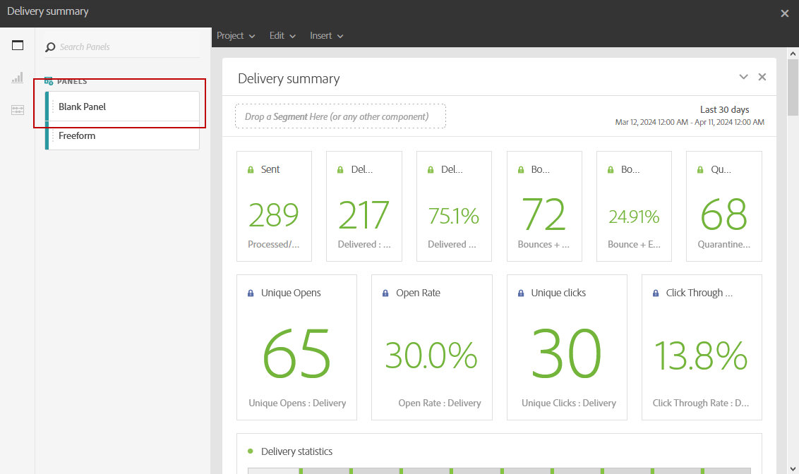
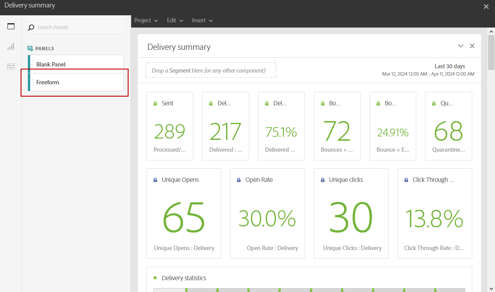
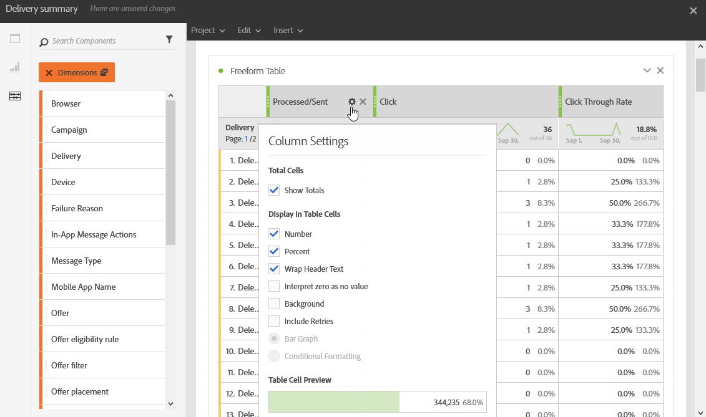
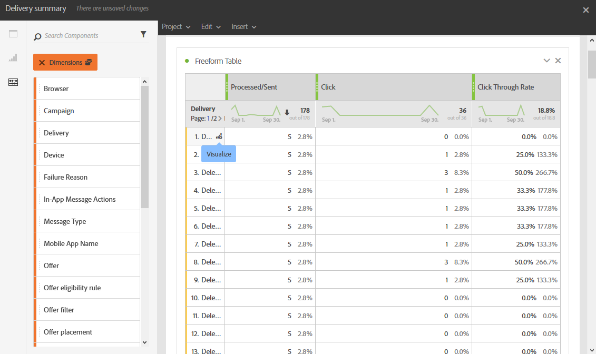

# 新增面板{#adding-panels}

## 新增空白面板 {#adding-a-blank-panel}

若要啟動報表，您可以將一組面板新增至立即可用或自訂的報表中。 每個面板都包含不同的資料集，而且由自由表格和視覺效果組成。

此面板可讓您視需要建置報告。 您可以在報表中新增任意數量的面板，以篩選不同時段的資料。

1. 按一下&#x200B;**面板**&#x200B;圖示。 您也可以按一下&#x200B;**插入索引標籤**&#x200B;並選取&#x200B;**新增空白面板**，以新增面板。

   

1. 將&#x200B;**空白面板**&#x200B;拖放到您的儀表板中。

   

您現在可以將自由表格新增至面板，以開始鎖定資料目標。

## 新增自由表格 {#adding-a-freeform-table}

自由表格可讓您建立表格，以使用&#x200B;**元件**&#x200B;表格中可用的不同量度和維度來分析您的資料。

每個表格和視覺效果皆可調整大小，且可以移動以自訂報表。

1. 按一下&#x200B;**[!UICONTROL 面板]**&#x200B;圖示。

   

1. 將&#x200B;**[!UICONTROL 自由格式]**&#x200B;專案拖放到您的儀表板中。

   您也可以按一下&#x200B;**[!UICONTROL 插入]**&#x200B;索引標籤並選取&#x200B;**[!UICONTROL 新增自由表格]**，或在空白面板中按一下&#x200B;**[!UICONTROL 新增自由表格]**，以新增表格。

   

1. 在&#x200B;**[!UICONTROL 將區段拖曳到此處]**&#x200B;欄位中，從&#x200B;**[!UICONTROL 元件]**&#x200B;索引標籤將&#x200B;**[!UICONTROL 區段]**&#x200B;新增到頂端列。

   

1. 從&#x200B;**[!UICONTROL 元件]**&#x200B;索引標籤拖放專案至欄和列，以建置您的表格。

   

1. 按一下&#x200B;**[!UICONTROL 設定]**&#x200B;圖示以變更資料在欄中的顯示方式。

   

   **[!UICONTROL 資料行設定]**&#x200B;由下列專案組成：

   * **[!UICONTROL 數字]**：可讓您顯示或隱藏欄中的摘要數字。
   * **[!UICONTROL 百分比]**：可讓您顯示或隱藏欄中的百分比。
   * **[!UICONTROL 將零解譯為沒有值]**：可讓您在值等於零時顯示或隱藏。
   * **[!UICONTROL 背景]**：可讓您顯示或隱藏儲存格中的水準進度列。
   * **[!UICONTROL 包含重試]**：可讓您在結果中包含重試。 這僅適用於&#x200B;**[!UICONTROL 已傳送]**&#x200B;和&#x200B;**[!UICONTROL 退回+錯誤]**。

1. 選取一或多個資料列，然後按一下&#x200B;**[!UICONTROL 視覺化]**&#x200B;圖示。 視覺效果會新增，以反映您選取的列。

   

您現在可以視需要新增任意數量的元件，也可以新增視覺效果以提供資料的圖形表示。
