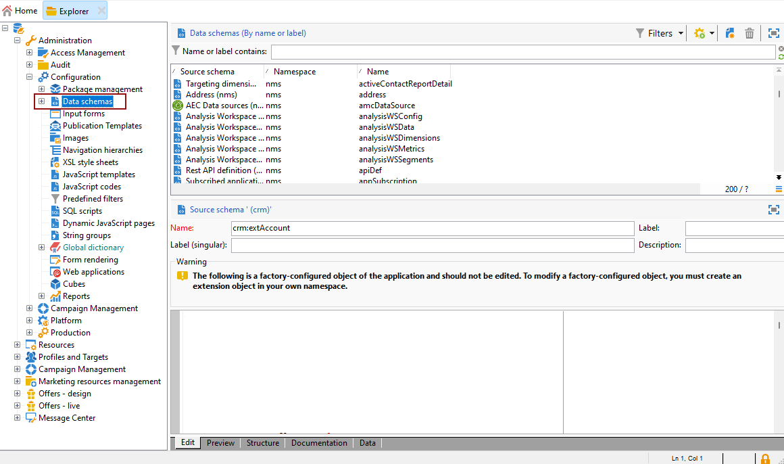

# 建立自訂設定檔維度{#creating-a-custom-profile-dimension}

您也可以根據在收件者方案擴充功能期間建立的自訂設定檔資料，來建立和管理報表。

* [步驟1：擴充收件者綱要](##extend-schema)
* [步驟2：連結您的新自訂欄位](#link-custom)
* [步驟3：建立動態報告，使用自訂設定檔維度篩選收件者](#create-report)

## 步驟1：擴充收件者綱要 {#extend-schema}

若要新增設定檔欄位，您需要擴充結構，請遵循下列步驟：

1. 導覽至 **[!UICONTROL 管理]** > **[!UICONTROL 設定]** > **[!UICONTROL 資料結構描述]** 檔案夾。

   

1. 識別您的自訂收件者綱要並加以選取。 如果您尚未擴充內建nms：recipient綱要，請參閱 [此程式](https://experienceleague.adobe.com/en/docs/campaign/campaign-v8/developer/shemas-forms/extend-schema).

1. 將您的自訂欄位新增到結構描述編輯器。

   例如，若要在收件者綱要中新增「忠誠度」自訂欄位：

   ```
   <attribute label="Loyalty" name="loyalty" type="string"/>
   ```

   

1. 按一下&#x200B;**[!UICONTROL 儲存]**。

1. 然後，識別您的自訂broadLogRcp結構描述並加以選取。 如果您尚未擴充內建的傳送記錄結構，請參閱 [此程式](https://experienceleague.adobe.com/en/docs/campaign/campaign-v8/developer/shemas-forms/extend-schema).

1. 將和收件者結構描述相同的自訂欄位新增到結構描述編輯器。

   

1. 按一下&#x200B;**[!UICONTROL 儲存]**。

1. 若要套用對結構描述的修改，請透過啟動資料庫更新精靈 **[!UICONTROL 工具]** > **[!UICONTROL 進階]** > **[!UICONTROL 更新資料庫結構]** 並執行「更新資料庫結構」。 [了解更多](https://experienceleague.adobe.com/en/docs/campaign/campaign-v8/developer/shemas-forms/update-database-structure)

   

您的新設定檔欄位現在已可供收件者使用及選取。

## 步驟2：連結您的新自訂欄位 {#link-custom}

>[!NOTE]
>
> 您最多只能新增20個自訂欄位至動態報表。

現在您的設定檔欄位已建立，我們需要將其連結至對應的動態報告維度。

1. 導覽至 **[!UICONTROL 管理]** > **[!UICONTROL 設定]** > **[!UICONTROL 資料結構描述]** > **[!UICONTROL 其他報告欄位]** 檔案夾。

   

1. 按一下 **[!UICONTROL 新增]** 以建立對應的動態報表維度。

1. 選取 **[!UICONTROL 編輯運算式]** 並瀏覽收件者綱要，以尋找您先前建立的自訂設定檔欄位。

   

1. 按一下&#x200B;**[!UICONTROL 完成]**。

1. 輸入您的維度 **[!UICONTROL 標籤]**，在動態報告中可見，然後按一下 **[!UICONTROL 儲存]**.

   

您的自訂設定檔欄位現在可在報表中作為自訂設定檔維度使用。 若要刪除自訂設定檔維度，您可以選取並按一下 **[!UICONTROL 刪除]** 圖示。

現在，收件者綱要已使用此設定檔欄位擴充，並且已建立您的自訂維度，您可以在傳送中開始鎖定收件者。

## 步驟3：建立動態報告，使用自訂設定檔維度篩選收件者 {#create-report}

傳送傳遞後，您可以使用自訂設定檔維度來劃分報表。

1. 從 **[!UICONTROL 報表]** 索引標籤中，選取現成可用的報表或按一下 **[!UICONTROL 建立]** 按鈕以從頭開始一個。

   

1. 在 **[!UICONTROL Dimension]** 類別，按一下 **[!UICONTROL 個人資料]** 然後，將您的自訂設定檔維度拖放至您的自由表格。

   

1. 拖放任何量度以開始篩選資料。

1. 視需要在工作區中拖放視覺效果。
