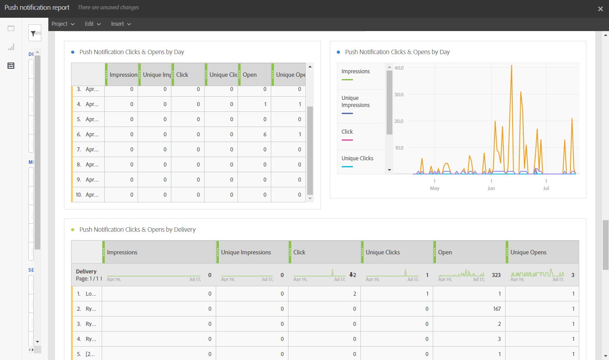

# 推播通知報告{#push-notification-report}

>[!CAUTION]
>
>請注意，您必須拖放 **[!UICONTROL 訊息型別]** 量度至您的表格，以根據您的傳送型別分割資料，在此例中是推播通知傳送。

此 **推播通知** 報表提供Adobe Campaign中推播通知之行銷績效的詳細資訊。 這個現成的報告可協助您瞭解使用者如何與推播通知、行動應用程式和傳遞互動。

每個表格都由摘要數字和圖表表示。 您可以變更詳細資訊在其各自視覺效果設定中的顯示方式。

第一個表格 **推播通知參與摘要** 分為三種類別：依日期、依行動應用程式及依傳送。 它包含可用於收件者對傳遞的反應性的資料：

* **[!UICONTROL 已處理/傳送]**：已傳送的推播通知總數。
* **[!UICONTROL 已傳遞]**：成功傳送的推播通知數，與已傳送推播通知總數相關。
* **[!UICONTROL 曝光數]**：推播通知已傳送至裝置並在通知中心保持未觸及的次數。 在大多數情況下，曝光次數應該與傳送的數目類似。 這可確保裝置收到訊息，並將該資訊轉送回伺服器。
* **[!UICONTROL 不重複曝光次數]**：收件者的曝光次數。
* **[!UICONTROL 點進率]**：與推播通知互動的使用者百分比。
* **[!UICONTROL 開啟率]**：已開啟推播通知的百分比。

第二個表格 **推播通知點按與開啟** 分為三種類別：依日期、依行動應用程式及依傳送。 它包含每個傳遞的收件者行為可用資料：

* **[!UICONTROL 曝光數]**：收件者看到的推播通知總數。
* **[!UICONTROL 不重複曝光次數]**：收件者的曝光次數。
* **[!UICONTROL 按一下]**：推播通知已傳送至裝置且使用者已點按的次數。 使用者想要檢視通知（通知隨後將移至推播開啟追蹤）或將其關閉。
* **[!UICONTROL 不重複點按]**：不重複使用者與推播通知互動的次數，例如點選通知或按鈕。
* **[!UICONTROL 開啟]**：傳送至裝置並由使用者按一下以開啟應用程式的推播通知總數。 這類似於「推送點按」，但如果通知已關閉，則不會觸發「推送開啟」。
* **[!UICONTROL 不重複開啟次數]**：開啟傳遞的收件者人數。
