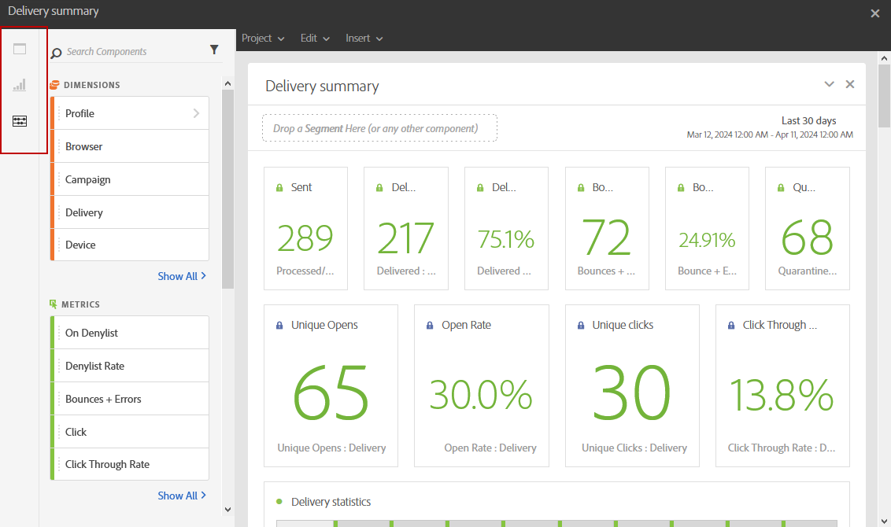

# 報告介面{#reporting-interface}

例如，頂端工具列可讓您修改、儲存或列印報告。

使用&#x200B;**專案**&#x200B;標籤可以：

* **開啟……**：開啟先前建立的報表或範本。
* **另存新檔……**：重複範本以便修改。
* **重新整理專案**：根據新的資料和篩選器的變更來更新您的報告。
* **下載CSV**：將報表匯出至CSV檔案。

**編輯**&#x200B;索引標籤可讓您：

* **復原**：取消您在上一個儀表板上的動作。
* **全部清除**：刪除您儀表板上的每個面板。

**插入**&#x200B;表格可讓您新增圖形和表格至您的儀表板，以自訂報表：

* **新增空白面板**：新增空白面板至您的儀表板。
* **新的自由表格**：新增自由表格至您的儀表板。
* **新線條**：新增線條圖至您的儀表板。
* **新長條圖**：新增長條圖至您的儀表板。

**相關主題：**

* [新增面板](adding-panels.md)
* [新增視覺效果](adding-visualizations.md)
* [新增元件](adding-components.md)

## 索引標籤 {#tabs}

左邊標籤可讓您建立報告，並依需求篩選資料。

這些標籤可讓您存取以下專案：

* **[!UICONTROL 面板]**：新增空白面板或自由格式至您的報告，以開始篩選您的資料。 如需詳細資訊，請參閱新增面板區段
* **[!UICONTROL 視覺效果]**：拖放選取的視覺效果專案，讓您的報表具有圖形維度。 如需詳細資訊，請參閱新增視覺效果區段。
* **[!UICONTROL 元件]**：使用不同的維度、量度、區段和時段來自訂您的報表。

## 工具列 {#toolbar}

工具列可在工作區上方找到。 由不同標籤所組成，例如可讓您修改、儲存、共用或列印報表。

**相關主題：**

* [新增面板](adding-panels.md)
* [新增視覺效果](adding-visualizations.md)
* [新增元件](adding-components.md)

### 專案索引標籤 {#project-tab}

使用&#x200B;**專案**&#x200B;標籤可以：

* **開啟……**：開啟先前建立的報表或範本。
* **另存新檔……**：重複範本以便修改。
* **重新整理專案**：根據新的資料和篩選器的變更來更新您的報告。
* **下載CSV**：將報表匯出至CSV檔案。
* **[!UICONTROL 列印]**：列印您的報告。

### 編輯索引標籤 {#edit-tab}

**編輯**&#x200B;索引標籤可讓您：

* **復原**：取消您在上一個儀表板上的動作。
* **全部清除**：刪除您儀表板上的每個面板。

### 插入索引標籤 {#insert-tab}

**插入**&#x200B;索引標籤可讓您新增圖形和表格至您的儀表板，以自訂報表：

* **新增空白面板**：新增空白面板至您的儀表板。
* **新的自由表格**：新增自由表格至您的儀表板。
* **新線條**：新增線條圖至您的儀表板。
* **新長條圖**：新增長條圖至您的儀表板。
