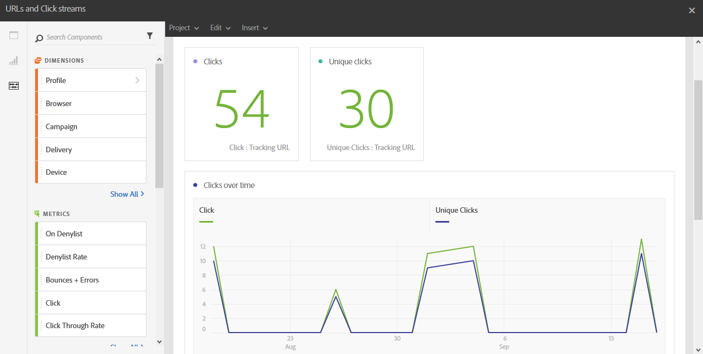

# URL 和點按資料流{#urls-and-click-streams}

此 **URL和點按流量** 顯示傳遞期間最多點選的URL，或若連結至行銷活動或方案的多次傳遞。

每個表格都由摘要數字和圖表表示。 您可以變更詳細資訊在其各自視覺效果設定中的顯示方式。

此 **造訪次數最多的連結** 表格包含每個傳遞的收件者行為可用資料，例如：

* **按一下**：內容在傳遞中的點按次數。
* **不重複點按**：點按傳遞中內容的收件者人數。
