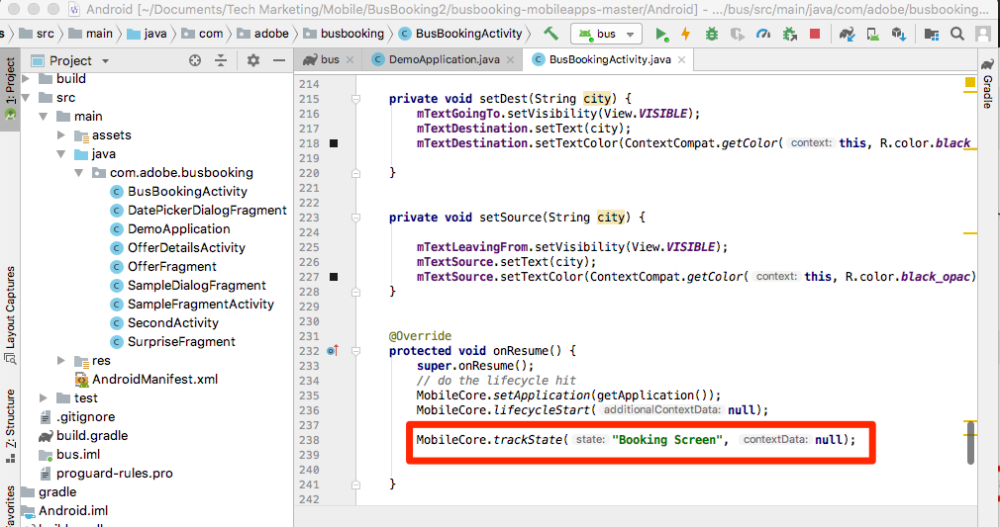
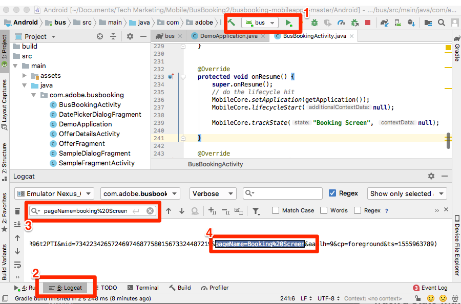

# 新增 Adobe Analytics

在本課中，您將在應用程式中啟用Adobe Analytics追蹤。

[Adobe Analytics](https://docs.adobe.com/content/help/en/analytics/landing/home.html) 是領先業界的解決方案，能夠讓您從使用者觀點瞭解客戶，並掌握客戶情報來為您的企業指引方向。

在「新 [增擴充功能](launch-add-extensions.md)[與安裝Mobile SDK](launch-install-the-mobile-sdk.md) 」課程中，您將Adobe Analytics擴充功能新增至Launch屬性，並將它匯入範例應用程式。  現在，您只需新增程式碼，即可追蹤應用程式中的狀態和動作！

## 學習目標

在本課程結束時，您將能夠:

* 驗證生命週期量度是否傳送至Adobe Analytics
* 新增程式碼以追蹤應用程式中的狀態，並附加資料
* 新增程式碼以追蹤應用程式中的動作，並附加資料

在Launch中，Analytics可實作許多項目。 本課程並非詳盡無遺，但應提供您在您自己的應用程式中實施所需的主要技巧的完整概述。

## 必要條件

You should have already completed the lessons in the [Configure Launch](launch-create-a-property.md) section. 在該區段中，您新增了Analytics擴充功能，並設定了追蹤伺服器和報表套裝ID。

## 生命週期度量與Adobe Analytics

生命週期度量是以環境為基礎的度量和維度，可在使用Experience Platform Mobile SDK的應用程式中輕鬆啟用。

當您將核心擴充功能新增至屬性並遵循介面中提供的行動安裝指示時，已啟用生命週期量度。 這些量度和維度，包括環境和應用程式特定量度，例如應用程式版本、參與的使用者人數、作業系統版本、時間分段、上次使用間隔天數等。 在分析應用程式時非常有用，尤其是當您從應用程式建立Analytics區段以套用至所有報表時。 檔案中提供度量的完整清 [單](https://docs.adobe.com/content/help/en/mobile-services/android/metrics.htmlh)。

## 匯入ACPCore程式庫

在先前的「安 [裝Mobile SDK」課程中](launch-install-the-mobile-sdk.md)，您新增了匯入陳述式，讓AdobeCore程式庫可在BusBookingActivity檔案中使用。 本課程中的活動會使用此相同的程式庫進行其他API呼叫。 在下個練習中，您將使用API來追蹤應用程式中的狀態(「trackState」)和動作(「trackAction」)，這些在AdobeCore程式庫中定義。  在新的Experience Cloud Platform Mobile SDK中，trackState和trackAction API已從Analytics程式庫移至核心程式庫，因此可將這些API運用在Adobe Analytics追蹤以外的用途。

## 追蹤狀態

在您的應用程式中，您可能會有許多不同的內容畫面，供您的使用者使用。 這等同於網站上的頁面。 Adobe Analytics提供一種方法，讓您在這些「頁面檢視點擊」中傳送，並在您用於網頁屬性的相同報表中檢視這些點擊。 此方法稱為「trackState」。

在本教學課程中，您將將trackState呼叫的程式碼只放入應用程式的一個畫面（頁面）中。 在現實生活中，您會在應用程式中的所有其他螢幕／狀態上複製此項目。

以下是語法和說明檔案中的程式碼範例，您可在本教學課程或您自己的應用程式中複製和貼上。

**語法:**

```java
public static void trackState(final String state, final Map<String, String> contextData)
```

**範例:**

```java
HashMap cData = new HashMap<String, String>();
contextData.put("key", "value");
MobileCore.trackState("state name",contextData);
```

### 追蹤沒有資料的狀態

1. 在Android studio中開啟範例應用程式時，請前往BusBookingActivity，並在底部附近向下捲動至onResume函式
1. 新增trackState方法呼叫
1. 設定 `state name` 為「預訂畫面」
1. 新增為API呼叫中的預留位 `null` 置，而非新增任何額外資料
1. 或複製並貼入下列項目：

   ```java
   MobileCore.trackState("Booking Screen", null);
   ```



**若要驗證trackState**

1. 儲存、建立及執行專案
1. 當模擬器執行並開啟應用程式的首頁畫面時，請檢視Android Studio Logcat除錯主控台
1. 搜索控制台 `pageName=Booking%20Screen`
1. 請注意，pageName變數已設 `Booking Screen` 為（以%20為編碼空間），沒有其他自訂資料對。 雖然從技術上講，您是在設定「狀態名稱」而非「頁面名稱」，但使用的參數名稱 `pageName` 是為了與網站實作保持一致。

   

### 使用資料追蹤狀態

1. 返回BusBookingActivity，並將匯入新增至檔案頂端的現 `import java.util.HashMap;` 有匯入項下
1. 在函式 `onResume()` 中，從上一個練習中注釋（或刪除）基本trackState呼叫
1. 新增trackState方法呼叫，這次是透過建立和命名HashMap來新增資料，使用"put"命令來包含一些索引鍵／值配對，然後在呼叫trackState時呼叫該HashMap
1. 請保留 `state name` 為「預訂畫面」
1. 或複製並貼入：

   ```java
   HashMap cData = new HashMap<String, String>();
   cData.put("cd.section", "Bus Booking");
   cData.put("cd.subSection", "Booking");
   cData.put("cd.conversionType", "Landing");
   MobileCore.trackState("Booking Screen", cData);
   ```

   

**若要使用資料驗證trackState**

1. 再次儲存、建立及執行專案
1. 當模擬器執行並開啟應用程式的首頁畫面時，請檢視Android Studio Logcat除錯主控台
1. 搜尋 `subSection` （或您在程式碼中輸入的任何索引鍵或值）
1. 現在，除了設定pageName外，您還有在點擊時傳送的金鑰／值配對

   

>[!NOTE] 如果您熟悉Analytics中的「prop和eVar」，您會注意到這些變數名稱不在SDK中。 來自SDK的所有關鍵／值資料都會以 [contextData變數傳送](https://docs.adobe.com/content/help/en/analytics/implementation/javascript-implementation/variables-analytics-reporting/context-data-variables.html)，因此需使用Analytics UI中的處理規則，將資料對應至prop或eVar [](https://docs.adobe.com/content/help/en/analytics/admin/admin-tools/processing-rules/processing-rules.html) （或其他變數）。

## 追蹤動作

與追蹤網站上的非頁面載入動作類似，您通常想要追蹤使用者在應用程式中採取的動作，例如點按未載入其他畫面的動作。 這個處理方式與上述的trackState非常類似，只不過此方法是呼叫的 `trackAction`。

以下是說明檔案的語法和程式碼範例。

**語法:**

```java
public static void trackAction(final String action, final Map<String, String> contextData) data;
```

**範例:**

```java
HashMap<String, String> contextData = new HashMap<String, String>();
contextData.put("key", "value");
MobileCore.trackAction("action taken", contextData);
```

### 追蹤與目標切換器的互動

在此範例巴士預訂應用程式中，您可以按一下這兩個值之間的箭頭，將原始城市與目的地城市切換。 您已決定要在Adobe Analytics中追蹤與此功能的互動。


此切換器在範例專案的BusBookingActivity檔案中控制。 在本練習中，每當有人點按trackAction點擊時，您就會傳送它。

#### 若要新增trackAction程式碼

1. 在Android studio中開啟範例專案後，請前往BusBookingActivity
1. 在第57行或前後找到"mBtnFlip.setOnClickListener"函式
1. 視需要展開函式，讓您看到所有程式碼
1. 在onClick函式中，在呼叫下方 `flipSourceDesti()`新增呼 `trackAction()` 叫
1. 將動作名稱設為「Flip Destination」，並為contextData參數新增「null」（因為我們目前不需要傳送任何其他資訊）
1. 您可以複製並貼上下列程式碼

   ```java
   MobileCore.trackAction("Flip Destination", null);
   ```

函式現在看起來如下：


#### 若要驗證trackAction程式碼

1. 新增程式碼後，儲存專案、執行和建立
1. 按一下廢棄項目圖示以清除Logcat主控台
1. 在模擬器中按一下「目標切換器」箭頭，注意到主控台中出現新要求（或更多）。
1. 在Logcat中搜 `Flip%20Destination` 尋
1. 請注意，action和pev2參數Flip%20Destination（含編碼空間）
1. 請注意 `pe=lnk_o` 同一行的金鑰／值，顯示這是「自訂連結」點擊，由trackAction觸發

   <!---->

幹得好！ 您已完成Analytics課程。 當然，您還可以做許多其他事來增強Analytics實作，但希望這能提供您一些解決其他需求所需的核心技能。

## trackState和trackAction的其他優點

在上一個練習中，您可以使用trackState和trackAction API，將資料從應用程式傳送至Adobe Analytics。 由於Experience Platform Mobile SDK根植於Launch，您可在Launch介面中運用您剛新增的程式碼，做更多事。

在Launch中，您可以建立由trackState和trackAction API觸發的規則，並讓它們執行其他動作，例如向其他Adobe解決方案或外部合作夥伴提出要求。

[下一個「新增Adobe Audience Manager」&gt;](audience-manager.md)
