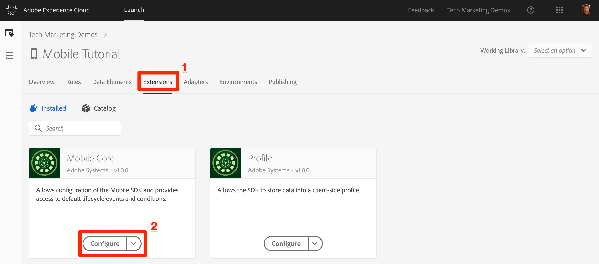
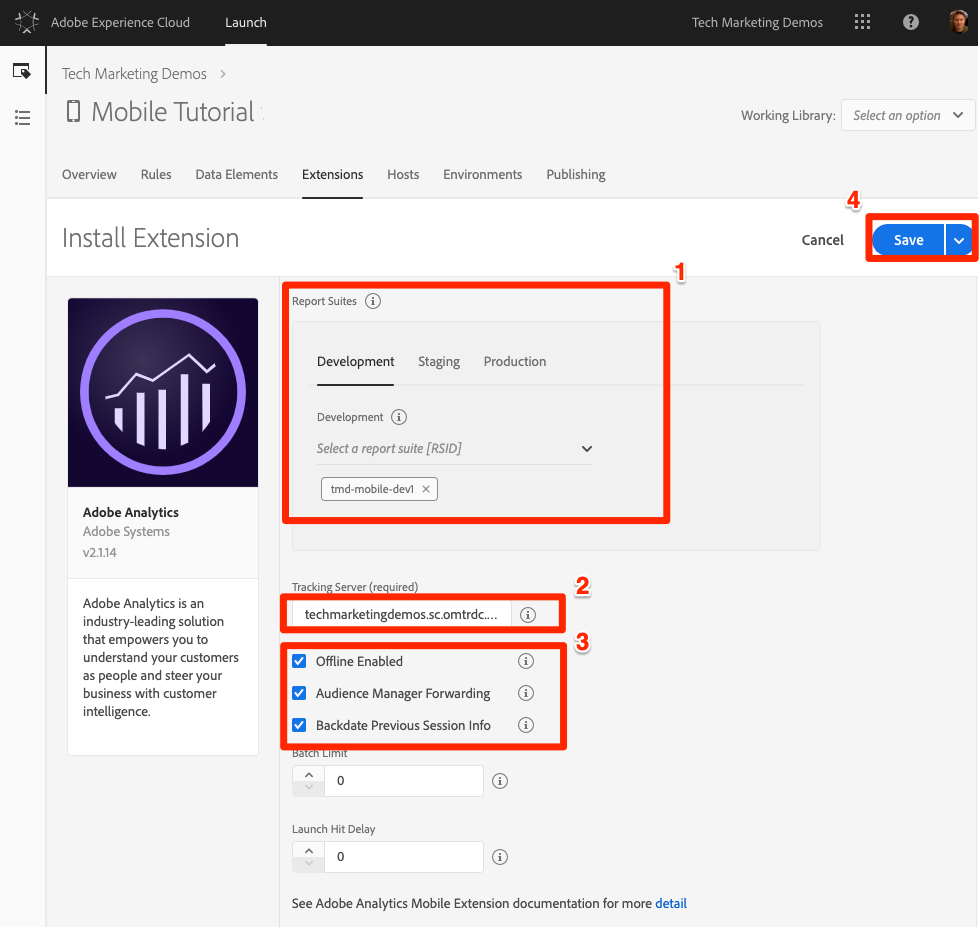

# 新增擴充功能

在本課中，您將新增擴充功能至您的Launch屬性。

Launch是一個平台，可讓Adobe和協力廠商建立擴充功能，以便透過Launch輕鬆部署其解決方案。 擴充功能是擴充啟動介面和用戶端功能的程式碼套件。 擴充功能可讓您只選擇您特定應用程式所需的Adobe Experience Platform Mobile SDK部分。  您可以將 Launch 想像成一個作業系統，而延伸模組則是您用來完成工作的應用程式。

由於您將實作Adobe解決方案（例如Target、Analytics和Audience Manager），因此您將新增必要的擴充功能以支援這些解決方案。

>[!CAUTION] 在Mobile Launch屬性中新增和移除延伸功能時，您必須更新應用程式。 這與Web Launch屬性不同，您可隨時新增或移除擴充功能，而不需更新網站。

## 必要條件

您的Launch使用者帳戶需要「管理擴充功能」的權限，才能完成本課程。 如果您因為使用者介面選項不適用而無法完成上述任何步驟，請連絡您的Experience cloud管理員以取得存取權。 For more information on Launch permissions, see [the documentation](https://docs.adobe.com/content/help/en/launch/using/reference/admin/user-permissions.html).

您需要下列解決方案詳細資訊：

* 一個Analytics報表套裝ID。 如果您沒有可用於本教學課程的測試／開發報表套裝，請建立一個。 如果您不確定如何執行此動作，請參閱[文件](https://docs.adobe.com/content/help/en/analytics/admin/manage-report-suites/new-report-suite/new-report-suite.html)。

* 您的Analytics追蹤伺服器。 您可以從目前的實作、Adobe顧問或客戶服務代表擷取追蹤伺服器。

## 學習目標

在本課程結束時，您將能夠:

* 將擴充功能新增至行動啟動屬性
* 設定 Analytics 擴充功能
* 設定Target和Target VEC擴充功能

>[!NOTE] Adobe Audience manager可透過Analytics擴充功能中的設定實作，因此您不需要在本教學課程中新增Audience Manager擴充功能

## 檢閱預先安裝的擴充功能

1. 按一下「 **[!UICONTROL 擴充功能]** 」標籤，前往擴充功能頁面
1. 請注意，Mobile Core和擴充 `Profile` 功能已預先安裝在您的新行動裝置屬性中
1. 按一下核 **[!UICONTROL 心擴展]** (Core extension)上的Configure（配置）按鈕以檢查其設定

   

1. Mobile Core擴充功能代表任何應用程式實作所需的核心Adobe Experience Platform Mobile SDK。 核心包含一組常用的功能和架構，例如Experience Cloud Identity Services、資料事件中樞、規則引擎、可重複使用的網路、磁碟存取常式等，這是所有Adobe和協力廠商擴充功能所需的。  如需行動核心擴充功能的詳細資訊，請參 [閱檔案](https://aep-sdks.gitbook.io/docs/using-mobile-extensions/mobile-core)。

   1. 請注意，系統會自動偵測您的Experience cloud組織ID並預先填入
   1. 「Experience Cloud Server」欄位可讓您指定訪客ID服務要求的自訂端點。 使用本教學課程的預設設定（保留為空白）。
   1. 「工作階段逾時」欄位可讓您指定應用程式生命週期工作階段何時應逾時。 依預設，如果應用程式在背景處於300秒，則會逾時。 使用本教學課程的預設設定。

1. 由於您尚未變更任何設定，請按一下「取 **[!UICONTROL 消]** 」以離開擴充功能設定

   

1. 描述檔擴充功能可讓SDK將資料儲存在用戶端描述檔中。 它沒有配置，所以沒有什麼可看的。 如需描述檔擴充功能的詳細資訊，請參 [閱檔案](https://aep-sdks.gitbook.io/docs/using-mobile-extensions/profile)。

## 新增解決方案擴充功能

現在，您應該開始嘗試有趣的部份，並開始新增擴充功能，以用於在本教學課程中將要實施的解決方案。 搭配行動應用程式使用Launch時，每次新增或移除擴充功能時，都必須更新應用程式。 為了節省以後的時間，我們將在本課中添加所有擴展。 只要略過您公司未授權的任何解決方案即可。

### 新增Adobe Analytics擴充功能

>[!NOTE] 如果您沒有Adobe Analytics授權，可略過本節。 目前，行動裝置屬性的Analytics擴充功能僅用於管理SDK設定，不會將介面選項新增至「啟動」，例如「規則」動作。

**若要新增擴充功能**

1. 按一下「目錄」標籤，以檢視已解除安裝 _的擴充_ 功能

1. 尋找 **[!UICONTROL Adobe Analytics擴充功能]** ，然後按一下「安 **[!UICONTROL 裝」]**

   

1. 從預先填 **[!UICONTROL 入的清單]** ，選取您的報表套裝。 這些是應用程式會傳送資料的報表套裝。 您可以為「開發」、「測試」和「生產環境」選擇不同的報表套裝。
1. 您 **[!UICONTROL 的Analytics追蹤伺服器]** ，可能已預先填入，或您可能需要從預先填入的清單中選取，或手動輸入。 這是信標將發送到的域，通常格式為 `yoursite.sc.omtrdc.net`。
1. 勾選「已啟用離 **[!UICONTROL 線」方塊]**。 選取「啟用離線」核取方塊時，Analytics點擊會在裝置離線時排入佇列，並在裝置重新連線時稍後傳送。 若要使用離線追蹤，請 **確定您的報表** 套裝已啟用時間戳記。 如需詳細資訊，請參閱 [ 說明文件](https://docs.adobe.com/content/help/en/analytics/implementation/javascript-implementation/offline-tracking.html)。
1. 核取「 **[!UICONTROL Audience Manager轉送」方塊]**。 這會將Analytics資料轉送至Audience Manager，因此您不需要從應用程式額外呼叫Audience Manager。 在本練習中，我們假設您有Audience Manager，因此會轉送Analytics的資料。 如果您沒有Audience Manager，請勿勾選此方塊，因為您已針對自己的實作設定Analytics。
1. 選中該框以 **[!UICONTROL 回退上一個會話資訊]**
1. 按一下「 **[!UICONTROL 儲存]** 」按鈕

   

### 新增 Target 擴充功能

Adobe Target有兩個正式擴充功能：Adobe Target擴充功能和Adobe Target VEC擴充功能。 Adobe target支援我們舊版行動SDK使用者所熟悉的所有API。 Adobe Target VEC擴充功能新增了對Target的Visual Experience Composer的支援，可讓行銷人員在「所見即所得」(WYSIWYG)介面中建立簡單的活動，以變更頁面上的影像和文字元素。 在本教學課程中，您將同時使用這兩者。

>[!NOTE] 如果您沒有Adobe target的授權，可以略過本節。 目前，行動裝置屬性的Target擴充功能僅用於管理SDK設定，不會將介面選項新增至Launch，例如規則動作。

**若要新增擴充功能**

1. 按一下「目錄」標籤，以檢視已解除安裝 _的擴充_ 功能

1. 尋找 **[!UICONTROL Adobe Target擴充功能]** ，然後按一下「安 **[!UICONTROL 裝」]**

   

1. 您的 **[!UICONTROL 用戶端代碼]** ，將會預先填入。
1. 將「環 **[!UICONTROL 境ID]** 」留空。 此設定會與Adobe Target的 [Hosts](https://docs.adobe.com/help/en/target/using/administer/hosts.html) （主機）功能搭配使用，可讓您將資料傳送至不同的報表環境（例如開發、測試、生產）。 依預設，資料會傳送至生產環境。
1. 將「目標工 **[!UICONTROL 作區屬性」保留]** 空白。 此設定會與Target Premium [Enterprise User Permissions功能搭配使用](https://docs.adobe.com/content/help/en/target/using/administer/manage-users/enterprise/property-channel.html) 。
1. 將「 **[!UICONTROL 逾時]** 」設為5秒。 此設定可控制應用程式在顯示預設內容之前，應等候Target回應的時間。
1. 按一下「 **[!UICONTROL 儲存]** 」按鈕

   

### 新增Target VEC擴充功能

現在已新增Target擴充功能，您可以新增Target VEC擴充功能。

>[!NOTE] 如果您沒有Adobe target的授權，可以略過本節。 目前，行動裝置屬性的Target VEC擴充功能僅用於管理SDK設定，且不會將介面選項新增至「啟動」，例如「規則」動作。

**若要新增擴充功能**

1. 按一下「目錄」標籤，以檢視已解除安裝 _的擴充_ 功能

1. 尋找 **[!UICONTROL Adobe Target VEC擴充功能]** ，然後按一下「安 **[!UICONTROL 裝」]**

   

1. 轉 **[!UICONTROL 換自動擷取目標促銷活動]**`ON` 。 當應用程式首次載入時，這會預先擷取所有Target活動，減少需要提出的請求數。
1. 將 **[!UICONTROL Fetch保留在背景]**`OFF`。 此設定僅在使用時 `Auto-Fetch Target Campaigns` 顯示。  離開此設 `OFF` 定可讓您在應用程式的首頁畫面上執行VEC活動，但也會增加應用程式啟動的延遲，以確保在首頁畫面顯示之前已完成或逾時Target要求。 建議您在主畫面上執行活 `OFF` 動時，保留此設定，並在未執行時 `ON` 加以切換。  您可以隨時在啟動介面中變更此設定，而不需更新您的應用程式。
1. 按一下「 **[!UICONTROL 儲存]** 」按鈕

   

完成了！現在您已將擴充功能新增至屬性，您可以將它們新增至程式庫：

[下一個「建立資料庫」&gt;](launch-create-a-library.md)