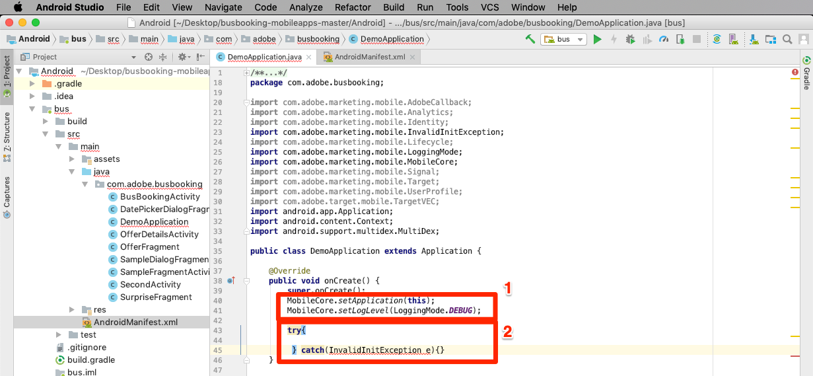
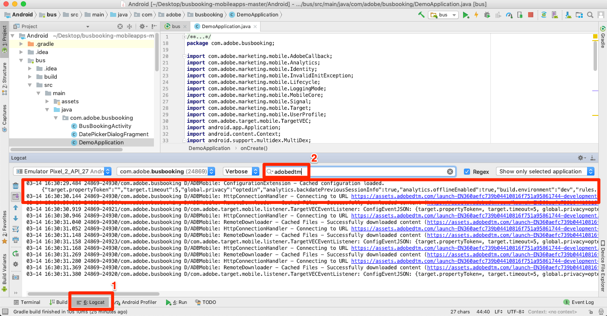

# 安裝行動 SDK

在本課中，您將會實作Mobile SDK，其副檔名和設定會與您的Launch屬性的「開發」環境相對應。

## 必要條件

在本課中，我們將開始將程式碼新增至「巴士預訂」應用程式，因此如果您尚未這麼做：

1. 下載並安裝 [Android Studio](https://developer.android.com/studio)
1. 下載巴士 [預訂應用程式](https://github.com/Adobe-Marketing-Cloud/busbooking-mobileapps)

## 學習目標

在本課程結束時，您將能夠:

* 取得行動啟動屬性的安裝指示
* 瞭解開發、測試和生產環境之間的差異
* 更新您 `build.gradle` 的檔案以新增Mobile SDK
* 將Mobile SDK匯入您的應用程式
* 確認SDK已成功實作
* 在應用程式中啟用生命週期度量

## 取得安裝指示

行動啟動屬性的安裝指示是程式碼片段的集合，您會將這些程式碼片段新增至行動應用程式的特定位置。

按一下頂端導 `Environments` 覽中的標籤，即可前往環境頁面。 請注意，您已預先建立開發、測試和生產環境。 這些對應於程式碼開發與發行程式中的典型環境。 程式碼首先由開發人員在開發環境中編寫。 當開發人員完成其工作時，就會將其傳送至測試環境，讓 QA 和其他團隊進行審查。一旦QA和其他團隊滿意後，程式碼就會發佈至「生產」環境，這是訪客下載應用程式時所體驗到的公開環境。

Launch允許額外的開發環境，這對於同時有多位開發人員處理不同專案的大型組織非常有用。

開發、測試和生產是我們完成教學課程所需的唯一環境。


在「開 **[!UICONTROL 發]** 」列中，按一下「安裝」圖示  ，以開啟內嵌代碼模式。


讓我們逐步完成說明。

## 更新build.gradle檔案

如果您先前在網站中使用過Launch，您首先會注意到的是，行動應用程式的安裝指示比網站的安裝指示要多很多。

適用於Android的Adobe Mobile SDK使用Gradle來管理其不同元件之間的相依性。 首先，我們會將Adobe Mobile SDK相依性新增至「匯流排預訂」應用程式的build.gradle檔案。

**若要更新build.gradle檔案**

1. 開啟Android Studio
1. 選取「開啟現有的Android studio專案」

   

1. 在「匯流排預訂Android」檔案夾的根目錄開啟build.gradle檔案：

   

1. 開啟下拉式清單並切換至「專案」檢視

   

1. 開啟 **Android &gt; bus &gt; build.gradle** 檔案

   

1. 在啟動介面中，請確定作業系統已設為 `Android`

1. 通過按一下「複製」(  )表徵圖將從屬關係複製到剪貼簿

   

1. 在Android studio中，直接在現有相依項之後（但在關閉之前）貼上剪貼簿中的相依項 `}`目
1. 此外，如果您要安裝Adobe Target VEC擴充功能，也需要新增下列相依性：

   ```java
   implementation 'com.google.code.gson:gson:2.8.2'
   implementation 'android.arch.lifecycle:extensions:1.1.1'
   implementation 'io.github.sac:SocketclusterClientJava:1.7.5'
   implementation 'com.android.support:support-annotations:28.0.0'
   implementation 'com.android.support:support-compat:28.0.0'
   implementation 'com.android.support:design:28.0.0'
   ```

1. 按一下「立即同步」連結以同步專案

   

## 更新應用程式

現在是時候更新應用程式以匯入SDK了

**若要匯入SDK**

1. 在「匯流排預訂」應用程式中開啟「主應用程式」檔案，該應用程式位於 **Android &gt; bus &gt; src &gt; main &gt; java &gt; com.adobe.busbooking &gt; DemoApplication**

   

1. 在「啟動」介面中，捲動至「新增初 **[!UICONTROL 始化代碼]** 」區段。
1. 通過按一下「添加初始化代碼」部分中的第  」表徵圖來 **[!UICONTROL 複製導入語句]** :

   

1. 在Android studio中，在檔案中現有匯入 *之前* ，貼上這些匯入 `DemoApplication` 陳述式。 請注意，核心擴充功能包括可支援回呼、身分服務、生命週期度量和主控台記錄等功能的程式庫。

   

1. 在「啟動」介面中，按一下「新增初始化程式碼」區段中的第二個「複製」圖示，複製與核心擴充功能 **** 。 第二行會開啟主控台記錄陳述式（可用的選項有「DEBUG」、「VERBOSE」、「WARNING」和「ERROR」）。

   

1. 在Android studio中，將這些核心陳述式直接貼 `DemoApplication` 入檔案 `super.onCreate()`
1. 移除行 `//` 和行前 `try` 的注 `catch` 釋

   

1. 在「啟動」介面中，按一下「新增初始化程式碼」區段中的第三個「復  」圖示，以 [!UICONTROL 複製擴充功能陳述式] 。

   

1. 在Android studio中，將這些擴充功能陳述式貼入 `try` 區段。 請注意， `MobileCore.configureWithAppID` 包含屬性的啟動開發環境識別碼。 這很重要，因為當我們準備將應用程式部署至生產環境時，您需要更新此值。

   

>[!NOTE] Launch介面中提供的行動安裝指示包括身分識別、生命週期和訊號擴充功能的匯入和註冊陳述式，以及生命週期量度的初始化。 這些擴充功能被視為Mobile Core擴充功能的一部分。 如果您不想在應用程式中使用這些擴充功能，則不需要匯入、註冊或實作與這些擴充功能相關的其他程式碼。
>
> 此外，還有其他實作選項在使用這些擴充功能時應考慮（例如，當使用者背景／預先建立應用程式時，您可以暫停／重新啟動生命週期系列）。 您可在Mobile Core擴充功能檔案中 [閱讀更多有關此資訊](https://aep-sdks.gitbook.io/docs/using-mobile-extensions/mobile-core)

## 驗證實作

1. 儲存您的Android studio專案
1. 執行應用程式並在模擬器中啟動它。 如果您未設定任何模擬器裝置，請立即設定一個，請務必設定執行Android 4.1(API 16)或更新版本的裝置。

   

1. 等候模擬器啟動並完全開啟應用程式至預訂畫面（可能需要幾分鐘的時間）

   

1. 確認Android Studio記錄中的Adobe伺服器正在進行呼叫

   

以下是您可尋找的某些特定呼叫範例：

1. **呼叫以擷取啟動設定** (篩選記錄 `adobedtm.com`至)。 請注意您在上一課中輸入的擴展配置。 雖然新增擴充功能需要更新至應用程式，但您可在Launch中從外部管理這些設定，並隨時變更：

   ```java
   03-14 16:30:29.484 24869-24930/com.adobe.busbooking D/ADBMobile: ConfigurationExtension - Cached configuration loaded.
    {"target.propertyToken":"","target.timeout":5,"global.privacy":"optedin","analytics.backdatePreviousSessionInfo":true,"analytics.offlineEnabled":true,"build.environment":"dev","rules.url":"https://assets.adobedtm.com/launch-EN360aefc739b04410816f751a95861744-development-rules.zip","experienceCloud.org":"7ABB3E6A5A7491460A495D61@AdobeOrg","target.clientCode":"techmarketingdemos","target.autoFetch":true,"target.fetchBackground":false,"lifecycle.sessionTimeout":300,"target.environmentId":"busbookingapp","analytics.server":"tmd.sc.omtrdc.net","analytics.rsids":"tmd-mobile-dev1","analytics.batchLimit":0,"property.id":"PRb4881271498b4f2cbaf67d38a8f3891a","global.ssl":true,"analytics.aamForwardingEnabled":true}
   ```

1. **向Identity Service** (篩選記錄至 `IdentityExtension`)提出要求在此範例中，ID(`d_mid`)已設定，且正在重新報告)

   ```java
   03-14 17:01:18.526 7743-7803/com.adobe.busbooking D/ADBMobile: IdentityExtension - Sending request (https://dpm.demdex.net/id?d_mid=59651426340521082405908216148091920022&d_ver=2&d_orgid=7ABB3E6A5A7491460A495D61%40AdobeOrg)
   ```

1. **Analytics要求** (篩選記錄至 `AnalyticsExtension`)

   ```java
   03-14 17:01:18.509 7743-7777/com.adobe.busbooking D/ADBMobile: AnalyticsExtension - Sending Analytics ID call (https://tmd.sc.omtrdc.net/id?mcorgid=7ABB3E6A5A7491460A495D61%40AdobeOrg&mid=59651426340521082405908216148091920022)
   ```

恭喜，您已將SDK新增至行動應用程式！

## 在應用程式中啟用生命週期度量

生命週期度量是以環境為基礎的度量和維度，可在使用Experience Platform Mobile SDK的應用程式中輕鬆啟用。 由於可供多個Experience cloud解決方案使用，因此我們將在此啟用它們，然後再深入探討個別解決方案。 只要在適當的位置新增幾行程式碼，就可輕鬆辦到。

### 將核心程式庫匯入BusBookingActivity檔案

若要透過Adobe Experience Platform Mobile SDK進行API呼叫，您必須將程式庫匯入適當的檔案。 在這種情況下，若要利用生命週期API呼叫，我們需要匯入核心程式庫。

1. 在Android studio中開啟您的應用程式時，請開啟BusBookingActivity檔案，該檔案位於您目前所使用之DemoApplication檔案的同一目錄中。
1. 在檔案頂端新增下列MobileCore匯入陳述式，以便您能使用關聯的API呼叫
   `import com.adobe.marketing.mobile.MobileCore;`


### 新增生命週期代碼

您現在會將生命週期程式碼新增至應用程式中的主要onResume()函式，以觸發生命週期函式。

1. 開啟BusBookingActivity檔案
1. 向下捲動檔案底部附近，並找到onResume()函式
1. 在行下添加以下兩行代 `super.onResume()` 碼：

   ```java
    MobileCore.setApplication(getApplication());
    MobileCore.lifecycleStart(null);
   ```


### 驗證生命週期點擊

當您執行應用程式時，現在應該會在Android studio的除錯區段中收到一或多則生命週期訊息。

1. 執行組建版本，然後選擇模擬器以執行應用程式
1. 在模擬器啟動並執行後，按一下Android studio中除錯程式的「執行」區段
1. 搜尋 `internalaction=Lifecycle`
1. 請看，有些行包含此索引鍵／值配對，以及其他生命週期度量。

請注意，您將看到的行實際上是Analytics使用生命週期度量的呼叫。


[接下來的「新增Adobe Experience Platform Identity Service」&gt;](id-service.md)