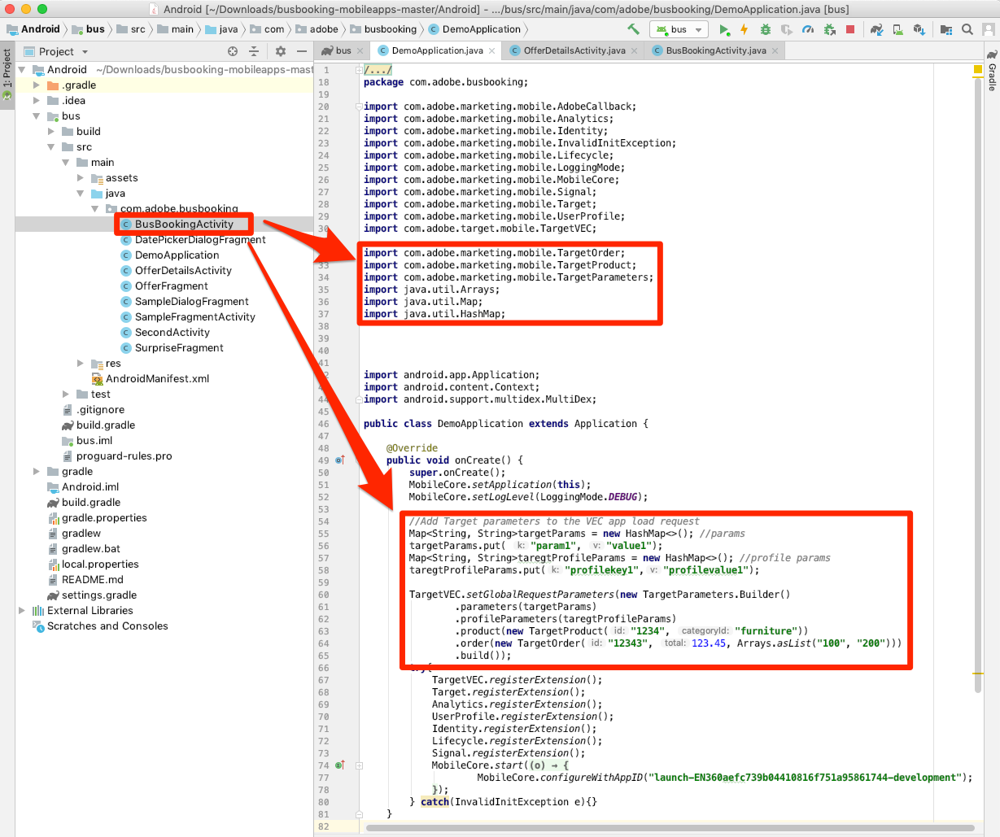
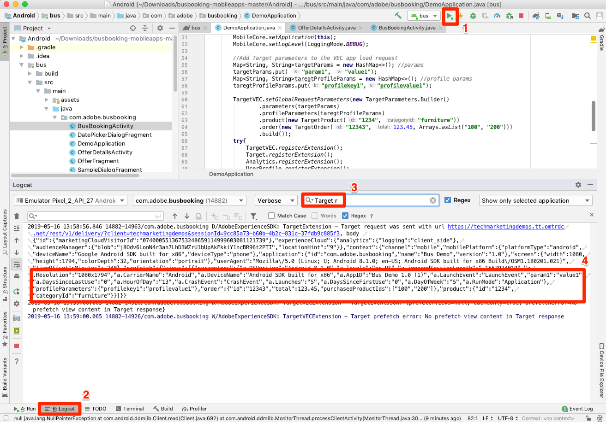

# 新增Adobe Target的Visual Experience Composer(VEC)

在本課中，您將啟用行動應用程式的Target Visual Experience Composer(VEC)。

[Adobe Target](https://docs.adobe.com/content/help/en/target/using/target-home.html) 是Adobe Experience cloud解決方案，提供您量身打造和個人化客戶體驗所需的一切，讓您的網站和行動網站、應用程式、社交媒體和其他數位通道獲得最大收益。

適用原生行動應用程式的視覺化體驗撰寫器 (VEC) 可讓您在原生行動應用程式中，自己動手建立活動與個人化內容，不必再經過不斷的開發相依性及應用程式發行週期。

在「新增 [擴充功能](launch-add-extensions.md)」課程中，您將Target VEC擴充功能新增至Launch屬性。 在「安裝 [Mobile SDK](launch-install-the-mobile-sdk.md) 」課程中，您將擴充功能匯入範例應用程式。 在Target的行動視覺體驗撰寫器中開始設定活動只需進行幾項小幅更新！

>[!IMPORTANT]  您必須有Target和Target VEC啟動擴充功能，才能在行動應用程式中使用Target VEC。

## 學習目標

在本課程結束時，您將能夠:

* 啟用Target VEC的範例應用程式
* 新增參數至Target VEC請求
* 將裝置與VEC配對
* 使用VEC建立活動

## 必要條件

要完成本節中的課程，您必須：

* 完成「設定啟 [動」一節的課](launch-create-a-property.md) 。
* 擁有Adobe target介面的核准者層級存取權

## 應用程式載入請求

由於我們設定Target VEC擴充功能時所選取的設定，因此當應用程式首次載入時，Target會觸發「應用程式載入」請求。 此請求會預取您為應用程式建立的所有Target VEC活動。

在Android Studio中，將記錄篩選為「目標r」以顯示Target請求和回應。 請注意應用程式名稱和版本的參數。 您建立的所有Target VEC活動都會自動定位至這些屬性。


## 新增參數

如您在上一個練習中所見，應用程式生命週期度量會自動納入為Target VEC請求中的參數。 您也可以將自訂參數新增至請求，全域或應用程式中特定檢視的自訂參數。

**若要全域新增自訂參數**

1. 在Android Studio中，開啟 `DemoApplication` 檔案。
1. 在現有匯入下方新增，以匯 `import ACPTargetVEC` 入Target VEC擴充功能
1. 在註冊擴充功能之前，在函 `onCreate()` 數中新增下列范常式式碼。 此范常式式碼顯示如何將一般參數、描述檔參數、產品（或實體）參數和訂單參數新增至TargetVEC請求。 此範例使用靜態值，而實際應用程式中您可能想使用動態變數來填入值。 當然，您只想填入與所有檢視相關的參數：

   ```java
   Map<String, String>targetParams = new HashMap<>(); //params
   targetParams.put( "param1", "value1");
   Map<String, String>taregtProfileParams = new HashMap<>(); //profile params
   taregtProfileParams.put("profilekey1","profilevalue1");
   
   TargetVEC.setGlobalRequestParameters(new TargetParameters.Builder()
            .parameters(targetParams)
            .profileParameters(taregtProfileParams)
            .product(new TargetProduct("1234", "furniture"))
            .order(new TargetOrder("12343", 123.45, Arrays.asList("100", "200")))
            .build());
   ```

1. 您可能會注意到Android studio中發生錯誤，因為上述參數程式碼需要下列匯入，您需要將這些匯入新增至檔案：

   ```java
   import com.adobe.marketing.mobile.TargetOrder;
   import com.adobe.marketing.mobile.TargetProduct;
   import com.adobe.marketing.mobile.TargetParameters;
   import java.util.Arrays;
   import java.util.Map;
   import java.util.HashMap;
   ```

   

現在您已將參數新增至應用程式，是時候確認這些參數是否傳入請求中了。

**要驗證參數**

1. 儲存Android studio專案
1. 重建應用程式，並等待在模擬器中重新開啟
1. 開啟Android studio的「登入」窗格
1. 篩選以顯示所有具有"Target r"的陳述式
1. 您剛新增的自訂參數應會顯示在請求中

   

如需詳細資訊，以及如何透過特定檢視傳遞參數的詳細資訊，請參 [閱檔案](https://docs.adobe.com/content/help/en/target/using/implement-target/mobile-apps/composer/mobile-visual-experience-composer-android.html#parameters)。

## 將行動應用程式與目標介面配對

若要在Target介面中建立VEC活動，您必須先將Target與應用程式配對。 這種配對是通過使用深部鏈來實現的。

### 建立深層連結

Android支援使用「深 [層連結」和「Android應用程式連結」](https://developer.android.com/training/app-links/deep-linking) ，建立可直接前往應用程式中特定位置的URL。 您可能已在應用程式中使用這些功能。 如果是，您可以使用現有的URL結構來搭配Target。 在本教學課程中，您將檢視「巴士預訂」應用程式中預先定義的深層連結，確認其正在運作，然後使用它將您的應用程式與「行動應用程式的Target VEC」配對。

**要查看深層連結設定**

1. 在Android studio中，開啟AndroidManifest.xml檔案
1. 請注意，已針對「匯流排預訂」應用程式的深層連結方案設定「目的篩選」
1. 請注意， `Host` 和 `Scheme` 已分別設定 `com.adobe.example.busbooking` 為和 `http`。 這表示在模擬器中開啟 `http://com.adobe.example.busbooking` 時的URL應該會自動開啟範例應用程式

   

下一步是確認深層鏈路方案正在運行

### 驗證深層連結

現在，讓我們確定深層連結會在模擬器中開啟應用程式。 您可能有您偏好的adb命令執行方式，您當然可以使用。

**若要使用adb(Mac®)驗證深層連結**

1. 請確定Android模擬器正在執行
1. 如果「巴士預訂」應用程式已開啟，請關閉它
1. 開啟「終端機」窗口
1. 導覽至您的Android平台工具目錄： `cd Library/Android/sdk/platform-tools/`
1. 確認您的模擬器已連接： `./adb devices`
1. 開啟adb shell: `./adb shell`
1. 在adb shell中測試深層連結： `am start -W -a android.intent.action.VIEW -d "http://com.adobe.example.busbooking" "com.adobe.busbooking"`
1. 確認「匯流排預訂」應用程式已在模擬器中啟動

   

既然已設定深層連結結構，您就可以使用Target VEC來設定活動！

## 在Mobile VEC中建立活動

現在，讓我們在Target介面中建立活動。

**使用目標VEC建立活動**

1. 登入 [Adobe Experience Cloud](https://experiencecloud.adobe.com)
1. 使用解決方案切換器前往Target

   

1. 啟動Target

   

1. 按一下「 **[!UICONTROL 建立活動]** 」按鈕並選 **[!UICONTROL 取「A/B測試」]**
1. 選取行 **[!UICONTROL 動應用程式]**
1. 確定在「選 **[!UICONTROL 擇體驗]** 撰寫器」下 **[!UICONTROL 選取了「視覺化」]**
1. 按一下「下 **[!UICONTROL 一步]** 」按鈕

   

1. 在「選取 **[!UICONTROL 要使用的應用程式」畫面上]** ，按一下「新 **[!UICONTROL 增應用程式」]**

   

1. 在「輸入URL配置」欄位中 **[!UICONTROL 輸入您剛定義的URL配置]** ，例如 `http://com.adobe.example.busbooking/`
1. 按一下「 **[!UICONTROL 建立深層連結」]**

   

   >[!NOTE] 您有幾個選項可將深層連結傳送至應用程式。 您可以:
   >
   >   1. 以電子郵件將深層連結傳送至有效的電子郵件地址，然後在裝置上開啟含有電子郵件應用程式的連結
   >   1. 從您的Android裝置拍下QR code像片（在我們的教學課程中，裝置必須連結至Android Studio）
   >   1. 從Target介面複製深層連結，然後依您想要的方式傳送至裝置


1. 按一下「復 **[!UICONTROL 制並傳送連結」標籤]** 。
1. 按一下產生的URL（請注意，按一下URL會自動將它複製到剪貼簿）

   

1. 開啟「終端機」窗口（如果您仍然開啟該窗口，則切換到該窗口）
1. 導覽至您的Android平台工具目錄（您可能已在此）: `cd Library/Android/sdk/platform-tools/`
1. 確認您的模擬器已連接： `./adb devices`
1. 開啟adb shell: `./adb shell`
1. 在adb shell中，以您 [剛複製到剪貼簿的URL，取代下列命令中的] YOUR_TARGET_URL_WITH_TOKEN: `am start -W -a android.intent.action.VIEW -d "[YOUR_TARGET_URL_WITH_TOKEN]" "com.adobe.busbooking"`
1. 在應用程式載入後，切換回您已開啟Target的瀏覽器標籤。 您應該會在VEC中看到您的應用程式載入。
1. 按一下應用程式中的文字和影像資產，您應該會看到編輯和取代它們的選項！

   

   > [!TIP] 如果您在行動裝置中開啟深層連結後未看到Mobile VEC在Target介面中自動開啟，請嘗試以下幾項：
   >
   >   1. 請確定您在Target介面中使用的URL完全相同，而且不會意外剪下任何字元。 在adb shell中運行命令時，請確保URL使用引號
      >
      >
      >   

   1. 確認您新增了Target VEC所需的額外相依性至build.gradle檔案。 在「安裝Mobile SDK」課程中，應已 [新增這些相依性](https://docs.adobe.com/content/help/en/experience-cloud/implementing-in-mobile-android-apps-with-launch/configure-launch/launch-install-the-mobile-sdk.html#update-the-buildgradle-file)
      >
      >
      >   

   1. 嘗試清除儲存在應用程式中的資料，詳細內容請見下圖
      >
      >       
      


1. 對應用程式中的第一個畫面進行一些變更
1. 現在開啟VEC時，將模擬器置於瀏覽器旁
1. 導覽至應用程式中的不同畫面，並注意VEC如何使用模擬器更新！
1. 您可以在單一活動中更新應用程式中的多個檢視！

   

1. 您也可以視覺化地新增點按追蹤量度！
1. 儲存並核准您的活動，並確認您可以在範例應用程式中看到它

將裝置與VEC配對是一次性動作。 當您日後在相同裝置上建立更多活動時，您只能從清單中選取裝置，如下圖所示：


>[!TIP] 如果您有開啟的裝置，但在選取選單中是「無法使用」，請嘗試在模擬器或裝置上關閉並重新開啟應用程式。

## 根據生命週期度量建立觀眾

生命週期度量內建有關訪客使用您應用程式的量度，這些量度會自動包含在Adobe Mobile SDK進行的呼叫中。 您可以根據這些量度，在Target中輕鬆建立觀眾。

**若要建立觀眾**

1. 在Target介面中，按一下頂端導 **覽中** 「觀眾」
1. Click the **Create Audience** button

   

1. Name the Audience `Launches < 5`
1. Click **Add Rule &gt; Custom**

   

1. 在第一個下拉式清單中，選 **取a.Launches** 參數。 所有生命週期度量參數都以"a"開頭。 首碼。 我們將根據使用者的應用程式啟動次數來定位內容，這是透過指導性的首次使用者體驗(FTUE)來定位首次使用者的絕佳方式。
1. 在下一個下拉式清單中， **選取小於**
1. 在第三個下拉式清單中，輸入 **5**
1. Click **Save**

   

請注意，Target中有多種現成可用的觀眾建立選項。 此外，您可以在Target中傳送自訂資料以建立觀眾、使用從其他Experience cloud解決方案（例如Audience Manager和Analytics）共用的觀眾，以及使用People Core service的「客戶屬性」功能共用給Target的CRM資料。

[下一個「新增Adobe Target」&gt;](target.md)