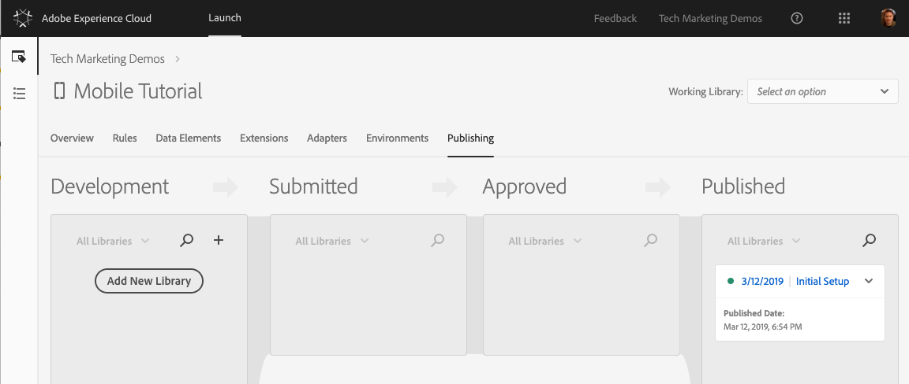

# 發佈您的啟動屬性

現在，您已在您的開發環境中實作了一些Adobe Experience cloud的主要解決方案，您該學習發佈工作流程了。

## 必要條件

您的Launch使用者帳戶需要「核准」和「發佈」的權限，才能完成本課程。 如果您因為使用者介面選項不適用而無法完成上述任何步驟，請連絡您的Experience cloud管理員以取得存取權。 For more information on Launch permissions, see [the documentation](https://docs.adobe.com/content/help/en/launch/using/reference/admin/user-permissions.html).

## 學習目標

在本課程結束時，您將能夠:

1. 將開發程式庫發佈到測試環境
1. 更新您的應用程式以載入不同的Launch環境
1. 將測試程式庫發佈到生產環境

## 發佈到測試環境

現在您已在開發環境中建立並驗證您的程式庫，是時候將它發佈至測試版了。

1. Go to the **[!UICONTROL Publishing]** page

1. 開啟您資料庫旁的下拉式清單，並選取「 **[!UICONTROL 送出以供核准」]**

   

1. 在對話方 **[!UICONTROL 塊中]** ，按一下「提交」按鈕：

   

1. 您的資料庫現在會以未建置的 [!UICONTROL 狀態] ，出現在「已提交」欄中：

1. 開啟下拉式清單，然後選 **[!UICONTROL 取「階段建置」]**:

   
1. 綠點圖示顯示之後，即可在測試環境中預覽程式庫。

在實際案例中，此程序的下一步通常是讓 QA 團隊在測試程式庫中驗證變更。

**驗證測試庫中的更改**

1. 在您的Launch屬性中，開啟「環 [!UICONTROL 境] 」頁

1. 在「 [!UICONTROL 測試] 」列中，按一下「安裝」圖示

    ，以開啟模式
   

如果您的「測試」應用程式使用不同的工作區，您必須確定此工作區包含您在本教學課程中進行的所有Pod和應用程式更新。 目前，您的開發環境中安裝指示的唯一差異，是核心組態中的啟動參考，如上述螢幕擷取所強調。 您需要更新AppDelegate.h檔案中的對應行，並重建應用程式。

在現實中，一旦您的QA團隊通過查看測試環境中的更改而簽約後，就應該發佈到生產環境。

## 發佈到生產環境

1. Go to the [!UICONTROL Publishing] page

1. 從下拉式清單中，按一下「 **[!UICONTROL 核准發佈]**:

   

1. 在對話方 **[!UICONTROL 塊中]** ，按一下「核准」按鈕：

   

1. 程式庫現在會以未建立狀態( [!UICONTROL 黃色圓點] )出現在「已核准」欄中：

1. 開啟下拉式清單，然後選 **[!UICONTROL 取「建立並發佈至生產」]**:

   

1. 在對話 **[!UICONTROL 方塊中]** ，按一下「發佈」:

   

1. 程式庫現在會出現在「已發 [!UICONTROL 布」欄] :

   

同樣地，請注意，生產環境使用核心組態中的啟動參考，如下方螢幕擷取所強調。  如果您的「測試」應用程式使用不同的工作區，您必須確定此工作區包含您在本教學課程中進行的所有Pod和應用程式更新。

>[!WARNING] 下次您變更Launch設定時，就需要在「開發」環境中建立新的「程式庫」。 請記住，新增和移除擴充功能需要更新應用程式本身。 請小心讓您的Launch環境和應用程式程式碼彼此同步，以避免發生問題。

就這樣！ 您已完成教學課程，並在Launch！中發佈了您的第一個行動裝置屬性。