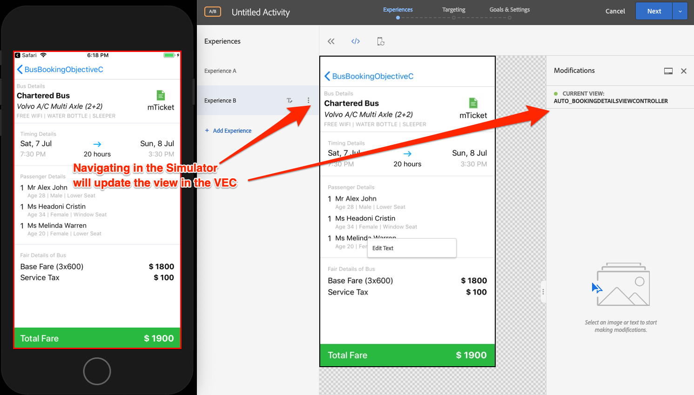
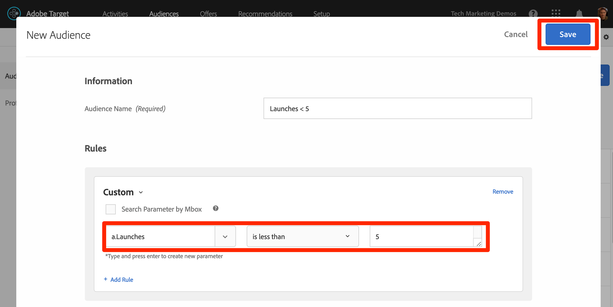

# 新增Adobe Target的Visual Experience Composer(VEC)

在本課中，您將啟用行動應用程式的Target Visual Experience Composer(VEC)。

[Adobe Target](https://docs.adobe.com/content/help/en/target/using/target-home.html) 是Adobe Experience cloud解決方案，提供您量身打造和個人化客戶體驗所需的一切，讓您的網站和行動網站、應用程式、社交媒體和其他數位通道獲得最大收益。

適用原生行動應用程式的視覺化體驗撰寫器 (VEC) 可讓您在原生行動應用程式中，自己動手建立活動與個人化內容，不必再經過不斷的開發相依性及應用程式發行週期。

在「新增 [擴充功能](launch-add-extensions.md)」課程中，您將Target VEC擴充功能新增至Launch屬性。 在「安裝 [Mobile SDK](launch-install-the-mobile-sdk.md) 」課程中，您將擴充功能匯入範例應用程式。 在Target的行動視覺體驗撰寫器中開始設定活動只需進行幾項小幅更新！

>[!WARNING]  您必須有Target和Target VEC啟動擴充功能，才能在行動應用程式中使用Target VEC。

## 學習目標

在本課程結束時，您將能夠:

* 啟用Target VEC的範例應用程式
* 新增參數至Target VEC請求
* 將裝置與VEC配對
* 使用VEC建立活動

## 必要條件

要完成本節中的課程，您必須：

* 完成「設定啟 [動」一節的課](launch-create-a-property.md) 。
* 擁有Adobe target介面的核准者層級存取權

## 新增參數

生命週期度量會自動納入為Target VEC請求中的參數。 您也可以新增自訂參數至請求。

**若要新增自訂參數**

1. 在Xcode中，開啟 `BookingViewController.m` 檔案。 此檔案由主螢幕使用。
1. 在現有匯入下匯入Target和Target VEC擴充功能

   ```swift
   #import "ACPTarget.h"
   #import "ACPTargetVEC.h"
   ```

1. 在函式 `viewDidLoad` 中，在行後加上 `super.viewDidLoad` 下列程式碼。 此范常式式碼顯示如何將參數、描述檔參數、產品（或實體）參數和訂單參數新增至TargetVEC請求。 此範例使用靜態值，而實際應用程式中您想使用動態變數來填入值。 當然，您只想填入與檢視相關的參數：

   ```objective-c
   NSDictionary *params = @{@"param1":@"value1"};
   NSDictionary *profileParams = @{@"profilekey1":@"profilevalue1"};
   ACPTargetProduct *product = [ACPTargetProduct targetProductWithId:@"1234" categoryId:@"furniture"];
   ACPTargetOrder *order = [ACPTargetOrder targetOrderWithId:@"12343" total:@(123.45) purchasedProductIds:@[@"100",@"200"]];
   ACPTargetParameters *targetParams = [ACPTargetParameters targetParametersWithParameters:params
                                                                         profileParameters:profileParams
                                                                                   product:product
                                                                                     order:order];
   [ACPTargetVEC setGlobalRequestParameters:targetParams];
   ```

   

現在您已將參數新增至應用程式，是時候確認這些參數是否傳入請求中了。

**要驗證參數**

1. 儲存Xcode專案
1. 重建應用程式，然後等待在模擬器中重新開啟
1. 在Xcode的控制台窗格中按一下
1. 使用enales-F開啟「查找」框
1. 在「查找」 `targetvec` 框中搜索
1. 點擊 `Enter` 可跳至Target請求和貼文內文。 找出您剛新增至請求的自訂參數：

   

## 將行動應用程式與目標介面配對

若要在Target介面中建立VEC活動，您必須先將Target與應用程式配對。 這種配對是通過使用深部鏈來實現的。

### 建立深層鏈路方案

iOS支援使用「通 [用連結」](https://developer.apple.com/documentation/uikit/core_app/allowing_apps_and_websites_to_link_to_your_content)[](https://developer.apple.com/documentation/uikit/core_app/allowing_apps_and_websites_to_link_to_your_content/defining_a_custom_url_scheme_for_your_app) 和自訂URL配置來建立應用程式的深層連結。 您可能已在應用程式中使用自訂URL配置。 如果是，您可以使用這些現有連結與Target配對。 在本教學課程中，您必須建立自訂URL配置。

**若要註冊您的URL配置**

1. 在Xcode中，按兩下您的應用程式以開啟「設定」畫面
1. 在「設定」畫面上，按一下標 `Info` 簽
1. 展開部 `URL Types` 分
1. 請注意， **[!UICONTROL Identifier]** is set to `com.adobetarget.BusBookingObjectiveC`. 您可以使用此識別碼，或視需要變更。
1. 請注意， **[!UICONTROL URL配置]** 為 `BusBookingObjectiveC`。 您可以使用此方案，或視需要變更。
1. 確定已 **[!UICONTROL 選擇]** 「編輯器」作為角 **[!UICONTROL 色]**

   

1. 如果您更新了識別碼或方案，請按一下標 `General` 簽以儲存方案。  按一下標籤上 `Info` 的，展開區 `URL type` 段並確認您的識別碼或配置並儲存。

下一步是新增處理常式至深層連結。

**要處理深層連結**

1. 開啟檔 `AppDelegate.m` 案
1. 如下圖 `[ACPCore collectLaunchInfo:@ {@"adb_deeplink": url.absoluteString}];` 所示將行 `AppDelegate:application:openURL` 添加到區
   

### 驗證深層連結

現在，當安裝您應用程式的使用者在模擬器中開啟類似URL( `BusBookingObjectiveC://com.adobetarget.BusBookingObjectiveC` 或您定義的任何配置)的URL時，就會開啟您的應用程式。

**要驗證深層鏈路方案**

1. 儲存Xcode專案
1. 重建應用程式
1. 在模擬器中，開啟Safari
1. 在位址 `BusBookingObjectiveC://com.adobetarget.BusBookingObjectiveC` 列中輸入URL（或您定義的任何配置）。 如果您遇到任何困難，請參閱下方的提示部分。
1. 您應會收到「在BusBookingObjectiveC中開啟此頁面」的提示。 如果您遇到任何困難，請參閱下方的提示部分。
1. 按一下 `Open`
1. 這應該會開啟「巴士預訂」應用程式

   > [!TIP] 如果您從案頭複製並貼上URL至模擬器時不成功，通常是出於以下兩個原因之一：
   >
   >   1. **從Target介面複製的URL不會貼入模擬器** 。這會發生在案頭和模擬器剪貼簿未同步的情況下。  如果發生此情況，請嘗試切換模擬器中 `Automatically Sync Pasteboard` 的設定並再次複製／貼上：
      >
      >      
      
      >
      >   
   1. **貼上URL會登陸Google搜尋結果頁面** ，嘗試將深層連結URL重新貼入位址列並點擊 `Enter`。 您可能需要重複幾次。


   

既然已設定深層連結結構，您就可以使用Target VEC來設定活動！

## 在Mobile VEC中建立活動

現在，讓我們在Target UI中建立活動。

**使用目標VEC建立活動**

1. 登入 [Adobe Experience Cloud](https://experiencecloud.adobe.com)
1. 使用解決方案切換器前往Target

   

1. 啟動Target

   

1. 按一下「 **[!UICONTROL 建立活動]** 」按鈕並選 **[!UICONTROL 取「A/B測試」]**
1. 選取行 **[!UICONTROL 動應用程式]**
1. 確定在「選 **[!UICONTROL 擇體驗]** 撰寫器」下 **[!UICONTROL 選取了「視覺化」]**
1. 按一下「下 **[!UICONTROL 一步]** 」按鈕

   

1. 在「選取 **[!UICONTROL 要使用的應用程式」畫面上]** ，按一下「新 **[!UICONTROL 增應用程式」]**

   

1. 在「輸入URL配置」欄位中 **[!UICONTROL 輸入您剛定義的URL配置]** ，例如 `BusBookingObjectiveC://com.adobetarget.BusBookingObjectiveC`
1. 按一下「 **[!UICONTROL 建立深層連結」]**

   

   >[!NOTE] 您有幾個選項可將深層連結傳送至應用程式。 您可以:
   >
   >   1. 從您的iOS裝置拍下QR code像片（在本教學課程中，裝置必須連結至Xcode）
   >   1. 從Target介面複製深層連結，然後依您想要的方式傳送至裝置
   >   1. 以電子郵件將深層連結傳送至有效的電子郵件地址，然後在裝置上開啟含有電子郵件應用程式的連結


1. 按一下「復 **[!UICONTROL 制並傳送連結」標籤]** 。
1. 按一下連結上的任何位置，即可自動將連結複製到剪貼簿

   

1. 切換回模擬器
1. 在模擬器中開啟Safari
1. 將深層連結URL貼入位址列
1. 按一下按 `Open` 鈕以開啟應用程式

   > [!TIP] 如果您從案頭複製並貼上URL至模擬器時不成功，通常是出於以下兩個原因之一：
   >
   >   1. **從Target介面複製的URL不會貼入模擬器** 。這會發生在案頭和模擬器剪貼簿未同步的情況下。  如果發生此情況，請嘗試切換模擬器中 `Automatically Sync Pasteboard` 的設定並再次複製／貼上：
      >
      >      
      
      >
      >   
   1. **貼上URL會登陸Google搜尋結果頁面** ，嘗試將深層連結URL重新貼入位址列並點擊 `Enter`。 您可能需要重複幾次。


   

1. 在應用程式載入後，切換回您已開啟Target的瀏覽器標籤。 您應該會在VEC中看到您的應用程式載入。
1. 按一下應用程式中的文字和影像資產，您應該會看到編輯和取代它們的選項！

   

1. 對應用程式中的第一個畫面進行一些變更
1. 現在在開啟VEC時，將模擬器放在瀏覽器旁
1. 導覽至應用程式中的其他畫面，並注意VEC如何使用模擬器更新！
1. 您可以在單一活動中更新應用程式中的多個檢視！
   
1. 您也可以視覺化地新增點按追蹤量度，並使用A4T與Analytics的整合！
1. 儲存並核准您的活動，並確認您可以在範例應用程式中看到它

將裝置與VEC配對是一次性動作。 當您日後在相同裝置上建立更多活動時，您只能從清單中選取裝置，如下圖所示：


>[!TIP] 如果您有開啟的裝置，但在選取選單中是「無法使用」，請回到「首頁」畫面背景應用程式，然後將應用程式移回前景，再次將它設為「可用」。

## 根據生命週期度量建立觀眾

生命週期度量內建有關訪客使用您應用程式的量度，這些量度會自動包含在Adobe Mobile SDK進行的呼叫中。 您可以根據這些量度，在Target中輕鬆建立觀眾。

**若要建立觀眾**

1. 在Target介面中，按一下頂端導 **覽中** 「觀眾」
1. Click the **Create Audience** button

   

1. Name the Audience `Launches < 5`
1. Click **Add Rule &gt; Custom**

   

1. 在第一個下拉式清單中，選 **取a.Launches** 參數。 所有生命週期度量參數都以"a"開頭。 首碼。 我們將根據使用者的應用程式啟動次數來定位內容，這是透過指導性的首次使用者體驗(FTUE)來定位首次使用者的絕佳方式。
1. 在下一個下拉式清單中， **選取小於**
1. 在第三個下拉式清單中，輸入 **5**
1. Click **Save**

   

請注意，Target中有多種現成可用的觀眾建立選項。 此外，您可以在Target中傳送自訂資料以建立觀眾、使用從其他Experience cloud解決方案（例如Audience Manager和Analytics）共用的觀眾，以及使用People Core service的「客戶屬性」功能共用給Target的CRM資料。

[下一個「新增Adobe Target」&gt;](target.md)