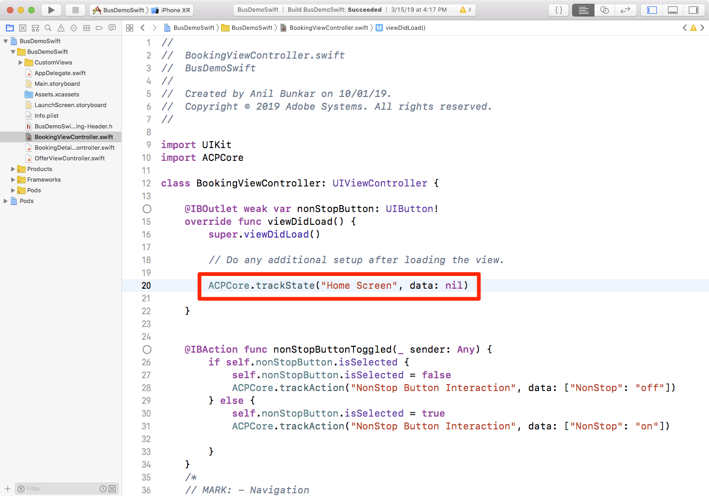
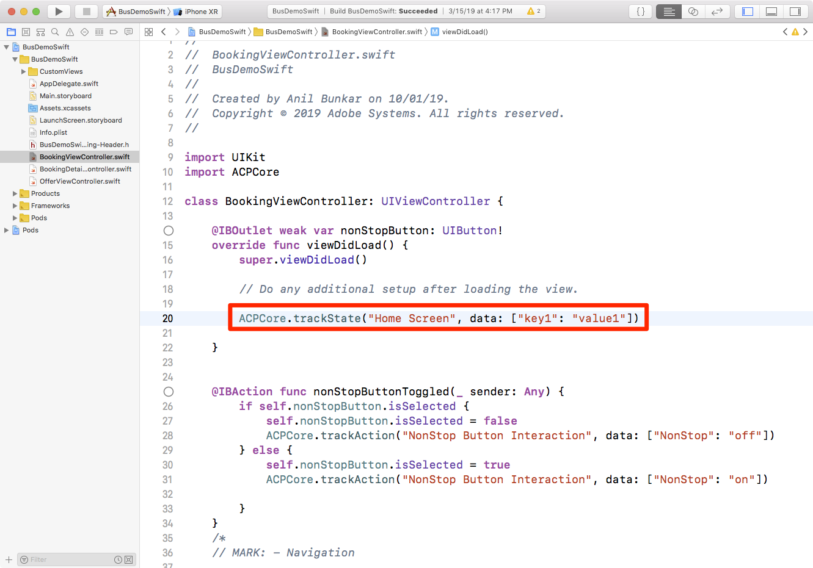
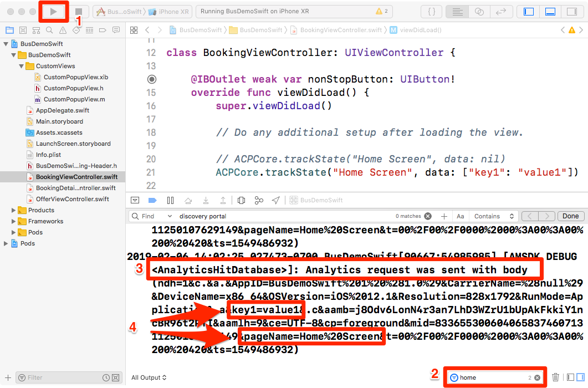

# 新增 Adobe Analytics

在本課中，您將在應用程式中啟用Adobe Analytics追蹤。

[Adobe Analytics](https://docs.adobe.com/content/help/en/analytics/landing/home.html) 是領先業界的解決方案，能夠讓您從使用者觀點瞭解客戶，並掌握客戶情報來為您的企業指引方向。

在「新 [增擴充功能](launch-add-extensions.md)[與安裝Mobile SDK](launch-install-the-mobile-sdk.md) 」課程中，您將Adobe Analytics擴充功能新增至Launch屬性，並將它匯入範例應用程式。  現在，您只需新增程式碼，即可追蹤應用程式中的狀態和動作！

## 學習目標

在本課程結束時，您將能夠:

* 驗證生命週期量度是否傳送至Adobe Analytics
* 新增程式碼以追蹤應用程式中的狀態，並附加資料
* 新增程式碼以追蹤應用程式中的動作，並附加資料

在Launch中，Analytics可實作許多項目。 本課程並非詳盡無遺，但應提供您在您自己的應用程式中實施所需的主要技巧的完整概述。

## 必要條件

You should have already completed the lessons in the [Configure Launch](launch-create-a-property.md) section. 在該區段中，您新增了Analytics擴充功能，並設定了追蹤伺服器和報表套裝ID。

## 生命週期度量與Adobe Analytics

生命週期度量是以環境為基礎的度量和維度，可在使用Experience Platform Mobile SDK的應用程式中輕鬆啟用。 事實上，您已經加入了！

當您將核心擴充功能新增至屬性並遵循介面中提供的行動安裝指示時，已啟用生命週期量度。 這些量度和維度，包括環境和應用程式特定量度，例如應用程式版本、參與的使用者人數、作業系統版本、時間分段、上次使用間隔天數等。 在分析應用程式時非常有用，尤其是當您從應用程式建立Analytics區段以套用至所有報表時。 檔案中提供度量的完整清 [單](https://docs.adobe.com/content/help/en/mobile-services/ios/metrics.html)。

### 檢視Analytics生命週期點擊

雖然您可以在任何除錯程式／封包嗅探器中看到生命週期點擊，但我們只會在Xcode除錯主控台中顯示。

1. 在Xcode中建立並執行專案，以啟動模擬器
1. 在Xcode除錯主控台中， `lifecycle` 在底部輸入篩選器以限制顯示的項目，然後捲動至項目底部
1. 請注意 `Analytics request was sent with body`
1. 生命週期度量包括AppID、CarrierName、DayOfWeek、DaysSinceFirstUse等，以及檔案中列出的其他度量／維 [度](https://docs.adobe.com/content/help/en/mobile-services/ios/metrics.html)

   

## 匯入ACPCore程式庫

在下個練習中，您將使用API來追蹤應用程式中的狀態(「trackState」)和動作(「trackAction」)。 若要使用這些API，您必須匯入包含這些API的程式庫。  在新的Experience Cloud Platform Mobile SDK中，trackState和trackAction API已從Analytics程式庫移至核心程式庫，因此可將這些API運用在Adobe Analytics追蹤以外的用途。

在本教學課程中，您只會追蹤一個狀態，不過在實際的應用程式中，您會想要追蹤多個狀態。

**要導入ACPCore庫**

1. 在Xcode中開啟BookingViewController.swift
1. 在檔案頂部（通常與其他導入語句一起）添加 `import ACPCore`
1. 儲存
1. 您現在已準備好在此檔案中使用trackState或trackAction API

   

## 追蹤狀態

在您的應用程式中，您可能會有許多不同的內容畫面，供您的使用者使用。 這等同於網站上的頁面。 Adobe Analytics提供一種方法，讓您在這些「頁面檢視點擊」中傳送，並在您用於網頁屬性的相同報表中檢視這些點擊。 此方法稱為「trackState」。

在本教學課程中，您將將trackState呼叫的程式碼只放入應用程式的一個畫面（頁面）中。 在現實生活中，您會在應用程式中的所有其他螢幕／狀態上複製此項目。 您也將探索幾種不同的方式，來傳送點擊的資料（金鑰／值配對）。

以下是語法和說明檔案中的程式碼範例，您可在本教學課程或您自己的應用程式中複製和貼上。

**語法:**

```swift
+ (void) trackState: (nullable NSString*) state data: (nullable NSDictionary*) data;
```

**範例:**

```swift
ACPCore.trackState("state name", data: ["key": "value"])
```

### 追蹤沒有資料的狀態

1. 在Xcode中開啟範例應用程式時，請前往BookingViewController.swift，並在viewDidLoad()函式中新增trackState方法呼叫
1. 將設 `state name` 為「首頁畫面」
1. 新增方法呼叫中的預留位 `nil` 置，而非新增任何額外資料
1. 或複製並貼入下列項目：

   ```swift
   ACPCore.trackState("Home Screen", data: nil)
   ```

   

>[!NOTE] 如果您完成實作Target VEC的課程，在viewDidLoad()函式中會有一些額外的程式碼，但本練習的螢幕擷取畫面中並未顯示。 這是預期的，意在將重點放在手邊的任務上。

**若要驗證trackState**

1. 儲存、建立及執行專案
1. 當模擬器執行並開啟應用程式的首頁畫面時，請檢視Xcode主控台
1. 將控制台篩選為具有"home"的項目，並查看底部項目，顯示 `Analytics request was sent with body`
1. 請注意，pageName變數已設 `Home Screen`為，沒有其他自訂資料對。 雖然從技術上講，您是在設定「狀態名稱」而非「頁面名稱」，但使用的參數名稱 `pageName` 是為了與網站實作保持一致。

   

### 使用資料追蹤狀態

1. 返回BookingViewController.swift，在函式中 `viewDidLoad()` ，注釋（或刪除）上次練習中的基本（未新增資料）trackState呼叫
1. 新增trackState方法呼叫，此時會使用資料， `key1` 以做為索引鍵 `value1` 和值
1. 保留 `state name` 為「主畫面」
1. 或複製並貼入：

   ```swift
   ACPCore.trackState("Home Screen", data: ["key1": "value1"])
   ```

   

**若要使用資料驗證trackState**

1. 再次儲存、建立及執行專案
1. 當模擬器執行並開啟應用程式的首頁畫面時，請檢視Xcode主控台
1. 將篩選保留為「首頁」，並查看底部項目，顯示 `Analytics request was sent with body`
1. 現在，除了設定pageName外，您還有在點擊時傳送的金鑰／值配對

   

>[!NOTE] 如果您熟悉Analytics中的「prop和eVar」，您會注意到這些變數名稱不在SDK中。 來自SDK的所有關鍵／值資料都會以 [contextData變數傳送](https://docs.adobe.com/content/help/en/analytics/implementation/javascript-implementation/variables-analytics-reporting/context-data-variables.html)，因此需使用Analytics UI中的處理規則，將資料對應至prop或eVar [](https://docs.adobe.com/content/help/en/analytics/admin/admin-tools/processing-rules/processing-rules.html) （或其他變數）。

### 其他資料傳送選項

在前兩項練習中，您提出了兩項請求，一項是附加資料，另一項是沒有資料。 不過，如果您想要透過螢幕或狀態載入，將多個資料點傳送至Analytics，該怎麼辦？ 以下是兩個選項。

#### 選項1:多鍵／值對

在trackState呼叫中，您可以選擇傳送多個金鑰／值配對，只要在資料集中以逗號分隔。 例如：

```swift
ACPCore.trackState("Home Screen", data: ["key1": "value1", "key2": "value2"])
```

#### 選項2:字典物件

您也可以在程式碼中定義字典，然後將其與trackState一起傳送。 當然，如果您在程式碼中已定義了某些字典物件，並想要將它們傳送至Analytics，這可能是您的最佳選擇。 例如：

```swift
let screenInfo = ["key1":"value1", "key2":"value2", "key3":"value3"]
ACPCore.trackState("Home Screen", data: screenInfo)
```

**額外評分**&#x200B;繼續，在程式碼中試用這兩個選項，並在Xcode除錯主控台中檢視結果。 您可以使用與以前相同的篩選，並檢查結果以確定您有變數和值傳入

## 追蹤動作

與追蹤網站上的非頁面載入動作類似，您通常想要追蹤使用者在應用程式中採取的動作，例如點按未載入其他畫面的動作。 這個處理方式與上述的trackState非常類似，只不過此方法是呼叫的 `trackAction`。

以下是說明檔案中的語法和程式碼範例，您可在本教學課程或您自己的應用程式中複製和貼上。

**語法:**

```swift
+ (void) trackAction: (nullable NSString*) action data: (nullable NSDictionary*) data;
```

**範例:**

```swift
ACPCore.trackAction("action name", data: ["key": "value"])
```

### 使用「不停止」核取方塊追蹤互動

在此範例巴士預訂應用程式中，有一個核取方塊可讓使用者決定是否要將搜尋結果限制為選項。 您已決定要在Adobe Analytics中追蹤與該核取方塊的互動。


此核取方塊會控制在範例專案的BookingViewController.swift檔案中。 在本練習中，每當有人勾選或取消勾選方塊時，您就會傳送trackAction點擊。

#### 設定trackAction代碼

1. 在Xcode中開啟範例專案後，請前往BookingViewController.swift，並找出"nonStopButtonTochecks"函式
1. 在語句 `if` 中，如果已選中該框，則第一個部分將取消選中該框。 在此案例中，您想使用下列程式碼，以值「off」傳送點擊：

   ```swift
   ACPCore.trackAction("NonStop Button Interaction", data: ["NonStop": "off"])
   ```

1. 在下一節（「else」區段）中，如果尚未勾選方塊，則會加以勾選。 在此案例中，您想使用下列程式碼，以值「on」傳送點擊：

   ```swift
   ACPCore.trackAction("NonStop Button Interaction", data: ["NonStop": "on"])
   ```

請注意程式碼中的其他自訂項目：

* 您正在將「不停 `action name` 止按鈕互動」設定為。 此值將填入請求的「action」參數，以及Adobe Analytics中的自訂連結報表／維度
* 您使用的 `key` 名稱為"NonStop"。 這是您在Analytics管理控制台的「處理規則」中可尋找的關鍵名稱，以便將這些值對應至prop或eVar。

函式現在看起來如下：


#### 若要驗證trackAction程式碼

1. 新增程式碼後，儲存專案、執行和建立
1. 按一下廢棄項目圖示以清除主控台
1. 勾選模擬器中的方塊，並注意到主控台中出現兩個請求。 最後一個是從您剛新增的程式碼，將資料傳送至Adobe Analytics。
1. 請注意，action和pev2參數都設為「NonStop Button Interaction」（不停止按鈕互動）（含編碼空格）
1. 請注意，「NonStop=on」索引鍵／值配對已存在，然後可指派至「處理規則」中的prop/eVar
1. 請注意"pe=lnk_o"金鑰／值，顯示這是由trackAction觸發的「自訂連結」點擊


幹得好！ 您已完成Analytics課程。 當然，您還可以做許多其他事來增強Analytics實作，但希望這能提供您一些解決其他需求所需的核心技能。

## trackState和trackAction的其他優點

在上一個練習中，您可以使用trackState和trackAction API，將資料從應用程式傳送至Adobe Analytics。 由於Experience Platform Mobile SDK根植於Launch，您可在Launch介面中運用您剛新增的程式碼，做更多事。

在Launch中，您可以建立由trackState和trackAction API觸發的規則，並讓它們執行其他動作，例如向其他Adobe解決方案或外部合作夥伴提出要求。

[下一個「新增Adobe Audience Manager」&gt;](audience-manager.md)
