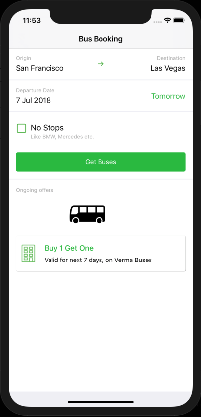

# 概述

_在行動iOS Swift™應用程式中實作Experience Cloud_ ，是行動應用程式開發人員的最佳起點，他們想要學習如何在iOS Swift應用程式中實作Adobe Experience cloud解決方案。

每堂課都包含操作練習和基礎資訊，可協助您實作Experience Cloud並瞭解其價值。  Swift應用程式提供示範，讓您完成教學課程，以便在安全的環境中學習基礎技巧。 完成本教學課程後，您應準備好開始在您自己的iOS Swift應用程式中實作所有Experience cloud解決方案！

完成本教學課程後，您將能夠：

* 建立行動啟動屬性

* 在Swift應用程式中安裝Launch屬性

* 實作下列Adobe Experience cloud解決方案：
   * **[Adobe Experience Platform Identity Service](id-service.md)**
   * **[Adobe Target](target-vec.md)**
   * **[Adobe Analytics](analytics.md)**
   * **[Adobe Audience Manager](audience-manager.md)**

* 透過開發、接移和生產環境，在Launch中發佈變更

>[!NOTE] 下列平台也提供類似的多解決方案教學課程：
>
> * [在Mobile iOS Objective-C應用程式中實作Experience Cloud](/help/mobile-ios-objective-c-implementation/index.md)
> * [在行動Android™應用程式中實作Experience Cloud](/help/mobile-android-implementation/index.md)
* [透過Launch在網站中實作Experience Cloud](/help/website-implementation/index.md)

## 必要條件

在這些課程中，您假設您擁有Adobe id和完成練習所需的權限。 如果沒有，您可能需要聯絡您的Experience cloud管理員以請求存取權。

* 對於Launch，您必須擁有「開發」、「核准」、「發佈」、「管理擴充功能」和「管理環境」的權限。 For more information on Launch permissions, see [the documentation](https://docs.adobe.com/content/help/en/launch/using/reference/admin/user-permissions.html).
* 對於Target，您必須擁有Adobe Target介面的核准者層級存取權
* 若是Adobe Analytics，您必須知道追蹤伺服器，以及您要使用哪些報表套裝來完成本教學課程

此外，您也認為您熟悉Swift的iOS開發。 你不需要精通Swift就能完成課程，但如果你能夠輕鬆地閱讀和理解代碼，你就能從中得到更多。

## 關於課程

在這些課程中，您將使用您自己的Experience cloud組織，將Adobe Experience cloud實作至名為「[Bus Booking](https://github.com/Adobe-Marketing-Cloud/busbooking-mobileapps)」的示範應用程式。 應用程式具備一些簡單功能，可讓您先完成基本的Experience cloud行動實作，然後再在您自己的應用程式中完成。

## 取得工具

1. 您必須使用Mac®來完成本教學課程
1. 下載 [Xcode](https://developer.apple.com/xcode/)
1. 下載巴士 [預訂應用程式](https://github.com/Adobe-Marketing-Cloud/busbooking-mobileapps)
1. 安裝 [Cocoapods](https://guides.cocoapods.org/using/getting-started.html)

開始吧！

[下一個「建立啟動屬性」&gt;](launch-create-a-property.md)

_Apple、Apple logo、iPad、iPhone、iPod和iPod touch為Apple Inc.在美國及其他國家的註冊商標。 Swift和Swift標誌為Apple Inc.的商標。_