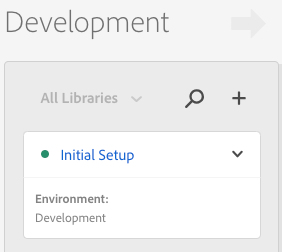

# 新增資料庫

在本課中，您將為新的Launch屬性建立程式庫。 程式庫會封裝所有所要的啟動設定，並產生在行動應用程式中安裝程式庫所需的特定實施指示。

## 學習目標

在本課程結束時，您將能夠:

* 建立程式庫
* 新增變更至程式庫
* 建立資料庫

## 將變更儲存至資料庫

在設定擴充功能後，您需要將它們封裝到程式庫中，以便部署在應用程式中，以便使用解決方案。

**若要新增及建立資料庫**

1. Go to the **[!UICONTROL Publishing]** tab

1. Click **[!UICONTROL Add New Library]**

   

1. Name the Library `Initial Setup`

1. 選擇 **[!UICONTROL 環境&gt;開發]**

1. Click **[!UICONTROL Add All Changed Resources]**

   

1. 請注意，按一下「 **[!UICONTROL 新增所有變更的資源]** Launch」（新增擴充功能）後，會摘要您剛才所做的變更。

1. Click **[!UICONTROL Save &amp; Build for Development]**

   

1. 稍後，狀態點會變成綠色，表示建立成功的程式庫。

   

[下一個「安裝Launch屬性和SDK」&gt;](launch-install-the-mobile-sdk.md)
