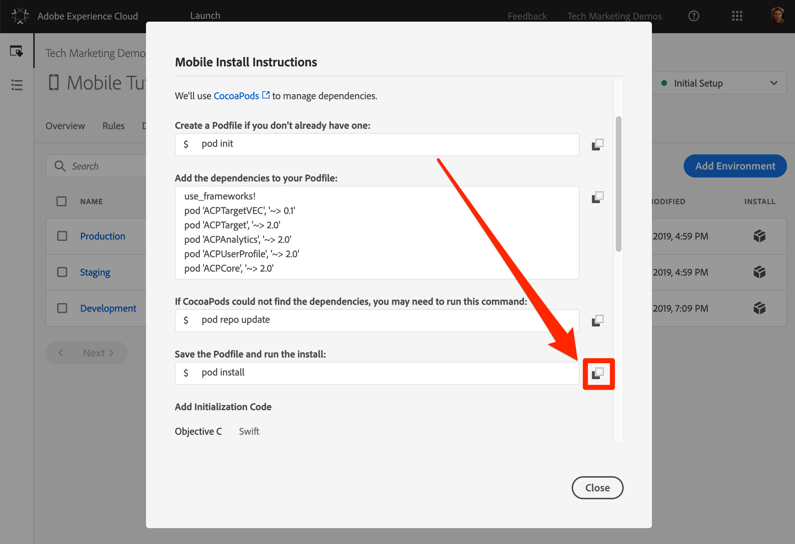
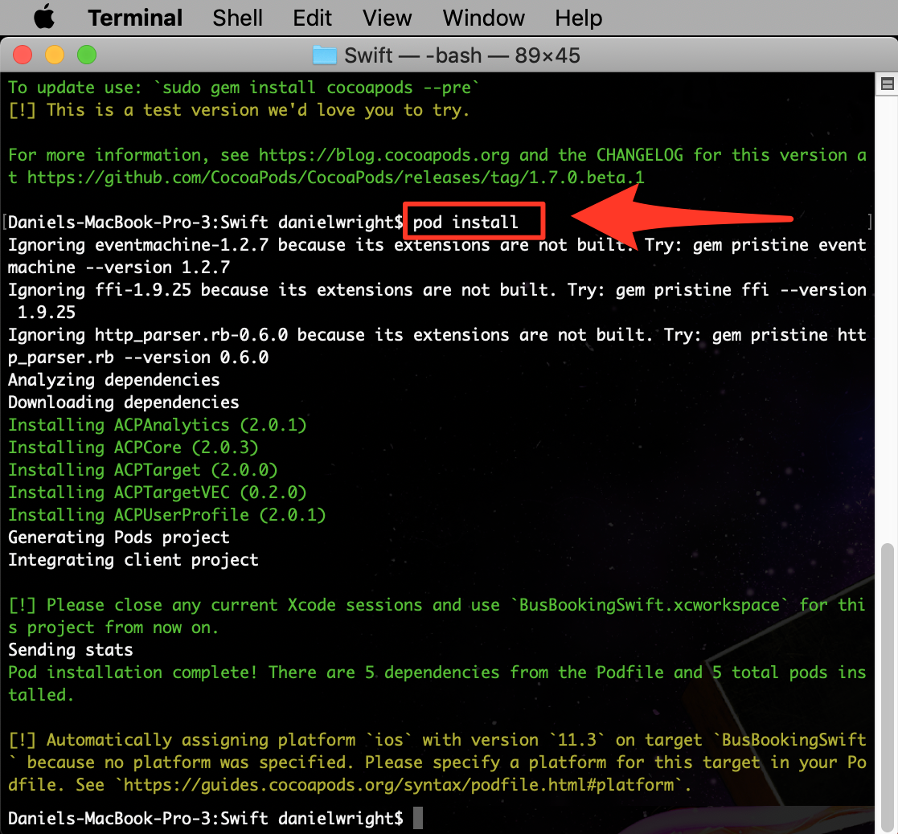
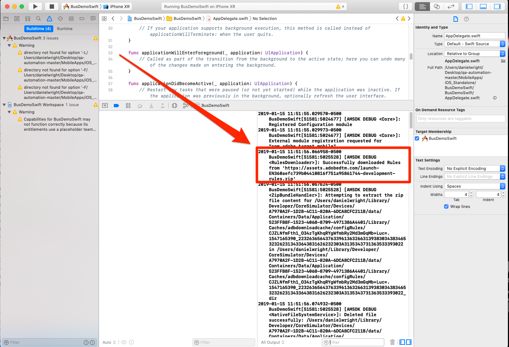

# 安裝行動 SDK

在本課中，您將會實作Mobile SDK，其副檔名和設定會與您的Launch屬性的「開發」環境相對應。

## 學習目標

在本課程結束時，您將能夠:

* 取得行動啟動屬性的安裝指示
* 瞭解開發、測試和生產環境之間的差異
* 建立和編輯Podfile
* 將Mobile SDK匯入您的AppDelegate檔案
* 確認SDK已成功實作

## 取得安裝指示

「行動啟動」屬性的安裝指示是程式碼片段的集合，您可在「終端機」中執行，或新增至行動應用程式中的特定位置。

按一下頂端導 `Environments` 覽中的標籤，即可前往環境頁面。 請注意，您已預先建立開發、測試和生產環境。 這些對應於程式碼開發與發行程式中的典型環境。 程式碼首先由開發人員在開發環境中編寫。 當開發人員完成其工作時，就會將其傳送至測試環境，讓 QA 和其他團隊進行審查。一旦QA和其他團隊滿意後，程式碼就會發佈至「生產」環境，這是訪客下載應用程式時所體驗到的公開環境。

Launch允許額外的開發環境，這對於同時有多位開發人員處理不同專案的大型組織非常有用。

開發、測試和生產是我們完成教學課程所需的唯一環境。


在「開 **[!UICONTROL 發]** 」列中，按一下「安裝」圖示  ，以開啟內嵌代碼模式。


讓我們逐步完成說明。

## 建立Podfile並安裝Pod

如果您先前在網站中使用過Launch，您首先會注意到的是，此模式中的資訊比Web屬性的資訊要多。

iOS專用的Adobe Mobile SDK使用CocoaPods來管理其不同元件之間的相依性。 如果您的開發環境中尚未安 [裝CocoaPod](https://cocoapods.org/) ，請依照其網站上的安裝指示進行。 此外，如果您尚未下載「 [Bus Booking」應用程式](https://github.com/Adobe-Marketing-Cloud/busbooking-mobileapps)，請將它儲存至本機電腦，然後將郵遞區號封存解壓縮至您的案頭。

**若要建立播客檔案**

1. 在您的 `Terminal` Mac®上開啟應用程式

1. 導覽至您儲存Bus Booking Swift應用程式的專案資料夾(例如 `cd Desktop/busbooking-mobileapps-master/Swift/`)

   

1. 在啟動介面中，將作業系統變更為 `iOS`

1. 按一下「複製」圖示 `pod init`，複製第一個iOS  。

   

1. 在您的「終端機應用程式」中， `pod init` 執行命令並等待它完成

   

1. 在您的「終端機」應用程式中，使用命令開啟播客 `open podfile` 檔案

   

1. 您的電腦可能會開啟對話方塊，詢問您要開啟播客檔案的應用程式。 選擇任何文字編輯器，例如 `TextEdit`

1. 在「啟動」介面中，通過按一下「複製」表徵圖來複製相  表。 請注意，在前面的課程中，您新增的每個擴充功能都會對應一行。 每個擴充功能都有其專屬的程式碼集，這些程式碼以Mobile Core擴充功能為基礎，而且只能透過應用程式更新加以新增或移除：

   

1. 在文字編輯器中，將相依項從剪貼簿貼到行後面 `# Pods for BusBookingSwift`

1. 在文字編輯器中儲存播客檔案的更新

   

1. 您現在可以關閉文字編輯器

1. 在「啟動」介面中，按一下「複製」圖示， `pod repo update`複製下一個iOS  。

   

1. 在您的「終端機應用程式」 `pod repo update` 中，執行命令並等待它完成（這可能需要幾分鐘的時間）

   

1. 在「啟動」介面中，按一下「複製」圖示， `pod install`複製下一個iOS  。

   

1. 在您的「終端機應用程式」中， `pod install` 執行命令並等待它完成

   

1. 您現在可以關閉「終端機」視窗

1. 開啟Finder視窗，導覽至您儲存「匯流排預訂」應用程式的檔案夾，並確認已建立BusBookingSwift.xcworkspace檔案、Podfile、Podfile.lock檔案以及Pods檔案夾

   

## 更新AppDelegate

現在是時候更新應用程式以匯入SDK了

1. 在Xcode中 `BusBookingSwift.xcworkspace` 開啟檔案
1. 開啟檔 `AppDelegate.swift` 案

   

1. 在「啟動」介面中，捲動至「 **[!UICONTROL 新增初始化程式碼]** 」區段，然後選擇 **[!UICONTROL Swift]** 做為您使用的iOS語言。
1. 通過按一下「添加初始化代碼」部分中的第  」表徵圖來 **[!UICONTROL 複製導入語句]** :

   

1. 在Xcode中，將這些匯入陳述式貼 `AppDelegate.swift` 入檔案(在 `UIKit`

   

1. 在「啟動」介面中，按一下「新增初始化程式碼」區段中的第二個「複製」圖示，複製與核心擴充功能 **** 。 第一行會開啟主控台記錄陳述式（可用的選項有「debug」、「verbose」、「warning」和「error」）。 第二行指向Launch環境的唯一識別碼。 這很重要，因為當我們準備將應用程式部署至生產環境時，您需要更新此值。

   

1. 在Xcode中，將這些核心陳述式貼至方法上方的AppDelegate檔 `application(_:didFinishLaunchingWithOptions:)` 案：

   

1. 在Launch介面中，按一下「新增初始化程式碼」區段中的第三個「復  」圖示，以  複製擴充功能陳述式：

   

1. 在Xcode中，將這些擴充功能陳述式貼入AppDelegate檔案，就在方 `return true` 法行的正 `application(_:didFinishLaunchingWithOptions:)` 前：

   

>[!NOTE] Launch介面中提供的行動安裝指示包括身分識別、生命週期和訊號擴充功能的匯入和註冊陳述式，以及生命週期量度的初始化。 這些擴充功能被視為Mobile Core擴充功能的一部分。 如果您不想在應用程式中使用這些擴充功能，則不需要匯入、註冊或實作與這些擴充功能相關的其他程式碼。
>
> 此外，還有其他實作選項在使用這些擴充功能時應考慮（例如，當使用者背景／預先建立應用程式時，您可以暫停／重新啟動生命週期系列）。 您可在Mobile Core擴充功能檔案中 [閱讀更多有關此資訊](https://aep-sdks.gitbook.io/docs/using-mobile-extensions/mobile-core)

## 驗證實作

1. 儲存您的Xcode專案
1. 執行應用程式並在模擬器中啟動它。 如果您未設定任何模擬器裝置，請立即設定一個裝置，請務必設定執行iOS 10+的裝置。 我們喜歡使用iPhone 8模擬器，因為只需使用滑鼠按一下按鈕 `Home` 就很簡單。

   

1. 等候模擬器啟動並完全開啟應用程式至預訂畫面（這可能需要幾分鐘的時間）

   

1. 確認呼叫是在Xcode console中對Adobe伺服器進行

   

以下是您可尋找的某些特定呼叫範例：

1. **呼叫以擷取啟動設定** (將控制台篩選為 `adobedtm.com`)。 請注意您在上一課中輸入的擴展配置。 雖然新增擴充功能需要更新至應用程式，但您可在Launch中從外部管理這些設定，並隨時變更：

   ```swift
   2019-01-15 12:11:44.518220-0500 BusDemoSwift[52399:5056293] [AMSDK DEBUG <RulesDownloader>]: Successfully downloaded Rules from 'https://assets.adobedtm.com/launch-EN360aefc739b04410816f751a95861744-development-rules.zip'
   
   {"target.propertyToken":"","target.timeout":5,"global.privacy":"optedin","analytics.backdatePreviousSessionInfo":true,"analytics.offlineEnabled":true,"build.environment":"dev","rules.url":"https://assets.adobedtm.com/launch-EN360aefc739b04410816f751a95861744-development-rules.zip","target.clientCode":"techmarketingdemos","experienceCloud.org":"7ABB3E6A5A7491460A495D61@AdobeOrg","target.autoFetch":true,"target.fetchBackground":true,"lifecycle.sessionTimeout":300,"target.environmentId":"busbookingapp","analytics.server":"tmd.sc.omtrdc.net","analytics.rsids":"tmd-mobile-dev1","analytics.batchLimit":0,"property.id":"PRb4881271498b4f2cbaf67d38a8f3891a","global.ssl":true,"analytics.aamForwardingEnabled":true}
   ```

1. **向Identity Service** (將控制台篩選為 `demdex.net`)請求在此範例中，ID(`d_mid`)已設定，且正在重新報告)

   ```swift
   2019-01-15 12:11:45.164590-0500 BusDemoSwift[52399:5056322] [AMSDK DEBUG <com.adobe.module.identity>]:
   
   Sending request (https://dpm.demdex.net/id?d_rtbd=json&d_ver=2&d_orgid=7ABB3E6A5A7491460A495D61@AdobeOrg&d_mid=17179986463578698626041670574784107777&d_blob=j8Odv6LonN4r3an7LhD3WZrU1bUpAkFkkiY1ncBR96t2PTI&dcs_region=9)
   ```

1. **來自Identity Service的回應** (將控制台篩選為 `ID Service`)。 請注意此 `mid` 值如何符合 `d_mid` 上述請求中的值：

   ```swift
   2019-01-15 12:11:45.681821-0500 BusDemoSwift[52399:5056322] [AMSDK DEBUG <com.adobe.module.identity>]:
   
   ID Service - Got ID Response (mid: 17179986463578698626041670574784107777, blob: j8Odv6LonN4r3an7LhD3WZrU1bUpAkFkkiY1ncBR96t2PTI, hint: 9, ttl: "604800000 ms")
   ```

1. **Analytics要求** (篩選控制台至 `Analytics request`)

   ```swift
   2019-01-15 12:11:45.828465-0500 BusDemoSwift[52399:5056336] [AMSDK DEBUG <AnalyticsHitDatabase>]: Analytics request was sent with body
   
   (ndh=1&c.&a.&AppID=BusDemoSwift%201%20%281.0%29&CarrierName=%28null%29&DayOfWeek=3&DaysSinceFirstUse=0&DaysSinceLastUse=0&DeviceName=x86_64&HourOfDay=12&LaunchEvent=LaunchEvent&Launches=3&OSVersion=iOS%2012.1&Resolution=828x1792&RunMode=Application&TimeSinceLaunch=0&ignoredSessionLength=-1547572244&internalaction=Lifecycle&locale=en-US&.a&.c&aamb=j8Odv6LonN4r3an7LhD3WZrU1bUpAkFkkiY1ncBR96t2PTI&aamlh=9&ce=UTF-8&cp=foreground&mid=17179986463578698626041670574784107777&pageName=BusDemoSwift%201%20%281.0%29&pe=lnk_o&pev2=ADBINTERNAL%3ALifecycle&t=00%2F00%2F0000%2000%3A00%3A00%200%20300&ts=1547572305)
   ```

恭喜，您已將SDK新增至行動應用程式！

[接下來的「新增Adobe Experience Platform Identity Service」&gt;](id-service.md)