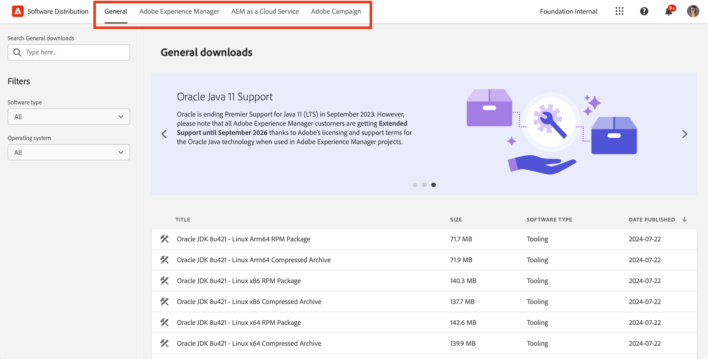

# Software Distribution

瞭解如何使用Software Distribution下載Adobe Experience Cloud軟體。

## 簡介

Software Distribution提供有效率的體驗，讓您尋找及下載Adobe Experience Cloud軟體。 Adobe核准的軟體套件和合作夥伴公司提供的套件適用於下列產品：

1. **Adobe Experience Manager** — 服務與維護、安全性、工具等相關套件(適用於所有支援的AEM版本)
1. **Adobe Experience Manager as a [!UICONTROL Cloud Service]** - [!UICONTROL AEM Cloud SDK]、[!UICONTROL AEM Cloud]移轉工具等
1. **Adobe Campaign** — 所有最新[!DNL Campaign]安裝程式版本和相關工具
1. **一般** — 為Adobe客戶提供的一般用途工具，包括[!DNL Oracle] JDK

使用Software Distribution非常簡單，如下所示：

1. [存取Software Distribution](#accessing)
1. [選取您的產品](#selecting)
1. [正在尋找您的下載專案](#finding)
1. [下載您的軟體](#downloading)

## 存取 Software Distribution {#accessing}

若要存取Software Distribution，請移至[`https://experience.adobe.com/downloads`](https://experience.adobe.com/downloads)並使用您的Adobe ID登入[!UICONTROL Software Distribution]。

## 選取您的產品 {#selecting}

Software Distribution UI會依產品組織，如功能表所示。

您到達&#x200B;**一般**&#x200B;標籤，您可以在此找到一般用途的軟體下載。

在功能表中點選或按一下您要下載軟體的產品。 只有貴組織已授權的產品可供下載。

## 正在尋找您的下載專案 {#finding}

選取所需的產品標籤後，您將會看到所有相關下載。 使用左側面板中的搜尋篩選器，快速尋找您的下載專案。 篩選器選項因產品而異。

## 下載您的軟體 {#downloading}

點選或按一下顯示的下載內容，對話方塊隨即開啟，為您提供有關下載的詳細資訊。 例如，您可以看到說明、提供者名稱和EULA。

您必須透過選取&#x200B;**接受EULA條款**&#x200B;來接受EULA，以啟用&#x200B;**下載**&#x200B;按鈕。

您也可以點選或按一下&#x200B;**共用**&#x200B;以複製該URL，以共用該特定下載專案的連結。

## 封裝共用 {#package-share}

在2020年6月，[!UICONTROL Software Distribution]已取代AEM的[!UICONTROL 封裝共用]和[!DNL Campaign]的[!DNL Neolane]。 直覺的使用者介面、簡化的搜尋功能，以及大幅提升的下載速度，讓您在下載Experience Cloud產品的軟體套件時，能更順暢地使用Software Distribution。

>[!IMPORTANT]
>
>來自[!UICONTROL 封裝共用]或[!DNL Neolane]的登入認證無法用於[!UICONTROL 軟體發佈]，它提供使用Adobe範圍安全性標準登入的功能。 如果您不知道您的Adobe ID，請聯絡貴組織的支援管理員。

>[!NOTE]
>
>[!UICONTROL Software Distribution] 僅支援瀏覽器下載作業。若您使用 AEM [!UICONTROL Package Manager] 執行新的安裝作業時，建議您將套件下載至本機資料夾，再從該資料夾安裝套件。
