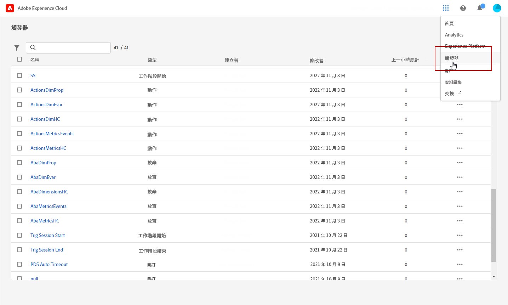
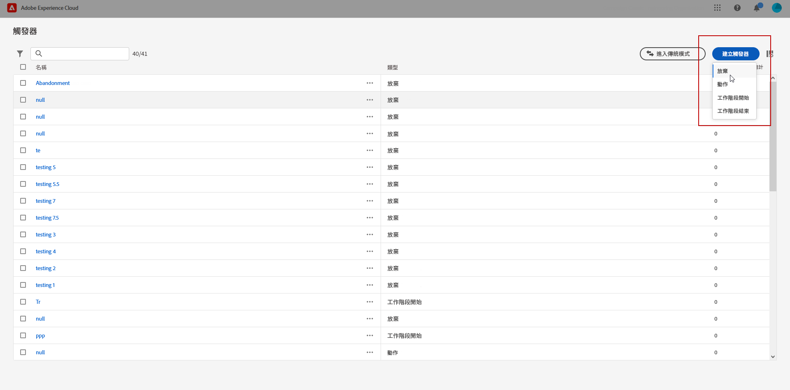
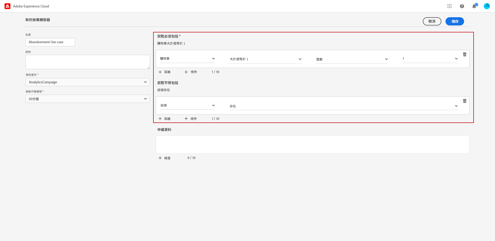
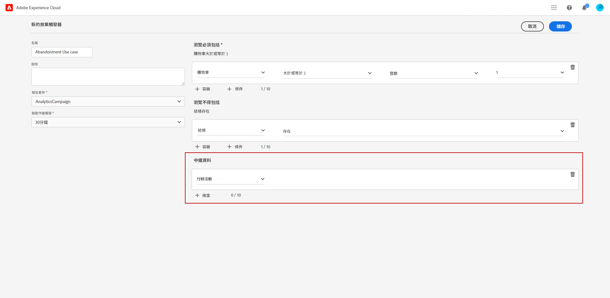
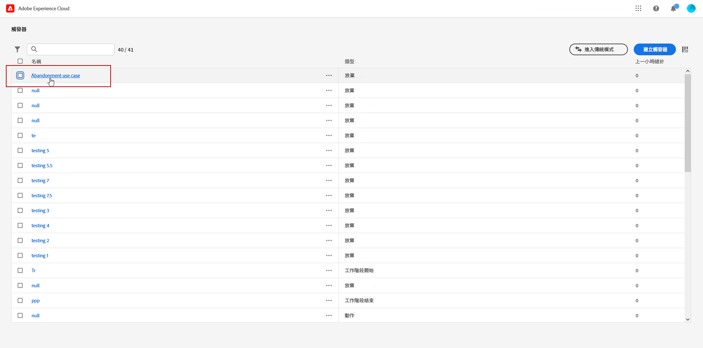
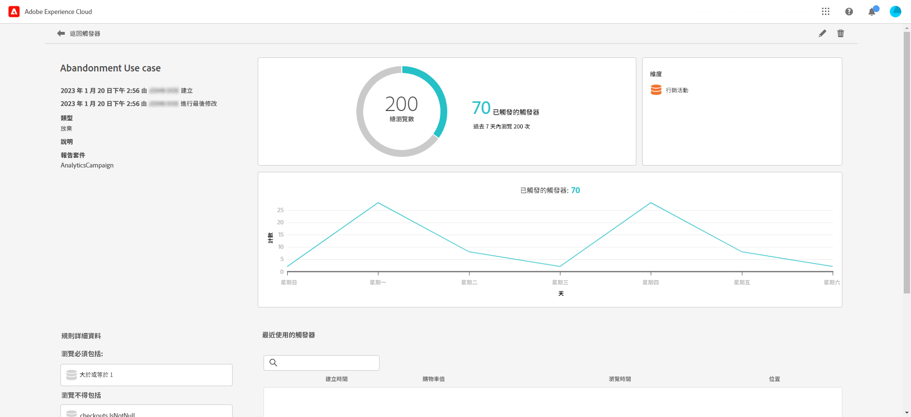

# 建立 Experience Cloud 觸發器 {#create-triggers}

>[!NOTE]
>
> Experience Cloud 觸發器的新使用者介面提供一種直覺體驗來管理消費者行為和個人化使用者體驗。若要切換回之前的介面，請按一下&#x200B;**[!UICONTROL 進入傳統模式]**&#x200B;按鈕。

建立觸發器並設定觸發器的條件。例如，您可以指定造訪期間觸發器規則的條件，例如「購物車放棄」等量度，或產品名稱等維度。符合規則時，觸發器就會執行。

1. 在 Experience Cloud 中，依序選取解決方案切換器選單和&#x200B;**[!UICONTROL 觸發器]**。

   

1. 從您的觸發器首頁，按一下&#x200B;**[!UICONTROL 建立觸發器]**，然後指定觸發器的類型。

   可以使用三種類型的觸發器：

   * **[!UICONTROL 捨棄]**：您可以建立觸發器，在訪客檢視產品但未新增任何產品至購物車時引發。

   * **[!UICONTROL 動作]**：您可以建立觸發器，在電子報註冊、電子郵件訂閱或信用卡申請 (確認) 等動作後引發。如果您是零售商，可針對註冊忠誠度計畫的訪客建立觸發器。若為媒體和娛樂產業，可針對觀看特定節目的訪客建立觸發器，而您可能會想透過意見調查給予回應。

   * **[!UICONTROL 工作階段開始和工作階段結束]**：針對工作階段開始和工作階段結束事件建立觸發器。

   

1. 為您的觸發器新增&#x200B;**[!UICONTROL 名稱]**&#x200B;和&#x200B;**[!UICONTROL 描述]**。

1. 選取用於此觸發器的 Analytics **[!UICONTROL 報表套裝]**。此設定可識別要使用的報表資料。

   [進一步瞭解報表套裝](https://experienceleague.adobe.com/docs/analytics/admin/admin-tools/manage-report-suites/c-new-report-suite/t-create-a-report-suite.html){target="_blank"}。

1. 選擇&#x200B;**[!UICONTROL 無動作後觸發]**&#x200B;有效期限。

1. 從&#x200B;**[!UICONTROL 造訪必須包括]**&#x200B;和&#x200B;**[!UICONTROL 造訪不得包括]**&#x200B;類別，您可以定義準則或您想要或不想要發生的訪客行為。您可以在條件內或條件之間指定 **And** 或 **Or** 邏輯，取決於您決定的準則。

   例如，簡單的購物車丟棄觸發器的規則可能是：

   * **[!UICONTROL 造訪必須包括]**：`Carts (metric) Is greater or equal to 1` 以購物車中至少有一件商品的訪客為目標。
   * **[!UICONTROL 造訪不得包括]**:`Checkout (metric) Exists.` 刪除購買了購物車中商品的訪客。

   

1. 按一下&#x200B;**[!UICONTROL 容器]**&#x200B;以建立和儲存定義觸發器的規則、條件或篩選器。若要讓事件同時發生，必須將事件放在相同的容器中。

   每個容器在點擊層獨立處理，這表示如果兩個容器以 **[!UICONTROL And]** 運算子結合，只有當兩個點擊都符合需求時，規則才會符合資格。

1. 從&#x200B;**[!UICONTROL 中繼資料]**&#x200B;欄位，按一下 **[!UICONTROL + 維度]** 以選擇與訪客的行為相關的特定行銷活動維度或變數。

   

1. 按一下&#x200B;**[!UICONTROL 儲存]**。

1. 從清單選取你新建立的&#x200B;**[!UICONTROL 觸發器]**&#x200B;以存取觸發器的詳細報告。

   

1. 從觸發器的詳細檢視中，您可以存取有關觸發了多少觸發器的報告。如果需要，您可以使用鉛筆圖示編輯觸發器。

   
