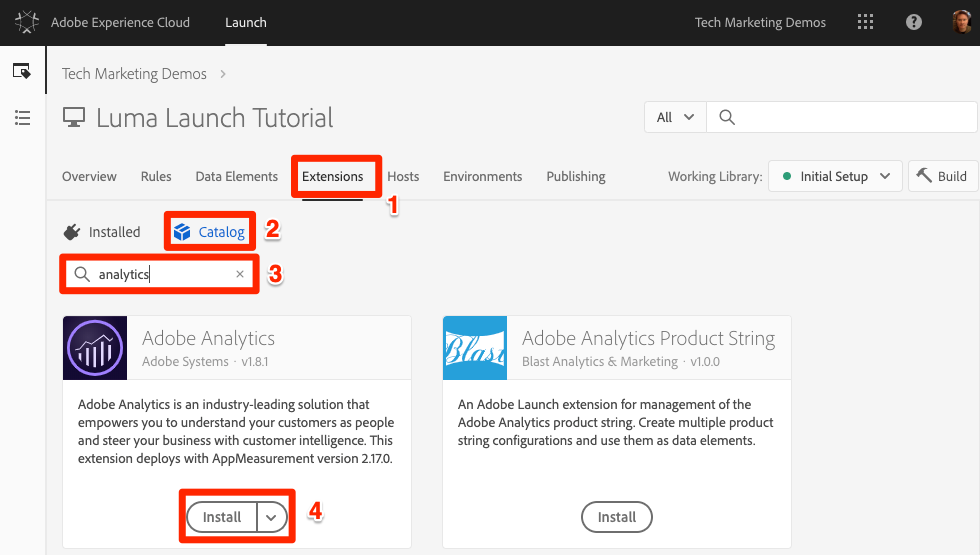
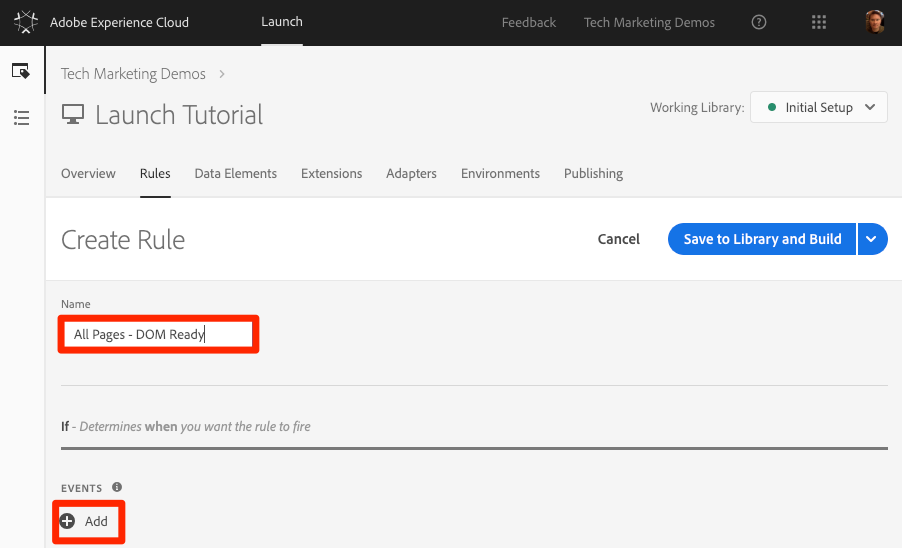
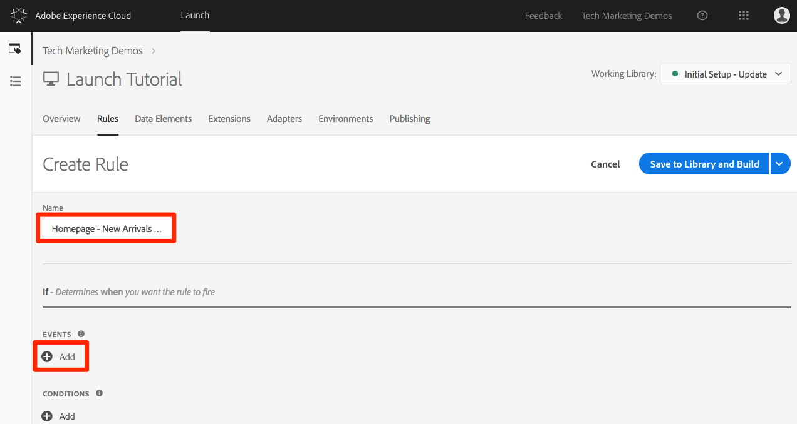

# 新增 Adobe Analytics

在本課中，您將實作 [Adobe Analytics擴充功能](https://docs.adobe.com/content/help/en/launch/using/extensions-ref/adobe-extension/analytics-extension/overview.html) ，並建立規則以傳送資料至Adobe Analytics。

[Adobe Analytics](https://docs.adobe.com/content/help/en/analytics/landing/home.html) 是領先業界的解決方案，能夠讓您從使用者觀點瞭解客戶，並掌握客戶情報來為您的企業指引方向。

## 學習目標

在本課程結束時，您將能夠:

1. 新增Adobe Analytics擴充功能
1. 使用擴充功能設定全域變數
1. 新增頁面檢視信標
1. 使用規則新增其他變數
1. 新增點擊追蹤和其他事件型信標
1. 新增Analytics外掛程式

在Launch中，Analytics可實作許多項目。 本課程並非詳盡無遺，但應提供您在網站上實施所需的主要技巧的完整概述。

## 必要條件

You should have already completed the lessons in [Configure Launch](launch.md) and [Add the Identity Service](id-service.md).

此外，您至少需要一個報表套裝ID和追蹤伺服器。 如果您沒有可用於本教學課程的測試／開發報表套裝，請建立一個。 如果您不確定如何執行此動作，請參閱[文件](https://docs.adobe.com/content/help/en/analytics/admin/manage-report-suites/new-report-suite/new-report-suite.html)。您可以從目前的實作、Adobe顧問或客戶服務代表擷取追蹤伺服器。

## 新增 Analytics 擴充功能

Analytics擴充功能包含兩個主要部分：

1. 擴充功能設定，可管理核心 AppMeasurement.js 程式庫設定，且可設定全域變數
1. 規則動作，可執行下列操作:
   1. 設定變數
   1. 清除變數
   1. 傳送Analytics信標

**若要新增Analytics擴充功能**

1. 前往「延伸 **[!UICONTROL 功能&gt;目錄」]**
1. 尋找Adobe Analytics擴充功能
1. 按一下「 **[!UICONTROL 安裝」]**

   

1. 在「 [!UICONTROL 資料庫管理&gt;報表套裝]」下，輸入您要用於每個啟動環境的報表套裝ID。 請注意，當您開始在方塊中輸入時，會看到所有報表套裝的預先填入清單。 （在本教學課程中，您可針對所有環境使用一個報表套裝，但在實際生活中，您會想使用個別的報表套裝，如下圖所示）

   

   >[!TIP] 我們建議使用「 [!UICONTROL Manage the library for me] 」（為我管理資料庫）選項作為「 [!UICONTROL Library Management] 」（資料庫管理）設定，因為這可讓資料庫更 `AppMeasurement.js` 容易保持最新狀態。

1. 在「 [!UICONTROL 一般&gt;追蹤伺服器]」下，輸入您的追蹤伺服器，例如"`tmd.sc.omtrdc.net`" Enter your SSL Tracking Server if your site supports `https://`

   

1. 在「全 [!UICONTROL 域變數」區段中]，使用您的資料元素設 [!UICONTROL 定「頁面名]`Page Name` 稱」變數。 按一下  ，以開啟模型並選擇頁面資 `Page Name` 料元素)

1. 按一 **[!UICONTROL 下「儲存至程式庫並建立」]**

   

>[!NOTE]  您可以在擴充功能設定或規則動作中設定全域變數。Be aware that when setting variables in the extension configuration, the data layer must be defined *before* the Launch embed codes.

## 傳送頁面檢視信標

現在您將建立規則以觸發Analytics信標，該信標將傳送擴充功能設定中 [!UICONTROL 設定的「頁面名稱] 」變數。

You have already created an "All Pages - Library Loaded" rule in the [Add a Data Element, a Rule and a Library](launch-data-elements-rules.md) lesson of this tutorial, which is triggered on every page when the Launch library loads. 您也 *可以對* Analytics使用此規則，但此設定需要在啟動內嵌代碼之前，先定義Analytics信標中使用的所有資料層屬性。 為了讓資料收集更具彈性，您將建立在DOM Ready上觸發的新「所有頁面」規則，以觸發Analytics信標。

**傳送頁面檢視信標**

1. 前往頂端導 **[!UICONTROL 覽的]** 「規則」區段，然後按一下「新 **[!UICONTROL 增規則」]**

   

1. Name the rule `All Pages - DOM Ready`
1. Click **[!UICONTROL Events &gt; Add]** to open the `Event Configuration` screen

   

1. 選 **[!UICONTROL 擇事件類型&gt; DOM就緒]** （請注意，規則的順序為"50"）
1. Click **[!UICONTROL Keep Changes]**
   

1. Under Actions, click the  to add a new action

   

1. 選取 **[!UICONTROL 延伸功能&gt; Adobe Analytics]**

1. 選擇 **[!UICONTROL 操作類型&gt;發送信標]**

1. 將 Tracking 保留設為 `s.t()`。Note that if you wanted to make an `s.tl()` call in a click-event rule you could do that using the Send Beacon action, as well.

1. 按一下「 **[!UICONTROL 保留變更]** 」按鈕

   

1. 按一 **[!UICONTROL 下「儲存至程式庫並建立」]**

   

### 驗證頁面檢視信標

既然您已建立規則來傳送Analytics信標，您應該可以在Experience cloud除錯程式中看到請求。

1. Open the [Luma site](https://luma.enablementadobe.com/content/luma/us/en.html) in your Chrome browser
1. 按一下「除錯程  ，以開啟 **[!UICONTROL Adobe Experience cloud除錯程式]**
1. Make sure the Debugger is mapping the Launch property to *your* Development environment, as described in the [earlier lesson](launch-switch-environments.md)

   

1. 按一下以開啟「分析」標籤
1. 展開您的報表套裝名稱，以顯示對其提出的所有請求
1. 確認請求已引發「頁面名稱」變數和值

   

>[!NOTE]  如果畫面上未顯示 Page Name，請逐步回到本頁面中的各個步驟，確認您沒有遺失任何項目。

## 使用規則新增變數

When you configured the Analytics Extension, you populated the `pageName` variable in the extension configuration. 假設在內嵌程式碼載入之前，頁面上有可供使用的值，此即為可填入其他全域變數 (例如 eVar 和 Prop) 的完善位置。

設定變數（以及事件）的更有彈性位置，是使用動作的規則 `Set Variables` 中。 規則可讓您在不同條件下設定不同的Analytics變數和事件。 For example, you could set the `prodView` only on product detail pages and the `purchase` event only on order confirmation pages. 本節將教您如何使用規則來設定變數。

### 使用案例

產品詳細資料頁面 (PDP) 是零售網站上資料收集的重點。通常，您會希望Analytics註冊產品檢視已發生，以及檢視了哪些產品。 這有助於瞭解哪些是受客戶歡迎的熱門產品。在媒體網站上，文章或視訊頁面可能會使用與本節中使用的類似追蹤技術。  When you load a Product Detail Page, you might want to put that value into a "Page Type" `eVar`, as well as set some events and the product id. 這可讓我們在分析中檢視下列內容：

1. 產品詳細資料頁面已載入幾次
1. 已檢視那些特定產品及其檢視次數
1. 其他因素 (促銷活動、搜尋等) 影響了幾個 PDP 的使用者載入

### 建立 Page Type 的資料元素

首先，您需要識別哪些頁面是「產品詳情」頁面。 您將使用「資料元素」來執行此動作。

**為頁面類型建立資料元素**

1. 按一 **[!UICONTROL 下頂端導覽中]** 「資料元素」
1. 按一 **[!UICONTROL 下新增資料元素]**

   

1. Name the data element `Page Type`
1. 選擇 **[!UICONTROL 資料元素類型&gt; javaScript變數]**
1. 使 `digitalData.page.category.type` 用 `JavaScript variable name`
1. Check the `Clean text` and `Force Lower Case` options
1. 按一 **[!UICONTROL 下「儲存至程式庫並建立」]**

   

### 建立產品ID的資料元素

接著，您將收集目前「產品詳細資料」頁面的產品ID與資料元素

**為產品ID建立資料元素**

1. 按一 **[!UICONTROL 下頂端導覽中]** 「資料元素」
1. 按一 **[!UICONTROL 下新增資料元素]**

   

1. Name the data element `Product Id`
1. 選擇 **[!UICONTROL 資料元素類型&gt; javaScript變數]**
1. 使 `digitalData.product.0.productInfo.sku` 用 `JavaScript variable name`
1. Check the `Force lowercase value` option
1. Check the `Clean text` option
1. 按一 **[!UICONTROL 下「儲存至程式庫並建立」]**

   

### 新增 Adobe Analytics Product String 擴充功能

If you are already familiar with Adobe Analytics implementations, you are probably familiar with the [products variable](https://docs.adobe.com/content/help/en/analytics/components/variables/dimensions-reports/reports-products.html). 產品變數的語法非常明確，其使用方式會因內容而異。 為協助讓產品變數在Launch中更容易填入，在Launch擴充功能市場中已建立了另外三個擴充功能！ 在本節中，您將新增由Adobe Consulting建立的擴充功能，以便用於「產品詳細資訊」頁面。

**若要新增擴充功`Adobe Analytics Product String`能**

1. 前往「擴充功 [!UICONTROL 能&gt;目錄] 」頁
1. 依Adobe諮詢服 `Adobe Analytics Product String` 務尋找擴充功能，然後按一下「安 **[!UICONTROL 裝」]**
   
1. 花點時間閱讀說明
1. 按一 **[!UICONTROL 下「儲存至程式庫並建立」]**

   

### 建立產品詳細資料頁面的規則

現在，您將使用新的資料元素和擴充功能來建立「產品詳細資料」頁面規則。 對於此功能，您將建立另一個由DOM就緒觸發的頁面載入規則。 However, you will use a condition so that it only fires on the Product Detail pages and the order setting so that it fires _before_ the rule that sends the beacon.

**若要建立「產品詳細資料」頁面規則**

1. 前往頂端導 **[!UICONTROL 覽的]** 「規則」區段，然後按一下「新 **[!UICONTROL 增規則」]**

   

1. Name the rule `Product Details - DOM Ready - 40`
1. Click **[!UICONTROL Events &gt; Add]** to open the `Event Configuration` screen

   

1. 選擇 **[!UICONTROL 事件類型&gt; DOM就緒]**
1. Set the **[!UICONTROL Order]** to 40, so that the rule will run *before* the rule containing the Analytics &gt; Send Beacon action
1. Click **[!UICONTROL Keep Changes]**
   

1. 在「 **[!UICONTROL 條件]**」下，按一下「  ，以開啟 `Condition Configuration` 畫面
   

   1. 選擇 **[!UICONTROL 條件類型&gt;值比較]**
   1. Use the data element picker, choose `Page Type` in the first field
   1. 從比 **[!UICONTROL 較運算子下拉式清單中選取]** 「包含」
   1. 在下一個欄位 `product-page` 類型中（這是從PDP上的資料層提取的頁面類型值的唯一部分）
   1. Click **[!UICONTROL Keep Changes]**

      

1. Under Actions, click the  to add a new action

   

1. 選取 **[!UICONTROL 延伸功能&gt; Adobe Analytics]**
1. 選擇 **[!UICONTROL 操作類型&gt;設定變數]**
1. 選取 **[!UICONTROL eVar1 &gt;設為]** ，然後輸入 `product detail page`
1. Set **[!UICONTROL event1]**, leaving the optional values blank
1. 在「事件」下，按一下「 **[!UICONTROL 新增其他]** 」按鈕
1. Set the **[!UICONTROL prodView]** event, leaving the optional values blank
1. Click **[!UICONTROL Keep Changes]**

   

1. Under Actions, click the  to add a new action

   

1. 選取 **[!UICONTROL 延伸功能&gt; Adobe Analytics產品字串]**
1. 選擇 **[!UICONTROL 動作類型&gt;設定s.products]**

1. 在「 **[!UICONTROL Analytics電子商務事件」區段中]** ，選取 **[!UICONTROL prodView]**

1. 在「產 **[!UICONTROL 品資料的資料層變數」區段中]** ，使用「資料元素」選取器來選擇 `Product Id` 資料元素

1. Click **[!UICONTROL Keep Changes]**

   

1. 按一 **[!UICONTROL 下「儲存至程式庫並建立」]**

   

### 驗證產品詳細資料頁面的資料

您剛建立規則，在傳送信標之前設定變數。 您現在應該可以在Experience cloud除錯程式的點擊中看到新資料。

**要驗證「產品詳細資訊」頁資料，請執行以下操作：**

1. Open the [Luma site](https://luma.enablementadobe.com/content/luma/us/en.html) in your Chrome browser
1. 導覽至任何產品詳細資訊頁面
1. 按一下「除錯程式」  ，以開啟 **[!UICONTROL 您的Adobe Experience cloud除錯程式]**
1. 按一下至「分析」標籤
1. 展開您的報表套裝
1. Notice the Product Detail Variables that are now in the debugger, namely that `eVar1` has been set to "product detail page", that the `Events` variable has been set to "event1" and "prodView", that the products variable is set with the product id of the product you are viewing, and that your Page Name is still set by the Analytics extension

   

## 傳送追蹤連結信標

頁面載入時，您通常會引發 `s.t()` 函數所引發的頁面載入信標。This automatically increments a `page view` metric for the page listed in the `pageName` variable.

不過，有時您不想在網站上增加頁面檢視次數，因為所執行的動作與頁面檢視相比「較小」（或可能只是不同）。 In this case, you will use the `s.tl()` function, which is commonly referred to as a "track link" request. 即使這作為追蹤連結要求參考，但並不必在連結點擊時觸發。It can be triggered by *any* of the events that are available to you in the Launch rule builder, including your own custom JavaScript.

在本教學課程中，您將使用 `s.tl()` 最酷的JavaScript事件（事件）觸發呼 `Enters Viewport` 叫。

### 使用案例

針對此使用案例，您會想知道人們是否在Luma首頁上向下捲動足夠多，以檢視本頁的「 *New Arrivals* 」區段。 我們公司內部對於人們是否看到該區段存在一些分歧，因此您想使用Analytics來判斷真相。

### 在啟動中建立規則

1. 前往頂端導 **[!UICONTROL 覽的]** 「規則」區段，然後按一下「新 **[!UICONTROL 增規則」]**
   
1. Name the rule `Homepage - New Arrivals enters Viewport`
1. Click **[!UICONTROL Events &gt; Add]** to open the `Event Configuration` screen

   

1. 選擇 **[!UICONTROL 事件類型&gt;進入視區]**。 這會顯示一個欄位，您需要輸入CSS選擇器，以識別頁面上在規則進入瀏覽器檢視時應觸發的項目。
1. 返回Luma的首頁，並向下捲動至「新到達」區段。
1. 以滑鼠右鍵按一下本區段中「NEW ARRIVALS」標題與項目之間的空白處，然後從右鍵功能表中選取 `Inspect`。這樣你就能接近你想要的了。
1. 就在那裡，或許就在選取的區段下方，您正在尋找具有div的項目 `class="we-productgrid aem-GridColumn aem-GridColumn--default--12"`。 找到此元素。
1. 在此元素上按一下滑鼠右鍵，然後選取「復 **[!UICONTROL 制&gt;複製選擇器」]**

   

1. 返回「啟動」，並將此值從剪貼簿貼到標示欄位中 `Elements matching the CSS selector`。
   1. 在附註中，您需自行決定如何識別CSS選擇器。 此方法有點脆弱，因為頁面上的某些變更可能會中斷此選擇器。 在Launch中使用任何CSS選擇器時，請考慮這一點。
1. Click **[!UICONTROL Keep Changes]**
   

1. 在「條件」下，按一  ，新增條件
1. 選擇 **[!UICONTROL 條件類型&gt;值比較]**
1. Use the data element picker, choose `Page Name` in the first field
1. 從比 **[!UICONTROL 較運算子下拉式清單中選取]** 「等於」
1. 在下一個欄位類 `content:we-retail:us:en` 型中（這是從資料層提取之首頁的頁面名稱——我們只希望此規則在首頁上執行）
1. Click **[!UICONTROL Keep Changes]**

   

1. Under Actions, click the  to add a new action
1. 選取 **[!UICONTROL 延伸功能&gt; Adobe Analytics]**
1. 選擇 **[!UICONTROL 操作類型&gt;設定變數]**
1. Set `eVar3` to `Home Page - New Arrivals`
1. Set `prop3` to `Home Page - New Arrivals`
1. Set the `Events` variable to `event3`
1. Click **[!UICONTROL Keep Changes]**

   

1. Under Actions, click the  to add another new action

   

1. 選取 **[!UICONTROL 延伸功能&gt; Adobe Analytics]**
1. 選擇 **[!UICONTROL 操作類型&gt;發送信標]**
1. Choose the **[!UICONTROL s.tl()]** tracking option
1. 在「連結 **[!UICONTROL 名稱]** 」欄位中輸入 `Scrolled down to New Arrivals`。 此值將放入Analytics的「自訂連結」報表中。
1. Click **[!UICONTROL Keep Changes]**

   

1. 按一 **[!UICONTROL 下「儲存至程式庫並建立」]**

   

### 驗證追蹤連結信標

現在，當您向下捲動至我們網站首頁的「新到達次數」區段時，您會想要確定此點擊已進入。 當您第一次載入首頁時，不應提出要求，但當您向下捲動並檢視區段時，點擊會以我們的新值觸發。

1. 在您的 [Chrome瀏覽器中開啟](https://luma.enablementadobe.com/content/luma/us/en.html) Luma網站，並確定您位於首頁頂端。
1. 按一下 **[!UICONTROL 除錯程式圖]** ，以開啟 [!UICONTROL 您的Adobe Experience Cloud Debugger]
1. 按一下至「分析」標籤
1. 展開您的報表套裝點擊
1. 請注意，首頁的一般頁面檢視點擊含有頁面名稱等。 （但eVar3或prop3中則無）。

   

1. 在除錯程式開啟時，在您的網站上向下捲動，直到您看到「新到達」區段
1. 再次檢視除錯程式，應該會出現另一個Analytics點擊。 此點擊應具有與您所設定的s.tl()點擊相關聯的參數，即：
   1. `LinkType = "link_o"` （這表示點擊是自訂連結點擊，而非頁面檢視點擊）
   1. `LinkName = "Scrolled down to New Arrivals"`
   1. `prop3 = "Home Page - New Arrivals"`
   1. `eVar3 = "Home Page - New Arrivals"`
   1. `Events = "event3"`

      

## 新增外掛程式

外掛程式是JavaScript程式碼的一部分，您可將其新增至實作，以執行未內建於產品中的特定函式。 外掛程式可由您、其他Adobe客戶／合作夥伴或Adobe Consulting建立。

若要實作增效模組，基本上有三個步驟：

1. 包含doPlugins函式，其中將參考外掛程式
1. 新增外掛程式的主要函式程式碼
1. 納入執行呼叫函數並設定變數等操作的程式碼。

### 讓Analytics物件可全域存取

如果您要新增doPlugins函式（如下）並使用外掛程式，則需要勾選方塊，以便Analytics實作中的Analytics "s"物件可全域使用。

1. 前往「擴充 **[!UICONTROL 功能&gt;已安裝」]**

1. 在Adobe Analytics擴充功能中，按一下「設 **[!UICONTROL 定」]**

   

1. 在「程 **[!UICONTROL 式庫管理]**」下，選取標示的方塊 `Make tracker globally accessible`。 如您在說明泡泡中所見，這會讓追蹤器在window.s下全域範圍，這在您在客戶JavaScript中參照時很重要。

### 包含doPlugins函式

若要新增外掛程式，您必須新增名為doPlugins的函式。 此函式預設不會新增，但新增後會由AppMeasurement程式庫處理，並在點擊傳入Adobe Analytics時呼叫為最後一個。 因此，您可以使用此函數執行一些 JavaScript，設定比較容易用這種方式設定的變數。

1. While still in the Analytics extension, scroll down and expand the section titled `Configure Tracker Using Custom Code.`
1. Click **[!UICONTROL Open Editor]**
1. 將下列程式碼貼到程式碼編輯器中:

   ```javascript
   /* Plugin Config */
   s.usePlugins=true
   s.doPlugins=function(s) {
   /* Add calls to plugins here */
   }
   ```

1. 保持此窗口開啟以進行下一步

### 為外掛程式新增函數程式碼

您實際上會在此程式碼中呼叫兩個外掛程式，但其中一個內建在AppMeasurement程式庫中，因此您不需要新增要呼叫的函式。 但是，對於第二個，您也需要新增函式程式碼。 此函式稱為getValOnce()。

### getValOnce()外掛程式

此外掛程式的目的，在於當訪客重新整理頁面或使用瀏覽器的上一頁按鈕返回設定值的頁面時，避免在程式碼中錯誤複製值。 在本課中，您將使用它來防止重 `clickthrough` 復事件。

此外掛程式的程式碼可在 [Analytics 文件](https://docs.adobe.com/content/help/en/analytics/implementation/javascript-implementation/plugins/getvalonce.html)中取得，也會呈現於此處，以方便您複製貼上。

1. 複製下列程式碼

   ```javascript
   /*
   * Plugin: getValOnce_v1.11
   */
   s.getValOnce=new Function("v","c","e","t",""
   +"var s=this,a=new Date,v=v?v:'',c=c?c:'s_gvo',e=e?e:0,i=t=='m'?6000"
   +"0:86400000,k=s.c_r(c);if(v){a.setTime(a.getTime()+e*i);s.c_w(c,v,e"
   +"==0?0:a);}return v==k?'':v");
   ```

1. 將它貼入Analytics擴充功能的程式碼視窗（如果您尚未開啟，請依照上一步重新開啟），完 **全位於** doPlugins函式下方（不在其中）。

   

您現在可以從doPlugins中呼叫此外掛程式。

### 從 doPlugins 中呼叫外掛程式

現在程式碼已存在且可被參考，您可以在doPlugins函式中呼叫外掛程式。

首先，您會呼叫已併入AppMeasurement程式庫的外掛程式，也稱為「公用程式」。 It is referred to as `s.Util.getQueryParam`, because it is part of the s object, is a built-in utility, and will grab values (based on a parameter) from the query string in the URL.

1. 複製下列程式碼:

   ```javascript
   s.campaign = s.Util.getQueryParam("cid");
   ```

1. 將它貼入doPlugins函式。 This will look for a parameter called `cid` in the current page URL and place it into the s.campaign variable.
1. 現在，複製下列程式碼並將它貼在getQueryParam呼叫的正下方，以呼叫getValOnce函式：

   ```javascript
   s.campaign=s.getValOnce(s.campaign,'s_cmp',30);
   ```

   此程式碼將確保30天內不會連續多次傳送相同值（如需依您的需求自訂此程式碼的方式，請參閱檔案）。

   

1. 儲存代碼視窗
1. 按一 **[!UICONTROL 下「儲存至程式庫並建立」]**

   

### 驗證外掛程式

現在，您可以確定增效模組正在運作。

**若要驗證外掛程式**

1. Open the [Luma site](https://luma.enablementadobe.com/content/luma/us/en.html) in your Chrome browser
1. 按一下「除錯程  ，以開啟 **[!UICONTROL Adobe Experience cloud除錯程式]**
1. 按一下至「分析」標籤
1. 展開您的報表套裝
1. 請注意，Analytics點擊沒有促銷活動變數
1. Leaving the Debugger open, go back to the Luma site and add  `?cid=1234` to the URL and hit Enter to refresh the page with that query string included

   

1. Check the Debugger and confirm that there is a second Analytics request with a Campaign variable set to `1234`

   

1. 返回並再次刷新Luma頁，查詢字串仍在URL中
1. 在偵錯器中檢查下一個點擊，促銷活動變數不應存在，因為getValOnce外掛程式已確保不會複製它，而且看起來就像是其他人從促銷活動追蹤程式碼傳入。 ****

   

1. BONUS: You can test this over and over by changing the value of the `cid` parameter in the query string. The Campaign variable should only be there if it is the **first** time you run the page with the value. If you are not seeing the Campaign value in the debugger, simply change the value of the `cid` in the query string of the URL, hit enter, and you should see it again in the debugger.

   >[!NOTE] 從URL的查詢字串擷取參數實際上有幾種不同的方法，包括在Analytics擴充功能設定中。 但是，在這些其他非插件選項中，它們無法像您在此處使用getValOnce插件那樣停止不必要的複製。 這是作者最愛的方法，但您應決定哪種方法最適合您和您的需求。

幹得好！ 您已完成Analytics課程。 當然，您還可以做許多其他事來增強Analytics實作，但希望這能提供您一些解決其他需求所需的核心技能。

[下一個「新增Adobe Audience Manager」&gt;](audience-manager.md)
