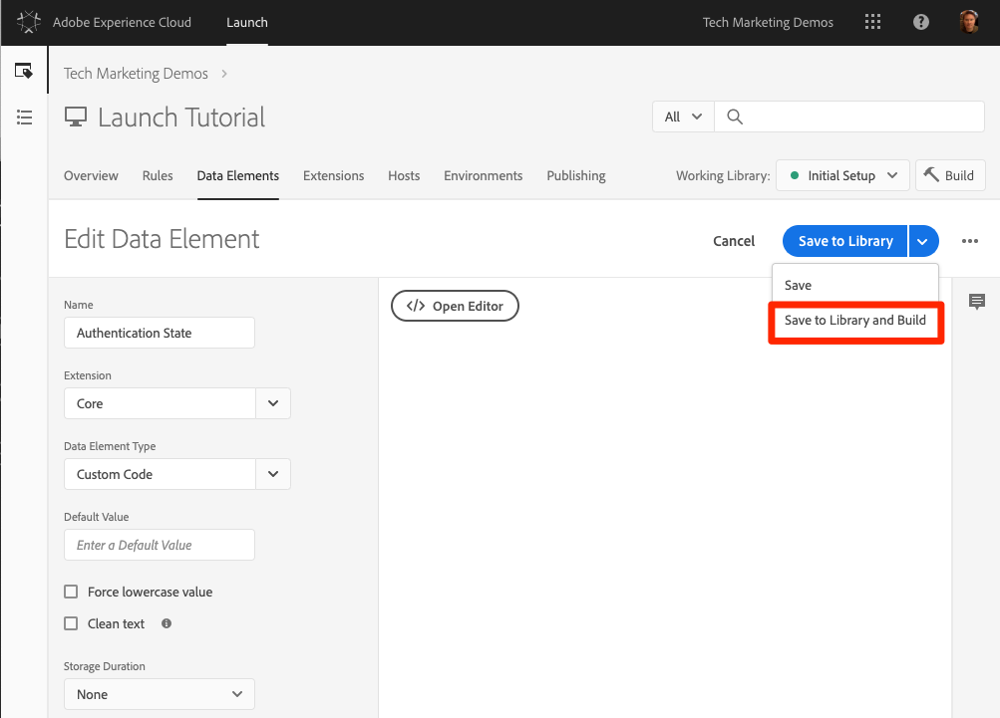
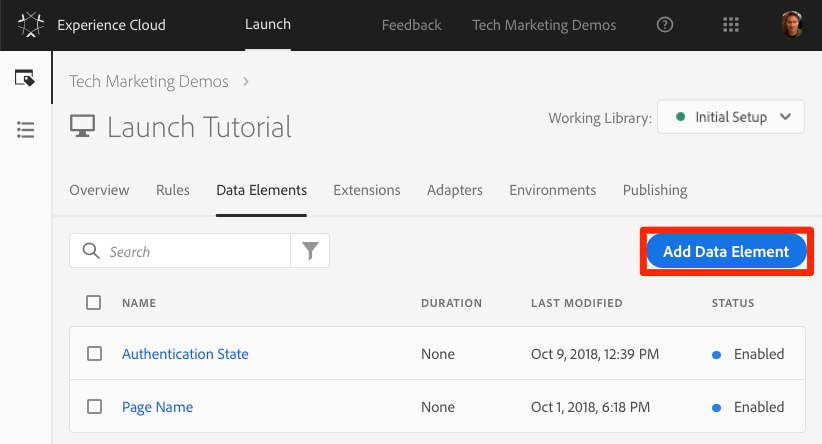
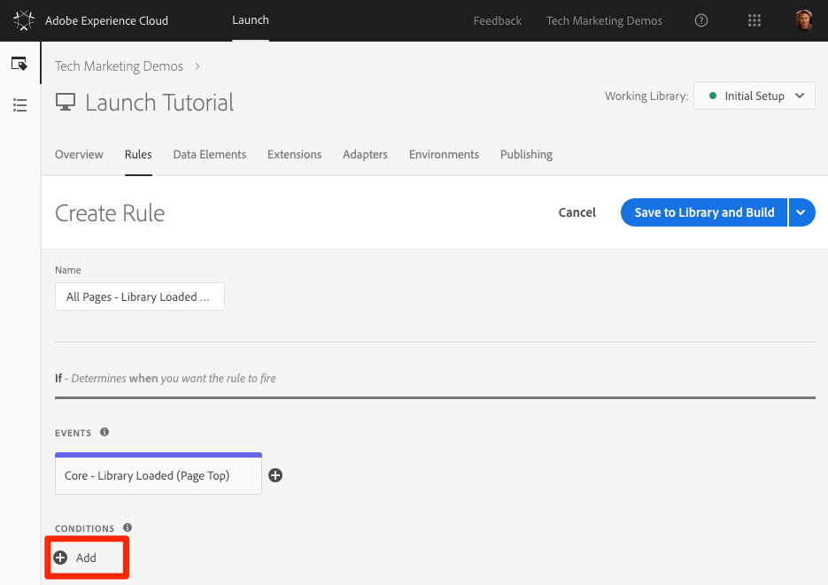
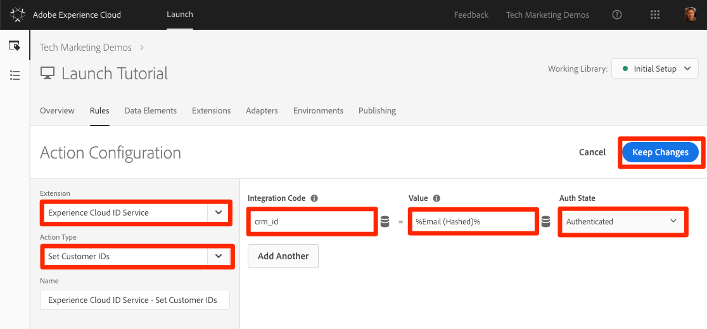

# 新增Adobe Experience Platform Identity Service

本課將引導您完成實作 [Adobe Experience Platform Identity Service擴充功能及傳送客戶ID](https://docs.adobe.com/content/help/en/launch/using/extensions-ref/adobe-extension/id-service-extension/overview.html) 所需的步驟。

Adobe [Experience Platform Identity Service](https://docs.adobe.com/content/help/en/id-service/using/home.html) 會在所有Adobe解決方案中設定共同的訪客ID，以強化Experience cloud功能，例如解決方案之間的觀眾共用。  您也可以將您自己的客戶ID傳送至服務，以啟用跨裝置鎖定並整合您的客戶關係管理(CRM)系統。

## 學習目標

在本課程結束時，您將能夠:

* 新增Identity Service擴充功能
* 建立資料元素以收集客戶ID
* 建立使用「設定客戶ID」動作來傳送客戶ID至Adobe的規則
* 使用規則排序功能，區隔相同事件上引發的規則

## 必要條件

You should have already completed the lessons in the [Configure Launch](launch.md) section.

## 新增Identity Service Extension

由於這是您要新增的第一個擴充功能，因此以下是擴充功能的快速概觀。 擴充功能是Launch的核心功能之一。 擴充功能是由Adobe、Adobe合作夥伴或任何Adobe客戶所建立的整合，可為您可部署至網站的標籤增加新的、無限的選項。 如果您認為Launch是作業系統，擴充功能就是您安裝的應用程式，讓Launch能夠完成您需要的工作。

**要添加Identity Service Extension**

1. In the top navigation, click **[!UICONTROL Extensions]**

1. 按一 **[!UICONTROL 下「目錄]** 」，前往「擴充功能目錄」頁面

   

1. 請注意目錄中提供的擴充功能

1. 在頂端的篩選器中，輸入"id"以篩選目錄

1. 在Adobe Experience Platform Identity service的資訊卡上，按一下「安 **[!UICONTROL 裝」]**

   

1. 請注意，您的Experience cloud組織ID已自動偵測到。

1. 保留所有預設設定，然後按一下「 **[!UICONTROL 儲存至資料庫並建立」]**

   

>[!NOTE] 每個Identity service擴充功能版本都隨附特定版本的VisitorAPI.js，並在擴充功能說明中注明。 您可以更新Identity service延伸模組，以更新VisitorAPI.js版本。

### 驗證擴充功能

Identity Service擴充功能是少數幾個不需使用規則動作即可提出要求的啟動擴充功能之一。 擴充功能會在第一次造訪網站時載入第一頁時，自動向Identity Service提出要求。 在請求ID後，它會儲存在以"AMCV_"開頭的第一方Cookie中。

**要驗證Identity Service擴展**

1. Open the [Luma site](https://luma.enablementadobe.com/content/luma/us/en.html)

1. Make sure the Debugger is mapping the Launch property to *your* Development environment, as described in the [earlier lesson](launch-switch-environments.md).

1. 在除錯程式的「摘要」標籤上，「啟動」區段應指出Adobe Experience Platform Identity Service擴充功能已實作。

1. 此外，在「摘要」標籤上，「身分服務」區段應填入與您在「啟動」介面的擴充功能設定畫面上相同的組織ID:

   

1. 擷取訪客ID的初始要求可能會出現在除錯程式的「身分服務」標籤中。 不過，它可能已經被要求了，因此，如果你看不到它，就不用擔心：
   

1. 在擷取 Visitor ID 的初始要求之後，ID 會儲存在名稱開頭為 `AMCV_` 的 Cookie 中。您可以執行下列操作，確認是否已設定 Cookie:
   1. 開啟您瀏覽器的開發人員工具
   1. Go to the `Application` tab
   1. Expand `Cookies` on the left side
   1. Click on the domain `https://luma.enablementadobe.com`
   1. 尋找右側的AMCV_ Cookie。 您可能會看到數個Luma網站已使用其硬式編碼Launch屬性載入Luma網站，並映射至您自己的網站。
      

完成了！您已新增第一個擴充功能！ 有關Identity service配置選項的詳細資訊，請參 [閱文檔](https://docs.adobe.com/content/help/en/id-service/using/id-service-api/configurations/function-vars.html)。

## 傳送客戶ID

接著，您將傳送 [客戶ID](https://docs.adobe.com/content/help/en/id-service/using/reference/authenticated-state.html) 至Identity Service。 This will allow you to [integrate your CRM](https://docs.adobe.com/content/help/en/core-services/interface/customer-attributes/attributes.html) with the Experience Cloud as well as track visitors across devices.

In the earlier lesson, [Add Data Elements, Rules, and Libraries](launch-data-elements-rules.md) you created a data element and used it in a rule. 現在，當訪客經過驗證時，您會使用這些相同的技巧來傳送客戶ID。

### 建立客戶 ID 的資料元素

首先，請建立兩個資料元素:

1. `Authentication State`—擷取訪客是否登入
1. `Email (Hashed)`—從資料層捕獲散列版本的電子郵件地址（用作客戶ID）

**為驗證狀態建立資料元素**

1. 按一 **[!UICONTROL 下頂端導覽中]** 「資料元素」
1. 按一下「 **[!UICONTROL 新增資料元素]** 」按鈕

   

1. Name the data element `Authentication State`
1. 對於「資 **[!UICONTROL 料元素類型]**」，選 **[!UICONTROL 取「自訂代碼」]**
1. 按一下「開 **[!UICONTROL 啟編輯器]** 」按鈕

   

1. 在「編 [!UICONTROL 輯代碼] 」窗口中，使用以下代碼根據Luma站點資料層中的屬性返回「已登錄」或「已登出」的值：

   ```javascript
   if (digitalData.user[0].profile[0].attributes.loggedIn)
       return "logged in"
   else
       return "logged out"
   ```

1. Click **[!UICONTROL Save]** to save the custom code

   

1. 將所有其他設定保留為其預設值
1. 按一 **[!UICONTROL 下「儲存至資料庫並建立]** 」，儲存資料元素並返回資料元素頁面

   

透過瞭解使用者的驗證狀態，您就知道何時應在頁面上存在客戶ID以傳送至Identity Service。 下一步是為客戶ID本身建立資料元素。 在Luma示範網站上，您將使用訪客電子郵件地址的雜湊版本。

**若要新增雜湊電子郵件的資料元素**

1. 按一下「 **[!UICONTROL 新增資料元素]** 」按鈕

   

1. Name the data element `Email (Hashed)`
1. 對於「資 **[!UICONTROL 料元素類型]**」，選 **[!UICONTROL 取JavaScript變數]**
1. 作為 **[!UICONTROL JavaScript變數名稱]**，請使用下列指向Luma網站資料層中變數的指標： `digitalData.user.0.profile.0.attributes.username`
1. 將所有其他設定保留為其預設值
1. 按一 **[!UICONTROL 下「儲存至程式庫並建立]** 」以儲存資料元素

   

### 新增規則以傳送客戶 ID

Adobe Experience Platform Identity service會使用名為「設定客戶ID」的動作，在規則中傳遞客戶ID。您現在將建立規則，在訪客經過驗證時觸發此動作。

**若要建立規則以傳送客戶ID**

1. In the top navigation, click **[!UICONTROL Rules]**
1. 按一 **[!UICONTROL 下「新增規則]** 」以開啟「規則產生器」

   

1. Name the rule `All Pages - Library Loaded - Authenticated - 10`

   >[!TIP] 此命名慣例表示當使用者經過驗證時，您會在所有頁面頂端觸發此規則，且其順序為"10"。 使用類似的命名慣例（而非為動作中觸發的解決方案命名）可讓您將實作所需的規則總數降到最低。

1. Under **[!UICONTROL Events]** click **[!UICONTROL Add]**

   

   1. For the **[!UICONTROL Event Type]** select **[!UICONTROL Library Loaded (Page Top)]**
   1. For the  **[!UICONTROL Order]** enter `10`. Order 會控制相同事件所觸發的規則順序。順序較低的規則會在順序較高的規則之前觸發。 In this case, you want to set the customer ID before you fire the Target request, which you will do in the next lesson with a rule with an order of `50` .
   1. 按一下「 **[!UICONTROL 保留變更]** 」按鈕，返回規則產生器
   

1. 在「條 **[!UICONTROL 件」下]** ，按一 **[!UICONTROL 下「新增」]**

   

   1. 對於條件 **[!UICONTROL 類型]** ，選擇 **[!UICONTROL 值比較]**
   1. Click the  icon to open the Data Element modal

      

   1. 在「資料元素模式」中，按一下「驗 **[!UICONTROL 證狀態]** 」，然後按一 **[!UICONTROL 下「選取]**

      

1. Make sure `Equals` is the operator
1. 在文字欄位中鍵入「logged in」，當資料元素「驗證狀態」的值為「logged in」時，就會觸發規則

1. Click **[!UICONTROL Keep Changes]**

   

1. 在「動 **[!UICONTROL 作」下]** ，按一 **[!UICONTROL 下「新增」]**

   

   1. 若是 **[!UICONTROL Extension]** ，請選 **[!UICONTROL 擇Adobe Experience Platform Identity Service]**
   1. 對於「活 **[!UICONTROL 動類型]** 」，請 **[!UICONTROL 選擇「設定客戶ID」]**
   1. 對於整 **[!UICONTROL 合代碼]** , `crm_id`
   1. 對於「 **[!UICONTROL 值]** 」，請輸入開啟「資料元素」選擇器模型並選擇 `Email (Hashed)`
   1. 對於驗 **[!UICONTROL 證狀態]** ，選 **[!UICONTROL 擇]**
   1. Click the **[!UICONTROL Keep Changes]** button to save the action and return to the Rule Builder

      

1. 按一下「 **[!UICONTROL 儲存至資料庫並建立]** 」按鈕以儲存規則

   

您現在已建立規則，在訪客經過驗證時，會將客戶ID `crm_id` 作為變數傳送。 由於您指定「順序」 `10` 為此規則，因此在您在「新增資料元素、規則和程式庫」課程中建立的規則之前，將會觸發該規則，此課程的預設「順序」值為 `All Pages - Library Loaded`[](launch-data-elements-rules.md)`50`。

### 驗證客戶ID

若要驗證您的作品，您將登入Luma網站以確認新規則的行為。

**要登錄Luma站點**

1. Open the [Luma site](https://luma.enablementadobe.com/content/luma/us/en.html)

1. Make sure the Debugger is mapping the Launch property to *your* Development environment, as described in the [earlier lesson](launch-switch-environments.md)

   

1. 按一 **[!UICONTROL 下]** Luma網站右上角的LOGIN連結

   

1. 輸入 `test@adobe.com` 為用戶名
1. 輸入 `test` 為密碼
1. 按一下「 **[!UICONTROL LOGIN]** （登錄）」按鈕

   

1. 返回首頁

現在，請確認客戶ID是使用除錯程式副檔名傳送至服務。

**驗證Identity service是否正在傳遞客戶ID**

1. 確保Luma站點的頁籤處於焦點
1. 在除錯程式中，前往「Adobe Experience Platform Identity Service」標籤
1. 展開您的組織ID
1. Click on the cell with the `Customer ID - crm_id` value
1. In the modal, note the customer id value and that the `AUTHENTICATED` state is reflected:

   

1. 請注意，您可以檢視Luma頁面的原始碼並查看username屬性，以確認雜湊的電子郵件值。 它應符合您在除錯程式中看到的值：

   

### 其他驗證提示

Launch也提供豐富的主控台記錄功能。 若要開啟，請移至除錯程式中的「 **[!UICONTROL 工具]** 」標籤，然後開啟「啟動控制台記錄」 **[!UICONTROL 切換]** 。


這會在瀏覽器主控台和除錯程式的「記錄檔」索引標籤中開啟主控台記錄檔。 您應看到您目前建立的所有規則的記錄！ 請注意，新的記錄項目會新增至清單頂端，因此您的規則「所有頁面——載入程式庫——已驗證- 10」應會在「所有頁面——載入程式庫」規則之前觸發，並顯示在除錯程式的主控台記錄中：


[下一個「新增Adobe Target」&gt;](target.md)
