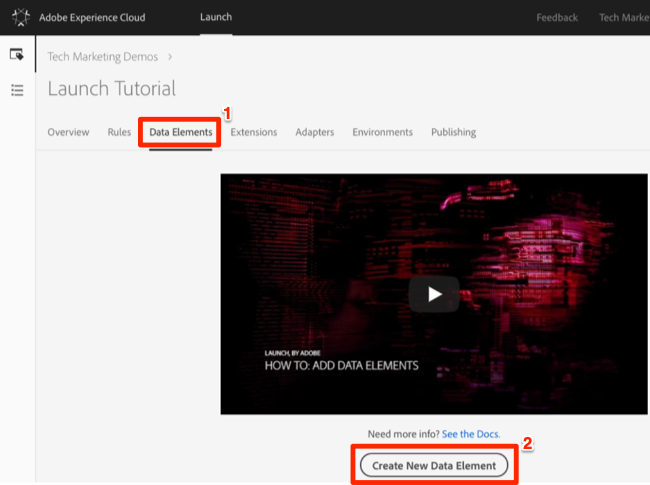

# 新增資料元素、規則和程式庫

在本課中，您將建立您的第一個資料元素、規則和資料庫。

資料元素和規則是Launch的基本建立區塊。 Data Elements會儲存您要傳送至行銷和廣告解決方案的屬性，而規則會在適當的條件下，將請求觸發給這些解決方案。  程式庫是載入頁面上以執行所有工作的JavaScript檔案。 在本課中，您將使用這三種工具，讓我們的範例頁面有所作為。

## 學習目標

在本課程結束時，您將能夠:

* 建立資料元素
* 建立規則
* 建立程式庫
* 新增變更至程式庫
* 驗證您的程式庫是否載入網頁瀏覽器
* 使用「工作庫」功能提高工作效率

## 建立頁面名稱的資料元素

資料元素是Launch的資料層版本。 他們可儲存您自己資料層物件、Cookie、本機儲存物件、查詢字串參數、頁面元素、中繼標籤等的值。 在本練習中，您將建立「頁面名稱」的資料元素，您稍後會在Target和Analytics實作中使用該元素。

**若要建立資料元素**

1. 在頂端導覽中，按一下「資 **[!UICONTROL 料元素」]**

1. 由於您尚未在此屬性中建立任何資料元素，因此會出現簡短的視訊，內含有關此主題的其他資訊。 如有需要，請觀看此影片。

1. Click the **[!UICONTROL Create New Data Element]** button:

   

1. Name the data element, e.g. `Page Name`

1. Use the [!UICONTROL JavaScript Variable] Data Element type to point to a value in your sample page's data layer: `digitalData.page.pageInfo.pageName`

1. Use "`not available`" as the [!UICONTROL Default Value]. The [!UICONTROL Default Value] tells Launch what value to use for the data element if your JavaScript Variable specified above is not found.

1. Check the boxes for **[!UICONTROL Force lowercase value]** and **[!UICONTROL Clean text]** to standardize the case and remove extraneous spaces

1. 保留 **[!UICONTROL 「無]** 」作為「存 **[!UICONTROL 儲持續時間]** 」設定，因為此值通常在每個頁面上都不同

1. 按一下「 **[!UICONTROL 儲存]** 」按鈕以儲存資料元素

   。

>[!NOTE]**** DTM遷移程式：新的資料元素類型已新增至Launch，而DTM中不存在。 其中一些新的資料元素類型包括本機儲存、工作階段儲存、頁面資訊和隨機數字
<!-- -->
>[!NOTE]資料元素功 _能可透過擴充功能擴充_。 例如，ContextHub擴充功能可讓您使用擴充功能新增資料元素。

## 建立規則

接下來，您將在簡單規則中使用此資料元素。 規則是Launch中最強大的功能之一，可讓您指定訪客與您網站互動時應該發生的事。 當符合規則中概述的標準時，規則會觸發您指定的動作。

您即將建立規則，將「頁面名稱」資料元素值輸出至瀏覽器主控台。

**若要建立規則**

1. In the top navigation, click **[!UICONTROL Rules]**

1. 由於您尚未在此屬性中建立任何規則，因此會出現簡短的影片，其中包含主題的其他資訊。 如有需要，請觀看此影片。

1. Click the **[!UICONTROL Create New Rule]** button:

   

1. Name the Rule `All Pages - Library Loaded`. 此命名慣例會指出規則將在何處及何時觸發，讓您更容易在Launch屬性成熟時識別和重複使用。

1. 在「事件」底下，按一下&#x200B;**[!UICONTROL 「新增」]**。「事件」會告訴「啟動」規則何時應觸發，並可能有許多事項，包括頁面載入、點按、自訂JavaScript事件等。

   

   1. 以「事件類型」形式選取&#x200B;**[!UICONTROL 「載入的程式庫」(頁面頂端)]**。請注意，當您選取「事件類型」時，Launch會使用您的選取項目預先填入事件的名稱。 另請注意，事件的預設順序為50。 排序是Launch的強大功能，當您有多個規則由相同事件觸發時，可讓您精確控制動作順序。 您將在教學課程的稍後部分使用此功能。

   1. 按一下「 **[!UICONTROL 保留變更]** 」按鈕
   

1. 由於此規則應在所有頁面上觸發，請將「條 **[!UICONTROL 件]** 」留空。 如果開啟「條件」強制回應，您會看到條件可以根據各種選項新增限制和排除項目，包括 URL、資料元素值、日期範圍等。

1. Under Actions, click **[!UICONTROL Add]**

1. 選擇「 **[!UICONTROL 動作類型」&gt;「自訂代碼]**」，此時此選項是唯一的選項。 在稍後的教學課程中，當您新增擴充功能時，畫面就會顯示更多選項。

1. 選擇 **[!UICONTROL &lt;/&gt; 「開啟編輯器]** 」以開啟代碼編輯器

   

1. 將下列項目新增至程式碼編輯器。 此程式碼會將「頁面名稱」資料元素的值輸出至瀏覽器主控台，以便您確認其運作：

   ```javascript
   console.log('The page name is '+_satellite.getVar('Page Name'));
   ```

1. 儲存程式碼編輯器

   

1. On the Action configuration screen click **[!UICONTROL Keep Changes]**

1. Click **[!UICONTROL Save]** to save the rule

>[!NOTE]**** DTM遷移程式：在Launch中，必須有規則才能觸發大部分的行銷像素。 例如，若要觸發Adobe Analytics信標，您必須使用規則指示Launch執行此動作。
>
> 規則產生器已在Launch中大幅重新設計並重建。
> 主要變更包括:
>
> * 只有一個規則建立器。DTM規則類型（例如「頁面底部」、「按一下」和「直接呼叫」）都只是規則產生器中的事件類型。 需要變更觸發條件時 (例如從 DOM 就緒事件變更為自訂事件)，此功能可方便您輕鬆更新規則。
> * 有新的「自訂代碼」事件類型
> * 延伸功能可將新事件類型新增至規則建立器。例如，Target 延伸功能最終可能會為其 [at.js 自訂事件](https://docs.adobe.com/content/help/en/target/using/implement-target/client-side/functions-overview/atjs-custom-events.html)新增內建支援，因此不需要藉由自訂程式碼來使用此功能。
> * 擴充功能可將新動作新增至規則產生器，取代對自訂程式碼的依賴，以減少問題。 在本教學課程中，您將會使用許多這些擴充功能動作。
> * 需使用規則才能引發若與大多數行銷工具相關聯的請求。這需要調整心態，尤其是設定客戶ID、引發Analytics信標和引發Target要求等。


## 將變更儲存至資料庫

在啟動介面中設定擴充功能、資料元素和規則的集合後，您必須將這些功能和邏輯封裝成一組JavaScript程式碼，您可以將它們部署在網站上，如此當訪客造訪網站時，行銷標籤就會觸發。 程式庫是一組將執行此動作的JavaScript程式碼。

在之前的課程中，您在範例頁面上實作了開發環境的內程式碼。當您載入範例頁面時，內嵌程式碼URL會傳回404錯誤，因為尚未建立啟動程式庫並指派給環境。 現在，您會將新的資料元素和規則放在資料庫中，讓範例頁面有所作為。

**若要新增及建立資料庫**

1. Go to the [!UICONTROL Publishing] tab

1. Click **[!UICONTROL Add New Library]**

   

1. 將程式庫命名為「初始設定」

1. 選擇 **[!UICONTROL 環境&gt;開發]**

1. Click **[!UICONTROL Add All Changed Resources]**

   

1. 請注意，按一下「 **[!UICONTROL 新增所有變更的資源]** 」啟動後，會摘要您剛才所做的變更。

1. Click **[!UICONTROL Save &amp; Build for Development]**

   

稍後，狀態點會變成綠色，表示程式庫已成功建立。


## 驗證您的作品

現在驗證您的規則是否如預期般運作。

重新載入範例頁面。如果您查看「開發人員工具-&gt;網路」標籤，您現在應該會看到啟動程式庫的200回應！


如果您查看「開發人員工具-&gt;主控台」，應該會看到「頁面名稱為首頁」文字


恭喜您，您建立了您的第一個資料元素和規則，並建立了您的第一個啟動程式庫！

## 使用工作庫功能

當您在Launch中進行許多變更時，每次想要查看結果時，都不方便進入「發佈」索引標籤、新增變更並建立程式庫。  現在您已建立「初始設定」程式庫，您可以使用稱為「工作程式庫」的功能，在單一步驟中快速儲存變更並重建程式庫。

對「所有頁面——已載入程式庫」規則進行小幅變更。 在頂端導覽中，按一 **[!UICONTROL 下「規則]** 」，然後按一下 `All Pages - Library Loaded` 規則以開啟它。


在頁面 `Edit Rule` 上，按一下「工 ***[!UICONTROL 作程式庫]*** 」下拉式清單，然後選取您 `Initial Setup` 的程式庫。


選取程式庫後，您應會看到「儲存」按鈕現 **[!UICONTROL 在預設為「儲]** 存至程式庫」和「建立」 ****。 當您在Launch中進行變更時，您可以使用這個選項，直接將變更自動新增至您的工作程式庫並重建。

測試一下。 開啟「自訂代碼」動作，只要在「頁面名稱為」文字後加上冒號，如此整個代碼區塊就會顯示：

```javascript
console.log('The page name is: '+_satellite.getVar('Page Name'));
```

儲存程式碼、保留動作中的變更，現在按一下「儲存至程 **[!UICONTROL 式庫並建立]** 」按鈕。


請稍候，直到綠色點重新出現在「工作庫」( [!UICONTROL Working Library] )下拉式清單旁。 現在，重新載入範例頁面，您應該會在主控台訊息中看到您的變更（您可能需要清除瀏覽器快取並重新載入，才能看到頁面的變更）:


這是一種更快速的工作方式，您將在教學課程的其餘部分使用此方法。

[下一個「使用Experience cloud除錯程式切換環境」&gt;](launch-switch-environments.md)
