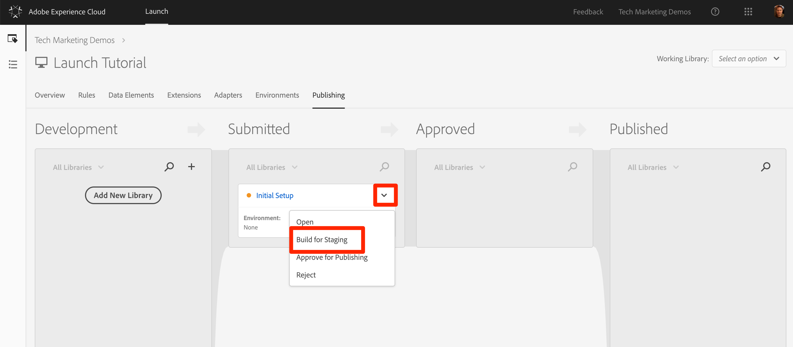
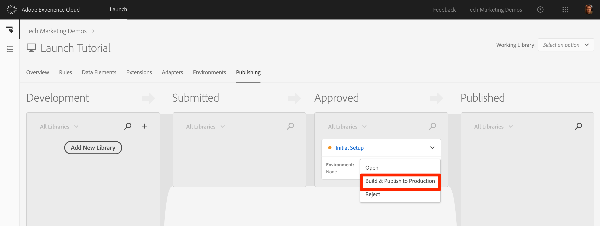

# 發佈您的啟動屬性

現在，您已在您的開發環境中實作了一些Adobe Experience cloud的主要解決方案，您該學習發佈工作流程了。

## 學習目標

在本課程結束時，您將能夠:

1. 將開發程式庫發佈到測試環境
1. 使用除錯程式將測試程式庫對應至您的生產網站
1. 將測試程式庫發佈到生產環境

## 發佈到測試環境

現在您已在開發環境中建立並驗證您的程式庫，是時候將它發佈至測試版了。

1. Go to the **[!UICONTROL Publishing]** page

1. 開啟您資料庫旁的下拉式清單，並選取「 **[!UICONTROL 送出以供核准」]**

   

1. 在對話方 **[!UICONTROL 塊中]** ，按一下「提交」按鈕：

   

1. 您的資料庫現在會以未建置的 [!UICONTROL 狀態] ，出現在「已提交」欄中：

1. 開啟下拉式清單，然後選 **[!UICONTROL 取「階段建置」]**:

   

1. 綠點圖示顯示之後，即可在測試環境中預覽程式庫。

在實際案例中，此程序的下一步通常是讓 QA 團隊在測試程式庫中驗證變更。他們可以使用除錯程式來執行此動作。

**驗證測試庫中的更改**

1. 在您的Launch屬性中，開啟「環 [!UICONTROL 境] 」頁

1. 在「 [!UICONTROL 測試] 」列中，按一下「安裝」圖示  ，以開啟模式

   

1. 按一下「複製」圖  」圖示，將內嵌代碼複製到剪貼簿

1. Click **[!UICONTROL Close]** to close the modal

   

1. Open the [Luma demo site](https://luma.enablementadobe.com/content/luma/us/en.html) in your Chrome browser

1. 按一下「 [Debugger圖示」圖示](https://chrome.google.com/webstore/detail/adobe-experience-cloud-de/ocdmogmohccmeicdhlhhgepeaijenapj) ，開啟 

   

1. 前往「工具」標籤

1. 按一 **** 下「Adobe Launch &gt;動態插入啟動&gt;內嵌代碼」按鈕，以開啟文字輸入欄位（它目前可能有您的開發內嵌代碼的URL）:

   

1. 貼上剪貼簿中的「測試內嵌」代碼

1. 按一下磁碟圖示以儲存

   

1. 重新載入並勾選除錯程式的「摘要」標籤。 在「啟動」區段下，您現在應會看到您的「測試屬性」已實作，並顯示您的屬性名稱(例如「啟動教學課程」或您為屬性命名的任何內容)!

   

在現實中，一旦您的QA團隊通過查看測試環境中的更改而簽約後，就應該發佈到生產環境。

## 發佈到生產環境

1. Go to the [!UICONTROL Publishing] page

1. 從下拉式清單中，按一下「 **[!UICONTROL 核准發佈]**:

   

1. 在對話方 **[!UICONTROL 塊中]** ，按一下「核准」按鈕：

   

1. 程式庫現在會以未建立狀態( [!UICONTROL 黃色圓點] )出現在「已核准」欄中：

1. 開啟下拉式清單並選 **[!UICONTROL 取**建立並發佈至生產]**:

   

1. 在對話 **[!UICONTROL 方塊中]** ，按一下「發佈」:

   

1. 程式庫現在會出現在「已發 [!UICONTROL 布」欄] :

   

就這樣！ 您已完成教學課程，並在Launch！中發佈了您的第一個屬性！