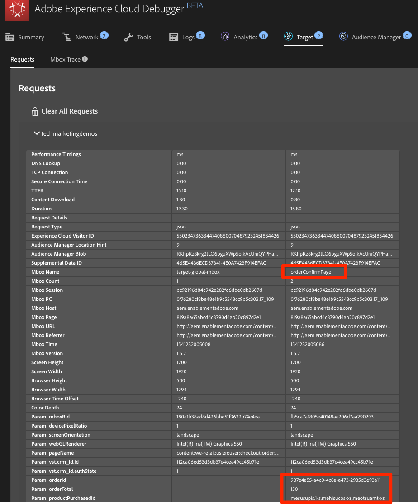

# 新增 Adobe Target

在本課中，我們將實作具有頁 [面載入要求](https://docs.adobe.com/content/help/en/launch/using/extensions-ref/adobe-extension/target-extension/overview.html) 和自訂參數的Adobe Target擴充功能。

[Adobe Target](https://docs.adobe.com/content/help/en/target/using/target-home.html) 是Adobe Marketing cloud解決方案，提供您量身打造和個人化客戶體驗所需的一切，讓您的網站和行動網站、應用程式、社交媒體和其他數位通道獲得最大收益。

## 學習目標

在本課程結束時，您將能夠:

* 新增預先隱藏的程式碼片段，用於管理搭配使用Target與非同步Launch內嵌代碼時的閃爍
* 新增Target v2擴充功能
* 觸發頁面載入請求（先前稱為「全域mbox」）
* 新增參數至頁面載入請求
* 說明如何將描述檔和實體參數新增至頁面載入請求
* 使用必要參數觸發訂單確認請求
* 說明如何新增進階設定，例如程式庫頁首和程式庫頁尾代碼
* 驗證Target實作

## 必要條件

To complete the lessons in this section, you must first complete the lessons in [Configure Launch](launch.md) and [Add the Identity Service](id-service.md).

## 新增Target預先隱藏程式碼片段

在開始之前，我們需要稍微更新Launch內嵌代碼。 當非同步載入Launch內嵌代碼時，頁面可能會在Target程式庫完全載入並執行其內容交換之前完成轉譯。 這可能會導致所謂的「閃爍」，預設內容會在被Target指定的個人化內容取代之前短暫顯示。 如果您想要避免此閃爍，強烈建議您在Launch的非同步內嵌代碼之前，立即硬式編碼特殊的預隱藏程式碼片段。

這已在Luma網站上完成，不過，讓我們在範例頁面上執行此動作，讓您瞭解實作。 複製下列數行程式碼:

```html
<script>
    //prehiding snippet for Adobe Target with asynchronous Launch deployment
    (function(g,b,d,f){(function(a,c,d){if(a){var e=b.createElement("style");e.id=c;e.innerHTML=d;a.appendChild(e)}})(b.getElementsByTagName("head")[0],"at-body-style",d);setTimeout(function(){var a=b.getElementsByTagName("head")[0];if(a){var c=b.getElementById("at-body-style");c&&a.removeChild(c)}},f)})(window,document,"body {opacity: 0 !important}",3E3);
</script>
```

開啟範例頁面並貼在您的Launch內嵌程式碼之前，如下圖所示（不要擔心行號是否不同）:將滑

重新載入範例頁面。您會注意到頁面在顯示前會隱藏3秒。 此行為是暫時的，在您部署Target後將會消失。 此預先隱藏行為由程式碼片段結尾處的兩個組態所控制，這些組態可自訂，但通常最好保留在預設設定中：

* `body {opacity: 0 !important}` 指定在Target載入前用於預先隱藏的css定義。 預設情況下，整個主體將隱藏。 例如，如果您具有一致的DOM結構，且容器元素可輕鬆辨識，並將導覽下方的所有內容封裝在一起，而您從未想要測試或個人化導覽，則可使用此設定將預先隱藏限制在該容器元素。
* `3E3` 它指定預隱藏的超時設定。 依預設，如果Target在三秒內未載入，則會顯示頁面。 這種情況應該非常罕見。

For more details and to obtain the un-minified pre-hiding snippet, please see [the Adobe Target extension with an asynchronous deployment&#x200B;](https://docs.adobe.com/content/help/en/launch/using/extensions-ref/adobe-extension/target-extension/overview.html#adobe-target-extension-with-an-asynchronous-deployment).

## 新增Target擴充功能

Adobe Target擴充功能支援使用Target適用於現代網路的JavaScript SDK進行用戶端實作，at.js。 Customers still using Target's older library, mbox.js, [should upgrade to at.js 2.x](https://docs.adobe.com/content/help/en/target/using/implement-target/client-side/mbox-implement/migrate-mbox/target-atjs-implementation.html) in order to use Launch.

Target v2擴充功能包含兩個主要部分：

1. 擴充功能設定，可管理核心程式庫設定
1. 規則動作，可執行下列操作:
   1. 載入目標(at.js 2.x)
   1. 新增參數至頁面載入請求
   1. 新增參數至所有請求
   1. 引發頁面載入請求

在第一個練習中，我們將添加擴展並查看配置。 在稍後的練習中，我們將使用這些動作。

**若要新增擴充功能**

1. 前往「延伸 **[!UICONTROL 功能&gt;目錄」]**
1. 在篩 `target` 選器中輸入以快速找到Adobe target擴充功能。 有兩種擴充功能：Adobe Target和Adobe Target v2。 本教學課程將使用v2版的擴充功能，此擴充功能使用最新版at.js（目前為2.x），最適合傳統網站和單頁應用程式(SPA)。
1. 按一下「 **[!UICONTROL 安裝」]**

   

1. 當您新增擴充功能時，它會從Target介面匯入許多設定，但並非所有at.js設定，如下圖所示。 一個不會匯入的設定是逾時，在新增擴充功能後一律為3000毫秒。 在本教學課程中，請保留預設設定。請注意，在左側，它會顯示目前擴充功能版本隨附的at.js版本。

1. 按一 **[!UICONTROL 下「儲存至程式庫並建立」]**

   

目前，Target並未真正做任何事，因此沒有任何可驗證的項目。

>[!NOTE] 每個Target擴充功能版本都隨附特定版本的at.js，此版本會列在擴充功能說明中。 您可以更新Target擴充功能，以更新at.js版本。

## 載入目標並觸發頁面載入請求

行銷人員在測試和定位內容時，會使用Target來控制頁面上的訪客體驗。 由於在頁面顯示中扮演這個重要角色，您應盡早載入Target，將對頁面可見度的影響降到最低。 在本節中，我們將載入Target javaScript程式庫at.js，並觸發頁面載入請求（在舊版at.js中稱為「全域mbox」）。

您可以使用 `All Pages - Library Loaded`[](launch-data-elements-rules.md)在「新增資料元素、規則和程式庫」一課中建立的規則來實作Target，因為它已在頁面載入時盡早觸發。

**要載入目標**

1. Go to the **[!UICONTROL Rules]** in the top navigation and then click on `All Pages - Library Loaded` to open the rule editor

   

1. Under Actions, click the  to add a new action

   

1. 選取 **[!UICONTROL 延伸功能&gt; Adobe Target v2]**

1. 選擇 **[!UICONTROL 操作類型&gt;載入目標]**

1. Click **[!UICONTROL Keep Changes]**

   

With the `Load Target` action added, at.js will load on the page. 不過，在我們新增動作之前，不會觸發Target `Fire Page Load Request` 請求。

**觸發頁面載入請求**

1. 在「動作」下方，再按一  ，以新增其他動作

   

1. 選取 **[!UICONTROL 延伸功能&gt; Adobe Target v2]**

1. 選擇 **[!UICONTROL 動作類型&gt;觸發頁面載入請求]**

1. 頁面載入請求有一些可用的設定，與是否隱藏頁面和CSS選擇器以用於預先隱藏有關。 這些設定可搭配頁面上預先隱藏的硬式編碼片段運作。 保留預設設定。

1. Click **[!UICONTROL Keep Changes]**

   

1. 新動作會依序在動作後加 `Load Target` 入，動作會依此順序執行。 您可以拖放動作來重新排列順序，但在此案例中， `Load Target` 必須先執行 `Fire Page Load Request`。

1. 按一 **[!UICONTROL 下「儲存至程式庫並建立」]**

   

### 驗證頁面載入請求

現在您已新增Target v2擴充功能並引發 `Load Target` 和 `Fire Page Load Request` 動作，因此應在使用Launch屬性的所有頁面上提出頁面載入要求。

**若要驗證「載入目標」和「觸發頁面載入請求」動作**

1. 重新載入範例頁面。應該不會再發生延遲三秒才顯示頁面的情況。If you are loading the sample page using the `file://` protocol, you should do this step in Firefox or Safari browsers since Chrome will not fire a Target request when using the `file://` protocol.

1. Open the [Luma site](https://luma.enablementadobe.com/content/luma/us/en.html)

1. Make sure the Debugger is mapping the Launch property to *your* Development environment, as described in the [earlier lesson](launch-switch-environments.md)

   

1. 轉至調試器的「摘要」頁籤

1. In the `Launch` section, confirm that `Target` appears under the `Extensions` heading

1. 在區段 `Target` 中，確認您的at.js程式庫版本已顯示

   

1. 最後，移至標籤，展 `Target` 開您的用戶端程式碼，並確認您的頁面載入請求已出現：

   

恭喜！ 您已實作Target!

## 新增參數

在Target請求中傳遞參數會為您的定位、測試和個人化活動新增強大功能。 Launch擴充功能提供兩個動作來傳遞參數：

1. `Add Params to Page Load Request`，會將參數新增至頁面載入請求(相當於 [targetPageParams()方法](https://docs.adobe.com/content/help/en/target/using/implement-target/client-side/functions-overview/cmp-atjs-functions.html) )

1. `Add Params to All Requests`，這會在所有Target請求中新增參數，例如頁面載入請求加上自訂代碼動作或在您網站上硬式編碼的其他請求(等同於 [targetPageParamsAll()方法](https://docs.adobe.com/content/help/en/target/using/implement-target/client-side/functions-overview/cmp-atjs-functions.html) )

These actions can be used *before* the `Load Target` action and can set different parameters on different pages based on your rule configurations. 使用您在使用Identity service設定客戶ID時使用的規則排序功能，在觸發頁面載入請求的規則之前，設定 `Library Loaded` 事件的其他參數。
>[!TIP] 由於大部分實施都會使用頁面載入請求來傳送活動，因此通常只需使用動 `Add Params to Page Load Requests` 作。

### 請求(mbox)參數

參數可用來將自訂資料傳遞至Target，以豐富您的個人化功能。 它們最適合在瀏覽作業期間經常變更的屬性，例如頁面名稱、範本等。 而且不會持續。

讓我們將我們在「 `Page Name` 新增資料元素、規則和程式庫」課中 [](launch-data-elements-rules.md) 先前建立的資料元素新增為請求參數。

**若要新增請求參數**

1. 前往頂端導覽列中的 **[!UICONTROL Rules]**，然後按一下 `All Pages - Library Loaded` 以開啟規則編輯器。

   

1. Under Actions, click the  to add a new action

   

1. 選取 **[!UICONTROL 延伸功能&gt; Adobe Target v2]**

1. 選擇 **[!UICONTROL 動作類型&gt;新增參數至頁面載入請求]**

1. 輸入 `pageName` 為名 **[!UICONTROL 稱]**

1. Click the  to open the data element modal

1. 按一下資 `Page Name` 料元素

1. 按一下「選 **[!UICONTROL 取]** 」按鈕

   

1. Click **[!UICONTROL Keep Changes]**

   

1. 按一下並拖曳動作左邊 `Add Params to Page Load Request` 緣，以重新排列動作前面的 `Fire Page Load Request` 動作(可在動作之前或之後 `Load Target`)

1. 按一 **[!UICONTROL 下「儲存至程式庫並建立」]**

   

#### 驗證請求參數

目前，使用at.js 2.x請求傳遞的自訂參數在除錯程式中不易顯示，因此我們將運用瀏覽器的開發人員工具。

**若要驗證pageName請求參數**

1. 重新載入Luma網站，確定它已對應至您自己的Launch屬性
1. 開啟您瀏覽器的開發人員工具
1. 按一下「Network（網路）」頁籤
1. 將請求篩選 `tt.omtrdc` 為（或您的CNAME'd網域中的Target請求）
1. 展開 `Headers` &gt; `Request Payload` &gt; `execute.pageLoad.parameters` 區段以驗證參 `pageName` 數和值
   

<!--Now go to the **[!UICONTROL Target]** tab in the Debugger. Expand your client code and look at the requests. You should see the new `pageName` parameter passed in the request:

-->

### 描述檔參數

與請求參數類似，描述檔參數也會透過Target請求傳遞。 However, profile parameters get stored in Target's visitor profile database and will persist for the [duration of the visitor's profile](https://docs.adobe.com/content/help/en/target/using/audiences/visitor-profiles/visitor-profile-lifetime.html). 您可以在網站的某一頁上設定這些項目，並在另一頁的Target活動中使用。 以下是來自某個汽車網站的範例。當訪客前往車輛頁面時，您可以傳遞描述檔參數"profile.lastViewed=sportscar"，記錄他們對該特定車輛的興趣。 當訪客瀏覽至其他非車輛頁面時，您可以根據上次檢視的內容來定位內容。  描述檔參數最適合很少變更或僅適用於特定頁面的屬性

You won't pass any profile parameters in this tutorial, but the workflow is almost identical to what you just did when passing the `pageName` parameter. 有一項差異是，您必須為設定檔參數名稱加上 `profile.` 前置詞。This is what a profile parameter called "userType" would look like in the `Add Params to Page Load Request` action:


### 實體參數

Entity 參數是 [Recommendations 實施](https://docs.adobe.com/content/help/en/target/using/recommendations/plan-implement.html)中使用的特殊參數 ，主要原因有三:

1. 作為觸發產品建議的索引鍵。例如，使用「已檢視產品 X 的使用者也已檢視 Y」等建議演算法時，「X」是建議的「索引鍵」。這通常是訪客目前正在檢視的產品 SKU (`entity.id`) 或類別 (`entity.categoryId`)。
1. 若要收集訪客行為，以強化建議演算法，例如「最近檢視的產品」或「最常檢視的產品」
1. 填入 Recommendations 目錄。Recommendations包含網站上所有產品或文章的資料庫，以便在建議選件中提供。 例如，建議產品時，您通常會想要顯示產品名稱 (`entity.name`) 和影像 (`entity.thumbnailUrl`) 等屬性。有些客戶會使用後端饋送來填入其目錄，但也可以使用Target請求中的實體參數來填入。

您不需要在本教學課程中傳遞任何描述檔參數，但工作流程與您先前傳遞請求參數時所做的相同，只需為參數指定以「entity」為前置詞的名稱即可。 `pageName` 並對應至相關的資料元素。 請注意，有些常見實體必須使用保留名稱（例如，產品sku的entity.id）。 This is what it would look like to set entity parameters in the `Add Params to Page Load Request` action:


### 新增客戶 ID 參數

透過Adobe Experience Platform Identity service收集客戶ID，您可以使用Adobe Experience cloud的「客戶屬性 [](https://docs.adobe.com/content/help/en/target/using/audiences/visitor-profiles/working-with-customer-attributes.html) 」功能，輕鬆地將CRM資料匯入Target。 It also enables [cross-device visitor stitching](https://docs.adobe.com/content/help/en/target/using/integrate/experience-cloud-device-co-op.html), allowing you to maintain a consistent user experience as your customers switch between their laptops and their mobile devices.

在觸發頁面載入請求之前，必須先在Identity service的動 `Set Customer IDs` 作中設定客戶ID。 為此，請確認您的網站上具備下列功能:

* 在啟動內嵌代碼之前，客戶ID必須位於頁面上
* 必須安裝Adobe Experience Platform Identity service擴充功能
* You must use the `Set Customer IDs` action in a rule that fires at the "Library Loaded (Page Top)" event
* Use the `Fire Page Load Request` action in a rule that fires *after* the "Set Customer IDs" action

在上一堂課中， [新增Adobe Experience Platform Identity Service](id-service.md)，您建立規則 `All Pages - Library Loaded - Authenticated - 10` 以觸發「設定客戶ID」動作。 由於此規則的設 `Order` 定為 `10`，因此客戶ID會在我們的頁面載入請求從規則觸發之前設定， `All Pages - Library Loaded` 其設定為 `Order` 規則 `50`。 因此，您已實作Target的客戶ID集合！

#### 驗證客戶ID

目前，使用at.js 2.x請求傳遞的自訂參數在除錯程式中不易顯示，因此我們將運用瀏覽器的開發人員工具。

**若要驗證客戶ID**

1. Open the [Luma site](https://luma.enablementadobe.com/content/luma/us/en.html)

1. Make sure the Debugger is mapping the Launch property to *your* Development environment, as described in the [earlier lesson](launch-switch-environments.md)

   

1. 使用認證 `test@adobe.com`/`test`
1. Return to the [Luma homepage](https://luma.enablementadobe.com/content/luma/us/en.html)

1. 開啟您瀏覽器的開發人員工具
1. 按一下「Network（網路）」頁籤
1. 將請求篩選 `tt.omtrdc` 為（或您的CNAME'd網域中的Target請求）
1. 展開 `Headers` &gt; `Request Payload` &gt; `id.customerIds.0` 區段以驗證客戶ID設定和值：
   
<!--
1. Open the Debugger
1. Go to the Target tab
1. Expand your client code
1. You should see parameters in the latest Target request for `vst.crm_id.id` and `vst.crm_id.authState`. `vst.crm_id.id` should have a value of the hashed email address and `vst.crm_id.authState` should have a value of `1` to represent `authenticated`. Note that `crm_id` is the `Integration Code` you specified in the Identity Service configuration and must align with the key you use in your [Customer Attributes data file](https://docs.adobe.com/content/help/en/core-services/interface/customer-attributes/t-crs-usecase.html):

-->

>[!WARNING] Adobe Experience Platform Identity service可讓您傳送多個ID至服務，但是，只有第一個ID會傳送至Target。

### 新增屬性Token參數

>[!NOTE] 這是Target Premium客戶的選購練習。

The property token is a reserved parameter used with the Target Premium [Enterprise User Permissions](https://docs.adobe.com/content/help/en/target/using/administer/manage-users/enterprise/property-channel.html) feature. 它可用來定義不同的數位屬性，讓Experience cloud組織的不同成員可以針對每個屬性指派不同的權限。 例如，您可能希望一組使用者能夠在您的網站上設定Target活動，但不能在行動應用程式中設定。

Target屬性類似於啟動屬性和Analytics報表套裝。 擁有多個品牌、網站和行銷團隊的企業可能會針對每個網站或行動應用程式使用不同的Target屬性、Launch屬性和Analytics報表套裝。 啟動屬性會依其內嵌代碼區分，Analytics報表套裝會依其報表套裝ID區分，而Target屬性則會依其屬性Token參數區分。

屬性Token的實作方式與請求參數類似。 只要將參數命名為"at_property"，然後貼入Target介面中提供的值即可。  如果您使用單一Launch屬性實作多個網站，則可透過資料元素管理at_property值。

如果您是Target Premium客戶，並想要在「教學課程」屬性中實作屬性Token，請選擇以下練習：

1. 在個別標籤中，開啟Target使用者介面

1. 前往「設 **[!UICONTROL 定&gt;屬性」]**

1. 識別您要使用的屬性，然後按一下 **[!UICONTROL &lt;/&gt;]** （或建立新屬性）

1. Copy the `at_property` value to your clipboard

   

1. In your Launch tab, go to the **[!UICONTROL Rules]** in the top navigation and then click on `All Pages - Library Loaded` to open the rule editor.

   

1. 在「動作」(Actions)下，按一 `Adobe Target - Add Params to Page Load Request` 下動作以開啟 `Action Configuration`

   

1. 在參數下 `pageName` ，按一下「新增 **[!UICONTROL 」按鈕]** 。

   

1. Name the parameter `at_property` and paste in the value you copied from the Target interface

1. Click **[!UICONTROL Keep Changes]**

   

1. 按一 **[!UICONTROL 下「儲存至程式庫並建立」]**
   

#### 驗證屬性代號

目前，使用at.js 2.x請求傳遞的自訂參數在除錯程式中不易顯示，因此我們將運用瀏覽器的開發人員工具。

**若要驗證屬性Token參數**

1. Open the [Luma site](https://luma.enablementadobe.com/content/luma/us/en.html)
1. Make sure the Debugger is mapping the Launch property to *your* Development environment, as described in the [earlier lesson](launch-switch-environments.md)

   

1. 開啟您瀏覽器的開發人員工具
1. 按一下「Network（網路）」頁籤
1. 將請求篩選 `tt.omtrdc` 為（或您的CNAME'd網域中的Target請求）
1. 展開 `Headers` &gt; `Request Payload` &gt; `property.token` 區段以驗證值
   

<!--
1. Go to the `Target` tab
1. Expand your client code
1. You should see the parameter for "at_property" in every page load request request as you browse the site:

-->

## 新增自訂請求

### 新增訂單確認請求

訂單確認請求是用於傳送訂單詳細資訊給Target的特殊請求類型。 包含3個特定請求參數- orderId、orderTotal和productPurchasedId —— 是將一般Target請求變成訂購請求的原因。 除了報告收入外，訂單要求也執行下列作業：

1. 消除重複意外訂單重新提交
1. 篩選極端訂單 (其總計超過平均值的三個標準差的訂單)
1. 在背景使用不同的演算法來計算統計可信度
1. 建立特殊、可下載之個別訂單詳細資料的稽核報表

最佳實務是在所有訂購漏斗中使用並訂購確認要求，即使在非零售網站亦然。 例如，潛在客戶產生網站通常會有潛在客戶漏斗，其尾端會產生唯一的「lead id」。這些網站應使用靜態值(例如："1")。

大部分報表都使用Analytics for Target(A4T)整合的客戶也應該實作訂單要求，因為A4T尚不相容於「自動配置」、「自動個人化」和「自動目標」等活動類型。 此外，訂單要求是Recommendations實作中的重要元素，可根據購買行為推動演算法。

訂單確認請求應從只在訂購確認頁面或事件上觸發的規則觸發。 通常，它可與設定Adobe Analytics購買事件的規則組合。 它必須使用核心擴充功能的「自訂代碼」動作來設定，並使用適當的資料元素來設定orderId、orderTotal和productPurchasedId參數。

讓我們新增資料元素和規則，以在Luma網站上觸發訂單確認請求。 由於您已建立數個資料元素，因此這些指示將會縮寫。

**若要建立訂單ID的資料元素**

1. 按一 **[!UICONTROL 下頂端導覽中]** 「資料元素」
1. 按一 **[!UICONTROL 下新增資料元素]**
1. Name the data element `Order Id`
1. 選擇 **[!UICONTROL 資料元素類型&gt; javaScript變數]**
1. 使 `digitalData.cart.orderId` 用 `JavaScript variable name`
1. Check the `Clean text` option
1. 按一 **[!UICONTROL 下「儲存至程式庫]**」（在完成訂購確認要求的所有變更之前，我們不會建立程式庫）

**若要建立購物車金額的資料元素**

1. 按一 **[!UICONTROL 下新增資料元素]**
1. Name the data element `Cart Amount`
1. 選擇 **[!UICONTROL 資料元素類型&gt; javaScript變數]**
1. 使 `digitalData.cart.cartAmount` 用 `JavaScript variable name`
1. Check the `Clean text` option
1. 按一下「 **[!UICONTROL 儲存至資料庫」]**

**若要建立購物車SKU(Target)的資料元素**

1. 按一 **[!UICONTROL 下新增資料元素]**
1. Name the data element `Cart SKUs (Target)`
1. 選擇 **[!UICONTROL 資料元素類型&gt;自訂代碼]**
1. 針對 Target，SKU 必須是以逗號分隔的清單。此自訂程式碼會將資料層陣列重新格式化為適當格式。 在自訂程式碼編輯器中，貼入下列內容:

   ```javascript
   var targetProdSkus="";
   for (var i=0; i<digitalData.cart.cartEntries.length; i++) {
     if(i>0) {
       targetProdSkus = targetProdSkus + ",";
     }
     targetProdSkus = targetProdSkus + digitalData.cart.cartEntries[i].sku;
   }
   return targetProdSkus;
   ```

1. Check the `Force lowercase value` option
1. Check the `Clean text` option
1. 按一下「 **[!UICONTROL 儲存至程式庫」]**

現在，我們需要建立規則，以這些資料元素作為訂購確認頁面上的參數來觸發訂購確認請求。

**要建立「訂單確認」頁的規則，請執行以下操作：**

1. Click **[!UICONTROL Rules]** in the top navigation
1. Click **[!UICONTROL Add Rule]**
1. Name the rule `Order Confirmation Page - Library Loaded - 60`
1. 按一下 **[!UICONTROL 事件&gt;新增]**
   1. 選取 **[!UICONTROL 事件類型&gt;載入的程式庫（頁面頂端）]**
   1. 將變 `Order` 更 `60` 為，以在動作後觸發(在我們的規則中，設 `Load Target` 定 `All Pages - Library Loaded` 為 `Order``50`)
   1. Click **[!UICONTROL Keep Changes]**
1. 按一下 **[!UICONTROL 條件&gt;新增]**
   1. 選擇「 **[!UICONTROL 條件類型」&gt;「路徑不含查詢字串」]**
   1. 對於輸 `Path equals` 入 `thank-you.html`
   1. 在「規則運算式」選項上切換，將 `equals` 邏輯 `contains` 從變更為(您可使用 `Test` 功能確認測試會與URL一起通過 `https://luma.enablementadobe.com/content/luma/us/en/user/checkout/order/thank-you.html`

      

   1. Click **[!UICONTROL Keep Changes]**
1. 按一下「 **[!UICONTROL 動作&gt;新增」]**
   1. 選擇 **[!UICONTROL 動作類型&gt;自訂代碼]**
   1. Click **[!UICONTROL Open Editor]**
   1. Paste the following code into the `Edit Code` modal

      ```javascript
      adobe.target.getOffer({
        "mbox": "orderConfirmPage",
        "params":{
           "orderId": _satellite.getVar('Order Id'),
           "orderTotal": _satellite.getVar('Cart Amount'),
          "productPurchasedId": _satellite.getVar('Cart SKUs (Target)')
        },
        "success": function(offer) {
          adobe.target.applyOffer({
            "mbox": "orderConfirmPage",
            "offer": offer
          });
        },
        "error": function(status, error) {
          console.log('Error', status, error);
        }
      });
      ```

   1. Click **[!UICONTROL Save]** to save the custom code
   1. 按一 **[!UICONTROL 下「保留變更]** 」以保留動作
1. 按一 **[!UICONTROL 下「儲存至程式庫並建立」]**

#### 驗證訂單確認請求

目前，使用at.js 2.x請求傳遞的自訂參數在除錯程式中不易顯示，因此我們將運用瀏覽器的開發人員工具。

1. Open the [Luma site](https://luma.enablementadobe.com/content/luma/us/en.html)

1. Make sure the Debugger is mapping the Launch property to *your* Development environment, as described in the [earlier lesson](launch-switch-environments.md)

   

1. 瀏覽網站並新增數種產品至您的購物車
1. 繼續結帳
1. During the checkout process the only required fields are `First Name` and `Last Name`

   

1. On the Review Order page, be sure to click the `Place Order` button
1. 開啟您瀏覽器的開發人員工具
1. 按一下「Network（網路）」頁籤
1. 將請求篩選 `tt.omtrdc` 為（或您的CNAME'd網域中的Target請求）
1. 按一下第二個請求
1. 展開 `Headers` &gt; `Request Payload` &gt; `execute.mboxes.0` 區段以驗證請求名稱和訂單參數：
   
<!--
1. Look in the Debugger
1. Go to the Target tab
1. Expand your client code
1. You should see the `orderConfirmPage` request as the latest Target request with the orderId, orderTotal, and productPurchasedId parameters populated with the details of your order

   -->

### 自訂請求

當您需要提出頁面載入和訂購確認請求以外的Target請求時，很少會發生例項。 例如，您想要用於個人化的重要資料，有時在啟動內嵌代碼之前並未在頁面上定義，可能會在頁面底部硬式編碼，或從非同步API要求中傳回。 此資料仍可使用其他請求傳送至Target，不過使用此請求進行內容傳送並非最佳，因為頁面已可見。 它可用來豐富訪客資料以供日後使用（使用描述檔參數）或填入Recommendations目錄。

In these circumstances, use the Custom Code action in the Core extension to fire a request using the
[getOffer()](https://docs.adobe.com/content/help/en/target/using/implement-target/client-side/functions-overview/adobe-target-getoffer.html)/[applyOffer()](https://docs.adobe.com/content/help/en/target/using/implement-target/client-side/functions-overview/adobe-target-applyoffer.html) and [trackEvent()](https://docs.adobe.com/content/help/en/target/using/implement-target/client-side/functions-overview/adobe-target-trackevent.html)
methods. This is very similar to what you just did in the [Order
Confirmation request](#order-confirmation-request) exercise, but you will just use a different request name and will not use the special order parameters. Be sure to use the **[!UICONTROL Load Target]** action before making Target requests from custom code.

## 程式庫標題和程式庫頁尾

Target使用者介面中的「編輯at.js」畫面有您可貼上自訂JavaScript的位置，該位置會立即在at.js檔案之前或之後執行。 The Library Header is sometimes used to override at.js settings via the
[targetGlobalSettings()](https://docs.adobe.com/content/help/en/target/using/implement-target/client-side/functions-overview/targetgobalsettings.html) function or pass data from third parties using the [Data Providers](https://docs.adobe.com/content/help/en/target-learn/tutorials/integrations/use-data-providers-to-integrate-third-party-data.html) feature. 「資料庫頁尾」有時用於新增 [at.js自訂事件監聽器](https://docs.adobe.com/content/help/en/target/using/implement-target/client-side/functions-overview/atjs-custom-events.html) 。

若要在Launch中複製此功能，請只使用核心擴充功能中的「自訂代碼」動作，並在「載入目標」動作之前（「程式庫頁首」）或之後（「程式庫頁尾」）排序動作。 This can be done in the same rule as the `Load Target` action (as pictured below) or in separate rules with events or order settings that will reliably fire before or after the rule containing `Load Target`:


若要深入瞭解自訂頁首和頁尾的使用案例，請參閱下列資源:

* [使用 dataProviders 將協力廠商資料整合至 Adobe Target](https://docs.adobe.com/content/help/en/target-learn/tutorials/integrations/use-data-providers-to-integrate-third-party-data.html)
* [實施 dataProviders 以將協力廠商資料整合至 Adobe Target](https://docs.adobe.com/content/help/en/target-learn/tutorials/integrations/implement-data-providers-to-integrate-third-party-data.html)
* [將回應代號和 at.js 自訂事件與 Adobe Target 搭配使用](https://docs.adobe.com/content/help/en/target-learn/tutorials/integrations/use-response-tokens-and-atjs-custom-events.html)

[下一個「新增Adobe Analytics」&gt;](analytics.md)
